## Sistema E-commerce y Gestión de Pedidos "Fritolay Ambato" 1. Objetivos del Proyecto Objetivo General

- Construir una aplicación que debe ser web y compatible con PWA.

- Desarrollar un sistema capaz de captar pedidos, ver en tiempo real su entrega, gestionar pedidos, guías de remisión de camiones y rutas.

## Objetivos Específicos de Arquitectura

- La aplicación debe estar en la nube y ser una aplicación orientada a microservicios y dockers.

- Ejecución en Desarrollo: Aunque la arquitectura es nativa de la nube, debe garantizarse que la aplicación también se pueda ejecutar en el local para el desarrollo de la misma.

- Debe existir separación estricta entre front end, back end, MySQL para datos transaccionales y Firestore para datos de geolocalización del camión.

- La aplicación debe ser desarrollada en Laravel con PHP tanto el backend y el front end y de forma independiente en el mismo repositorio de Git.

- Para los análisis y construcción de la aplicación debe usar pony tail (https://github.com/dietrichgebert/ponytail) para optimizar el uso de tokens.

- Aplicar los principios de SOLID en la construcción con agentes de IA para la aplicación, en especial el de responsabilidad única, y aplica también la Programación Orientada a Objetos.

- Las entradas del REST API o backend deben ser validadas para no recibir ataques de XSS o SQL Injection.

- Agregar test en el desarrollo del backend y front end

- 2. UI/UX e Identidad Visual

- Diseño y Usabilidad: Todo el sistema debe estar enfocado en un diseño minimalista y adaptable, priorizando la usabilidad y un buen diseño.

- Identidad Corporativa: La página debe tener los colores institucionales donde debe existir una combinación entre estas dos páginas https://www.lays.com/ y https://www.fritolay.com/ que son sus productos estrellas.

- 3. Seguridad, Gestión de Estado y Variables de Entorno (Environment)

- Autenticación API: Implementar JWT y usar Secret Manager en GCP para resguardar los secretos de infraestructura y JWT.


- Gestión de Contraseñas: Usar hash para comparación de las contraseñas y no estén en la base de datos en texto claro. La clave para generar el hash debe estar en un archivo environment.

- Recuperación de Credenciales: Todos los usuarios pueden recuperar sus credenciales mediante su correo electrónico con un pin de 6 dígitos aleatorios por defecto. La cantidad de dígitos debe ser configurada con una variable de entorno.

- Mensajería: Para la configuración del email para mensajería debe estar configurado en un environment en el backend para las funcionalidades.

- Persistencia Temporal: Uso de cookies seguras expirables para mantener el estado del carrito.

- Caché: Las imágenes (de GCS) deben guardarse en caché del lado del cliente o navegador con una duración configurable (por defecto 4 horas) que sea expirable.

## 4. Roles y Permisos

- Rol Administrador: Este usuario es capaz de crear, inactivar o resetear contraseñas de usuarios tipo empleados u otro rol de administración. Pueden ver el Módulo Dashboard de Gestión de Pedidos. Tendrá acceso al visor de facturas y exportación PDF.

- Rol Operador de Ruta: Este usuario gestionará los pedidos a entregar, como la asignación de los pedidos para un camión, aprobación de pedidos, asignación de rutas con la creación de guía de ruta y la guía de remisión, visor de facturas y cierre de caja del camión. Prácticamente estará usando el Módulo de Gestión de Pedidos.

- Rol Chofer: Este usuario es el chofer del camión, él tendrá accesos a su ruta asignada del Módulo Entregas.

- Rol Cliente: Una funcionalidad que no necesariamente debe ser autentificada es la de agregar productos al carrito de compras, la página de inicio debe ser esta y debe incluir inicio de sesión en el home page.

- 5. Módulos del Sistema y Lógica de Negocio

- 5.1. Dashboard 1: Estadísticas y KPIs (Módulo Dashboard de Gestión de Pedidos)

- Indicadores: Efectividad de entrega por camión, pedidos entregados, efectividad de entrega general y tiempos de entrega promedio.

- Ventas: Debe mostrar las ventas por día, por sector y por camión.

- Recaudación: Recaudación total y separado en efectivo, depósitos, cheques, De Una, Tarjeta de Crédito y Tarjetas de Débito.

- Carritos Abandonados: Compras no concretadas que el usuario haya creado el carrito y haya cancelado la compra. Al cancelar, debe poner opciones de por qué cancela el pedido; las comunes son: No lo necesito, Era una proforma, Pedido Equivocado, No es lo que requiero, y otros.


- Control de Stock: En el dashboard puede consultar el stock de los productos de las bodegas, de la bodega master y de los vehículos.

## 5.2. Módulo de Gestión de Pedidos (Operativo y Administrativo)

- Rastreo en Vivo: La última ubicación estará siempre visible en el Módulo de Gestión de Pedidos.

- Filtros de Fechas (Estilo Datadog): Se debe presentar un mapa el cual debe usar filtros de fechas especificando inicio y fin, este inicio y fin no puede ser mayor a un mes. Usar un textbox donde el usuario pueda escribir y las fechas deben cambiar (límite es 30 días por consulta):

- o Hoy = Fecha de inicio y fin deben estar configuradas como del día de hoy.

- o Ayer = Fechas inicio y fin del día de ayer.

- o 1d, 2d... 30d = Fechas configuradas de inicio 1 a 30 días antes de la fecha y hora actual, y fecha final la fecha y hora actual.

- o 1w, 2w, 3w y 4w = Fechas configuradas de inicio 1 a 4 semanas antes, y fecha final la fecha y hora actual.

- o Cuando haga una consulta custom, el cuadro de texto debe aparecer como custom, la validación que no debe pasarse de 30 días.

- Filtros por Estado: Usar también filtros de estado y por defecto debe aparecer los pedidos en espera de asignación de ruta y los camiones que no tienen asignado rutas.

- Cards Informativos: Debe tener unos cards como tipo informativo de la cantidad de pedidos por estado, y cuando dé un clic en el card este filtre por el estado. Los estados son: En espera de asignación de ruta, No entregado, Entregado Parcialmente, Entregados, Pendiente de Aprobación, Listo Para entregar, En Ruta, Todos.

- Ordenamiento: Los pedidos pueden ordenarse por: antigüedad del pedido (Por defecto), nombre del cliente y valor del pedido.

- Descuentos: El usuario puede asignar descuentos a clientes por tipo de pago, una sola configuración que aplicará en las siguientes compras. El usuario puede configurar descuentos a tipos de pagos para todos los clientes como un descuento adicional, este tiene que tener una fecha de caducidad.

- Asignación de Ruta y Bodegas Móviles:

- o Puede seleccionar del mapa o de una lista de pedidos en espera de asignación de ruta para ir asignando los pedidos a un camión activo.

- o Este también tendrá un card donde se ven los vehículos que se están asignado los pedidos.

- o La asignación termina cuando el gestor de ruta cierre la asignación y esto crea una guía de remisión visual igual a las sugeridas por el SRI y una guía de ruta con los negocios a visitar, con montos a cobrar y tipos de pagos.


- o Cuando se genere debe crear una transacción de ingreso a la bodega del camión. Cada camión administrará su bodega con transacciones de ingresos y egresos en la base de datos.

- o El módulo debe ser capaz de gestionar los vehículos, crear camiones, cambiar de estado por temas de mantenimiento y averías, y asignar choferes los cuales son usuarios tipo chofer.

- Aprobación de Pagos: Aprobar pedidos con tipo de pagos de depósito y de la aplicación De Una. Cuando un usuario haya hecho un pedido con estos pagos debe pasar por una aprobación y los requisitos son el comprobante de depósito para validar el pago. El pedido está en estado en espera por aprobación de pago. Los pagos de TC, TD y Efectivo estos se aprueban automáticamente y se dejan en espera de asignación de ruta.

- Cierres de Guías y Arqueo (Encerar Bodega):

- o Cuando el chofer haga su arqueo de caja, este aparecerá en estado de confirmación de cierre en la guía y en el camión.

- o En la página principal de la gestión debe aparecer un card de guías pendientes por cerrar.

- o El gestor confirma la recepción de la mercadería devuelta y el dinero para cerrar la caja y encerar la bodega (dejar el inventario del camión en cero).

- o Si los productos están en buen estado, debe actualizar el inventario master de los productos y generar transacciones de ingreso por mercadería en buen estado.

- o La de mal estado no debe ingresar, esta debe registrarse como mercadería mal estado en otra tabla.

- Listado de Facturas (Simuladas): Pantalla con filtros donde Administradores/Operadores visualizan facturas y pueden exportar a PDF (procesado del lado del cliente).

## 5.3. Módulo de Entregas (Chofer)

- Inventario Físico: Debe ser capaz de ver los productos del camión existentes en el camión e ir actualizando el inventario.

- Mapas y Navegación: Al momento de seleccionar la guía debe desplegarse el mapa donde estarán puntillado los pedidos a entregar. Estas deben permitir ordenar por el punto más cercano de la ubicación actual y también por la antigüedad que tiene el pedido solicitado, el ordenamiento debe realizarlo el front end. Cuando ocurra la selección del pedido, este pasará a estado Listo a ser entregado. Este debe ser seleccionado en el mapa de la aplicación web y cuando ocurra la aplicación direccionará a Google Maps o a Waze la ubicación y el chofer pueda navegar en estos mapas de aplicaciones externas y dirigirse a la ubicación de entrega.

- Tracking Constante: Al momento de seleccionar la guía debe compartirse la ubicación y esta debe ser guardada en Firestore cada cierto tiempo configurado en un environment.


- Ejecución y Facturación: Cuando se entregue un pedido de forma parcial o individual, generar una factura muy parecida a las autorizadas por el SRI como simulación. Crear una transacción para disminuir la cantidad fsica y la cantidad en pedido.

- Devoluciones: Las devoluciones parciales solo aplican en pedidos en efectivo, si el pago es de otro tipo la devolución es total.

- Cierre de Caja: Guías pendientes de cierre, un reporte visual dinero por cada guía de ruta para realizar el cierre de la caja del camión, tener la opción de cierre donde debe declarar el valor en efectivo actual.

## 5.4. Módulo de Clientes (E-commerce)

- Catálogo y Caché: Los productos deben mostrarse como una página e-commerce de fácil uso. La foto esta debe obtenerse de GCS y de ser posible que se guarde en caché del lado del cliente con una duración de 4 horas para ahorrar costos de GCS, el tiempo de permanencia de caché debe ser configurable.

- Detalles y Alertas: Mostrar información del producto como peso, tipo de producto (Cheetos, Papas, Doritos, Tostitos, etc.), y una breve descripción. También información de descuento y, cuando el producto se acerque a un porcentaje de agotamiento de stock, mostrar las unidades disponibles. Cuando no tenga stock este debe mostrar información que no hay ítems disponibles y solo va a permitir ver información del producto. Los productos pueden filtrarse por tipo de producto y ordenarse por tipo, por precio, por nombre.

- Carrito de Compras: Un usuario sin autentificarse o autentificado puede seleccionar productos y subir al carrito de compras. Cuando el usuario esté por seleccionar producto al carrito de compras, antes debo especificar la cantidad y debe mostrarme el subtotal. Si escoge el mismo producto debe realizar un merge aumentando la cantidad. Puede modificar el carrito de compras, eliminar productos, agregar cantidades o disminuir.

- Checkout y Autenticación: Cuando quiera hacer el checkout debe pedir autentificarse o crear un usuario.

- Inventario Lógico: En el inventario master habrá una funcionalidad, cuando finalice el checkout el inventario debe tener tres campos: CantidadFisica, EnPedidos y la disponible será la cantidad fsica menos la cantidad en pedidos.

- Gestión de Direcciones y Mapa (Bidireccional):

- o Los datos requeridos para el cliente es información de facturación, y puede registrar más de una dirección con ubicación del mapa.

- o Por defecto debe usar la ubicación actual, mover el punto de entrega y su dirección debe aparecer en el cuadro de texto.

- o También debe permitir buscar una dirección o coordenadas con un cuadro de texto, cuando ocurra esto el ping en el mapa debe moverse a lo que indica el cuadro de texto.


- o Puede seleccionar la dirección por defecto que aparecerá en los pedidos. El usuario debe permitir cambiar con otra o crear, editar o eliminar direcciones en el proceso de ingreso de datos o checkout.

- Liquidación de Pago: En el proceso de check out debe aparecer el detalle de los productos y cálculo de descuentos, impuesto IVA, total y sub total. Siempre debe mostrar el total del pedido y el ahorro por los descuentos configurados.

- Pasarela (Simulada): Simular el pago de tarjeta de débito, de crédito y el QR de De Una para pagos con De Una.

- Historial y PDF (Lado del Cliente): Módulo de historial de pedidos pasados. Generación de facturas en PDF procesada estrictamente utilizando los recursos del navegador/dispositivo del usuario para no recargar el servidor.

- Rastreo del Cliente: El cliente puede ver y recibir una notificación de la aplicación si el chofer eligió el pedido como "Listo para entregar". El cliente solo verá la ubicación del camión cuando el chofer seleccione el pedido y este pasará a este estado. Puede visualizar en el mapa la ubicación, el refresco de la ubicación del mapa será configurada en el archivo de environment.

## Análisis Previo del Sistema

A continuación, se detalla el análisis estructurado de la información proporcionada para establecer el contexto de la aplicación.

## Actores Involucrados

- Administrador: Gestiona usuarios (crear, inactivar, resetear contraseñas), visualiza el Dashboard de KPIs y tiene acceso a visores de facturas y exportación PDF.

- Operador de Ruta: Gestiona pedidos, aprueba pagos, asigna rutas a camiones, genera guías de remisión/rutas y supervisa el cierre de caja de camiones.

- Chofer: Gestiona la entrega en ruta, usa navegación en vivo, registra entregas/devoluciones, genera facturas simuladas y realiza su arqueo/cierre de caja.

- Cliente (Invitado/Registrado): Explora el catálogo, gestiona el carrito de compras, realiza el checkout (requiere registro), sube comprobantes y rastrea su pedido.

## Procesos Principales

- Exploración de catálogo y gestión de carrito de compras.

- Checkout, cálculo de totales y selección de método de pago.

- Aprobación de pagos (manual para depósitos/De Una, automática para el resto).

- Asignación de rutas y generación de guías (remisión y ruta).

- Navegación GPS, entrega de pedidos y facturación in situ.

- Cierre de caja, encerado de bodega móvil y actualización de inventario máster.

- Visualización de métricas y filtrado de datos (máximo 30 días).


## Reglas de Negocio Principales

- RN-A: Los pedidos pagados con Depósito o "De Una" requieren carga de comprobante y aprobación manual por el Operador de Ruta. Los pagos con TC, TD o Efectivo se aprueban automáticamente.

- RN-B: Las devoluciones parciales de mercadería durante la entrega solo están permitidas si el método de pago original es Efectivo. Para otros métodos, la devolución debe ser total.

- RN-C: Las consultas con filtros de fechas personalizadas tienen un límite estricto de máximo 30 días de rango entre la fecha de inicio y fin.

- RN-D: La mercadería devuelta en buen estado incrementa el inventario máster. La mercadería en mal estado se registra en una tabla separada y no afecta el stock disponible de venta.

## Fórmulas de Cálculo

- Inventario Lógico: \$CantidadDisponible = CantidadFisica - EnPedidos\$.

- Liquidación de Pedido: \$TotalPedido = (Subtotal - Descuentos) + ImpuestoIVA\$.

## Excepciones

- Intentar buscar datos con un rango de fechas mayor a 30 días.

- Intentar realizar una devolución parcial en un pedido pagado con Tarjeta de Crédito/Débito.

- Intentar agregar un producto al carrito cuando la cantidad solicitada supera la \$CantidadDisponible\$.

## Evidencias Requeridas

- Guías de Remisión y Guías de Ruta.

- Comprobantes de pago (imágenes/PDF subidos por el cliente).

- Facturas simuladas en formato PDF (procesadas del lado del cliente).

- Bitácoras de auditoría y tracking GPS guardado en Firestore.

## Reportes Necesarios

- Dashboard de KPIs (Efectividad, Ventas, Recaudación, Carritos Abandonados, Stock).

- Visor y exportación de Facturas.

- Reporte de Cierre de Caja por camión.

Épica: Módulo de Clientes (E-commerce)

## HU-001 - Liquidación de Pago y Checkout

Como: Cliente registrado Quiero: Visualizar el detalle de mi carrito, aplicar descuentos, calcular el IVA y elegir un método de pago Para: Completar mi compra con total claridad sobre los montos facturados y asegurar el stock de mis productos. Prioridad: Alta


## Reglas de negocio

- RN-01: El sistema debe calcular el total utilizando la fórmula \$TotalPedido = (Subtotal - Descuentos) + ImpuestoIVA\$.

- RN-02: Si el cliente elige "Depósito" o "De Una", debe obligatoriamente adjuntar un comprobante. El pedido quedará en estado "En espera por aprobación".

- RN-03: Al finalizar el checkout, el inventario del producto debe actualizarse afectando el campo EnPedidos.

## Criterios de aceptación en Gherkin

Característica: Checkout y Liquidación de compras

Escenario: Flujo principal exitoso con pago en efectivo Dado que el cliente tiene productos en su carrito de compras Y se encuentra autenticado en el sistema Cuando procede a la pantalla de checkout y selecciona "Efectivo" como método de pago Entonces el sistema calcula y muestra el \$TotalPedido\$ Y el sistema registra el pedido en estado "En espera de asignación de ruta" Y el sistema actualiza el inventario sumando la cantidad solicitada al campo EnPedidos.

Escenario: Validación obligatoria de comprobante para depósito Dado que el cliente selecciona "Depósito" en el checkout Cuando intenta finalizar el pedido sin adjuntar un documento Entonces el sistema bloquea la acción Y muestra un mensaje de error "Debe adjuntar el comprobante de depósito para continuar".

Escenario: Excepción por datos incompletos en la dirección Dado que el cliente se encuentra en la pantalla de checkout Cuando no selecciona ni registra una dirección de entrega válida en el mapa bidireccional Entonces el botón de "Finalizar Compra" se deshabilita Y se genera una alerta visual indicando "Dirección de entrega obligatoria".

## Datos o campos requeridos

| Campo | Tipo de dato | Obligatorio | Validación |
| --- | --- | --- | --- |
|   |   |   | Valores permitidos: |
| MetodoPago | Lista desplegable | Sí | Efectivo, Depósito, De |
|   |   |   | Una, TC, TD |
| Comprobante | Archivo | Condicional | Obligatorio si MetodoPago |
|   | (Imagen/PDF) |   | es Depósito o De Una |
| DireccionEntrega Coordenadas/Texto Sí |   |   | Debe existir en la base o |
|   |   |   | seleccionarse del mapa |

## Dependencias

- Historia o módulo relacionado: Módulo de Gestión de Direcciones y Mapa Bidireccional; Módulo de Autenticación de Usuarios.

## Evidencias esperadas


- Registro generado en la base de datos MySQL (Tabla de Pedidos).

- Documento o archivo adjunto guardado en Google Cloud Storage (GCS).

- Bitácora de auditoría detallando la fecha, hora y usuario que generó el pedido.

Épica: Módulo de Gestión de Pedidos

## HU-002 - Asignación de Rutas y Generación de Guías

Como: Operador de Ruta Quiero: Seleccionar pedidos en espera y asignarlos a un camión activo Para: Generar automáticamente la guía de remisión, la guía de ruta y registrar el ingreso de inventario en la bodega móvil del vehículo. Prioridad: Alta

## Reglas de negocio

- RN-01: Solo los camiones en estado "Activo" pueden recibir asignaciones de pedidos.

- RN-02: Un pedido no puede asignarse a más de un camión simultáneamente.

- RN-03: Al cerrar la asignación, se genera una transacción automática de ingreso desde la bodega máster a la bodega del camión seleccionado.

## Criterios de aceptación en Gherkin

Característica: Asignación de pedidos a camiones

Escenario: Flujo principal exitoso de asignación Dado que existen pedidos en estado "En espera de asignación de ruta" Y el Operador de Ruta tiene un camión "Activo" seleccionado Cuando asigna los pedidos y hace clic en "Cerrar Asignación" Entonces el sistema genera una Guía de Remisión visual Y genera una Guía de Ruta con los negocios, montos y tipos de pago Y crea una transacción de ingreso de inventario en la bodega del camión.

Escenario: Prevención de registros duplicados Dado que un pedido con ID "PED-123" ya fue asignado al "Camión A" Cuando el Operador de Ruta intenta asignarlo al "Camión B" Entonces el sistema rechaza la operación Y muestra una alerta "El pedido ya se encuentra en ruta con otro vehículo".

Escenario: Permisos según el rol del usuario Dado que un usuario con rol "Chofer" inicia sesión en el sistema Cuando intenta acceder a la pantalla de Asignación de Rutas Entonces el sistema deniega el acceso Y redirige al usuario a su Módulo de Entregas con el mensaje "No tiene permisos para esta acción".

## Datos o campos requeridos

| Campo | Tipo de | Obligatorio | Validación |
| --- | --- | --- | --- |
|   | dato |   |   |
| ID_Pedido Entero |   | Sí | Debe existir y estar en estado "En espera |
|   |   |   | de asignación" |
| ID_Camion Entero |   | Sí | Debe existir y estar en estado "Activo" |


## Dependencias

- Historia o módulo relacionado: Aprobación de Pagos (solo llegan pedidos aprobados o automáticos); Módulo de Autenticación.

## Evidencias esperadas

- Registro generado: Guía de Remisión y Guía de Ruta en MySQL.

- Transacción de inventario en la base de datos de bodegas móviles.

- Bitácora de auditoría con la trazabilidad de la asignación (Operador, Camión, Fecha).

Épica: Módulo de Entregas (Chofer)

## HU-003 - Ejecución de Entrega, Devolución y Facturación

Como: Chofer Quiero: Registrar la entrega parcial o total de un pedido en la ubicación del cliente Para: Descontar el inventario fsico del camión y generar la factura simulada en formato PDF. Prioridad: Alta

## Reglas de negocio

- RN-01: Si el pedido fue pagado con Efectivo, el chofer puede registrar una entrega parcial (devolución parcial).

- RN-02: Si el pedido fue pagado por métodos distintos a Efectivo, cualquier devolución debe ser obligatoriamente total.

- RN-03: Al confirmar la entrega, la factura PDF debe procesarse estrictamente del lado del cliente (navegador/dispositivo) para no recargar el servidor.

## Criterios de aceptación en Gherkin

Característica: Entrega de pedidos y facturación

Escenario: Flujo principal exitoso de entrega total Dado que el Chofer se encuentra en la ubicación del cliente Y el pedido está en estado "Listo a ser entregado" Cuando marca el pedido como "Entregado totalmente" Entonces el sistema descuenta la cantidad fsica del inventario del camión Y descuenta la cantidad en pedido del inventario Y genera

automáticamente la factura en PDF procesada en el navegador.

Escenario: Excepciones establecidas por la normativa (Devolución parcial no permitida) Dado que el pedido fue pagado con "Tarjeta de Crédito" Cuando el Chofer intenta registrar una devolución parcial de mercadería Entonces el sistema bloquea la entrada de cantidades menores al total Y muestra el mensaje de error "Las devoluciones parciales solo aplican para

pagos en efectivo. Proceda con devolución total o entrega completa."

Escenario: Cálculo automático en entrega parcial (Efectivo) Dado que un pedido de 10

unidades fue pagado en Efectivo Cuando el Chofer registra la entrega de 8 unidades y 2 unidades como devolución Entonces el sistema actualiza el valor a cobrar basado en las 8 unidades Y genera la factura únicamente por el valor recalculado de los artículos entregados Y el estado del pedido cambia a "Entregado Parcialmente".

## Datos o campos requeridos


| Campo | Tipo de | Obligatorio | Validación |
| --- | --- | --- | --- |
|   | dato |   |   |
| CantidadEntregada Entero |   | Sí | Debe ser mayor a 0 y menor o igual |
|   |   |   | a lo solicitado |
| MotivoDevolucion Texto |   | Condicional | Obligatorio si CantidadEntregada < |
|   |   |   | CantidadSolicitada |
| EstadoMercaderia Lista |   | Condicional | Valores: Buen estado, Mal estado |
|   |   |   | (si hay devolución) |

## Dependencias

- Historia o módulo relacionado: Módulo de Navegación GPS (Waze/Google Maps); Inventario Físico de Camiones.

## Evidencias esperadas

- Reporte: Factura simulada generada en PDF.

- Registro de transacción restando el inventario fsico del camión.

- Bitácora de auditoría detallando la ubicación GPS (Firestore) al momento de marcar la entrega.

Épica: Módulo de Gestión de Pedidos (Operativo)

## HU-004 - Aprobación Manual de Pagos con Comprobante

Como: Operador de Ruta Quiero: Revisar y aprobar los pedidos que fueron pagados mediante Depósito o la aplicación "De Una" Para: Validar la legitimidad del pago mediante el comprobante antes de que el pedido pase a la fase de asignación de ruta. Prioridad: Alta

## Reglas de negocio

- RN-01: Los pedidos realizados con pagos de Tarjeta de Crédito (TC), Tarjeta de Débito (TD) y Efectivo se aprueban automáticamente y pasan directo a espera de asignación de ruta.

- RN-02: Los pedidos con métodos de pago "Depósito" o "De Una" deben permanecer en estado "En espera por aprobación de pago" hasta que un operador valide el comprobante.

## Criterios de aceptación en Gherkin

Característica: Aprobación de pagos en pedidos

Escenario: Flujo principal exitoso de aprobación manual Dado que un pedido se encuentra en estado "En espera por aprobación de pago" Y el cliente adjuntó el comprobante de depósito Cuando el Operador de Ruta revisa el documento y selecciona "Aprobar Pago" Entonces el


sistema cambia el estado del pedido a "En espera de asignación de ruta" Y genera un registro en la bitácora de auditoría detallando la acción.

Escenario: Excepción por método de pago de aprobación automática Dado que un cliente finaliza un checkout con método de pago "Efectivo" Cuando el sistema procesa la orden Entonces el sistema aprueba automáticamente el pedido sin requerir intervención del operador Y lo coloca directamente en la lista de pedidos listos para asignación de ruta.

## Datos o campos requeridos

| Campo Tipo de dato ID_Pedido Entero EstadoActual Texto Archivo | Obligatorio Sí Sí | Validación El pedido debe existir Debe ser "En espera por aprobación de pago" Documento adjunto por el |   |
| --- | --- | --- | --- |
| ComprobantePago (Imagen/PDF) | Sí | cliente en el checkout |   |

## Dependencias

- Historia o módulo relacionado: Módulo de Clientes (Liquidación de Pago y Checkout).

## Evidencias esperadas

- Registro generado con la actualización del estado del pedido.

- Bitácora de auditoría indicando qué operador aprobó la transacción.

Épica: Módulo de Gestión de Pedidos (Operativo)

## HU-005 - Cierre de Guías, Arqueo y Encerado de Bodega

Como: Operador de Ruta Quiero: Confirmar la recepción del dinero en efectivo y procesar la mercadería devuelta por los camiones Para: Realizar el cierre de la guía de ruta, saldar la caja y encerar (dejar en cero) el inventario de la bodega del camión. Prioridad: Alta

## Reglas de negocio

- RN-01: La mercadería devuelta catalogada en "Buen estado" debe generar transacciones de ingreso y actualizar positivamente el inventario máster de productos.

- RN-02: La mercadería devuelta en "Mal estado" no debe ingresar al inventario máster y debe registrarse en una tabla independiente.

## Criterios de aceptación en Gherkin

Característica: Cierre de caja y encerado de bodegas móviles

Escenario: Flujo principal exitoso de cierre con mercadería en buen estado Dado que un camión tiene una guía en estado de "Confirmación de cierre" Y el chofer ha declarado el valor en efectivo actual en su arqueo Cuando el Operador de Ruta confirma la recepción del dinero y


de los productos devueltos en buen estado Entonces el sistema actualiza el inventario máster sumando los productos recibidos Y genera las transacciones de ingreso correspondientes Y el sistema encera el inventario del camión dejándolo en cero.

Escenario: Validación de mercadería en mal estado Dado que el Operador de Ruta procesa el cierre de una guía con productos devueltos Cuando clasifica una parte de la mercadería como "Mal estado" Entonces el sistema registra estos ítems en la tabla exclusiva de mercadería en mal estado Y omite la actualización de estos ítems en el inventario máster disponible.

## Datos o campos requeridos

| Tipo de Campo dato ID_Guia Entero |   | Obligatorio Sí |   |   | Validación |   | Debe estar en estado "Confirmación de cierre" |   |
| --- | --- | --- | --- | --- | --- | --- | --- | --- |
| EfectivoRecibido Decimal EstadoMercaderia Lista |   | Sí Sí |   |   |   |   | Monto entregado por el chofer "Buen estado" o "Mal estado" |   |

## Dependencias

- Historia o módulo relacionado: Módulo de Entregas (Cierre de Caja del Chofer).

## Evidencias esperadas

- Registro generado en el Inventario Máster (si aplica buen estado).

- Registro generado en la tabla de mercadería en mal estado (si aplica).

- Reporte de arqueo de caja cerrado exitosamente.

Épica: Módulo Dashboard y Estadísticas

## HU-006 - Filtros Temporales y de Estado Estilo Datadog

Como: Administrador / Operador de Ruta Quiero: Visualizar los pedidos en un mapa utilizando filtros por rangos de fechas personalizables y tarjetas de estados Para: Monitorizar la operación y localizar rápidamente los pedidos según su situación actual. Prioridad: Media

## Reglas de negocio

- RN-01: El filtro de fechas personalizado no puede exceder un límite de consulta máximo de 30 días entre la fecha de inicio y la fecha fin.

- RN-02: Al presionar un "Card Informativo" de estado, el sistema debe filtrar automáticamente la vista principal mostrando únicamente los pedidos con dicho estado.

## Criterios de aceptación en Gherkin

Característica: Filtros de búsqueda estilo Datadog y tarjetas informativas


Escenario: Flujo principal exitoso con atajo de filtro Dado que el usuario se encuentra en el Módulo de Gestión de Pedidos Cuando ingresa el comando "1w" en el cuadro de texto de fechas Entonces el sistema configura la fecha de inicio a 1 semana antes de la fecha actual Y configura la fecha final como la fecha y hora actual Y actualiza la información mostrada en pantalla.

Escenario: Validación obligatoria de límite de 30 días en consulta custom Dado que el usuario utiliza el filtro custom ingresando fechas manualmente Cuando define un rango superior a 30 días entre inicio y fin Entonces el sistema bloquea la búsqueda Y genera un mensaje de error indicando que la consulta no puede sobrepasar los 30 días.

## Datos o campos requeridos

| Tipo de Campo dato | Obligatorio | Validación Valores como: Hoy, Ayer, 1d-30d, 1w- |   |
| --- | --- | --- | --- |
| FiltroFecha Texto/Atajo Sí |   |   |   |
| RangoFechas Date | Condicional | 4w, o custom La diferencia entre fechas no puede superar 30 días |   |
| FiltroEstado Botón/Card No |   | Estados: En espera, Entregados, En Ruta, etc. |   |

## Dependencias

- Historia o módulo relacionado: Módulo de Gestión de Pedidos.

## Evidencias esperadas

- Reporte visual filtrado exitosamente en la interfaz (Front end).

Épica: Módulo de Clientes (E-commerce)

## HU-007 - Gestión del Carrito de Compras

Como: Cliente Quiero: Agregar productos al carrito, modificar sus cantidades y visualizar el subtotal de mi pedido Para: Preparar mi orden de compra guardando el estado de mi selección sin necesidad inmediata de iniciar sesión. Prioridad: Alta

## Reglas de negocio

- RN-01: Si el usuario selecciona un producto que ya se encuentra en el carrito, el sistema debe realizar un merge (fusión) aumentando únicamente la cantidad de dicho ítem.

- RN-02: El estado del carrito de compras debe preservarse utilizando cookies seguras expirables (Persistencia Temporal).

## Criterios de aceptación en Gherkin


Característica: Administración de ítems en el carrito de compras

Escenario: Flujo principal exitoso agregando cantidades al carrito Dado que el usuario está visualizando el catálogo de productos Y selecciona un ítem disponible Cuando especifica la cantidad deseada y lo añade al carrito de compras Entonces el sistema agrega el ítem al listado del carrito Y muestra inmediatamente el subtotal calculado.

Escenario: Prevención de duplicados mediante merge de productos Dado que el cliente tiene 2 unidades de "Papas Lays" en su carrito Cuando vuelve al catálogo y añade 3 unidades más del mismo producto Entonces el sistema no crea una nueva línea en el carrito Y realiza un merge actualizando la cantidad del producto a 5 unidades.

## Datos o campos requeridos

| Tipo de Campo dato ID_Producto Entero | Obligatorio Sí | Validación Debe existir en el catálogo e-commerce |   |
| --- | --- | --- | --- |
| Cantidad Entero | Sí | Debe ser mayor a cero y menor o igual al stock disponible |   |
| CookieSesion Texto | Automático | Se gestiona de forma segura expirable en el navegador |   |

## Dependencias

- Historia o módulo relacionado: Catálogo e Inventario Lógico.

## Evidencias esperadas

- Registro temporal generado en la cookie segura del cliente.

---

## 6. Diagramas UML

A continuación se presentan los diagramas UML del sistema **Fritolay Ambato**, modelando su arquitectura, comportamiento y base de datos.

---

### 6.1 Diagrama de Clases

Representa la estructura orientada a objetos del sistema, con sus entidades principales, atributos y relaciones.

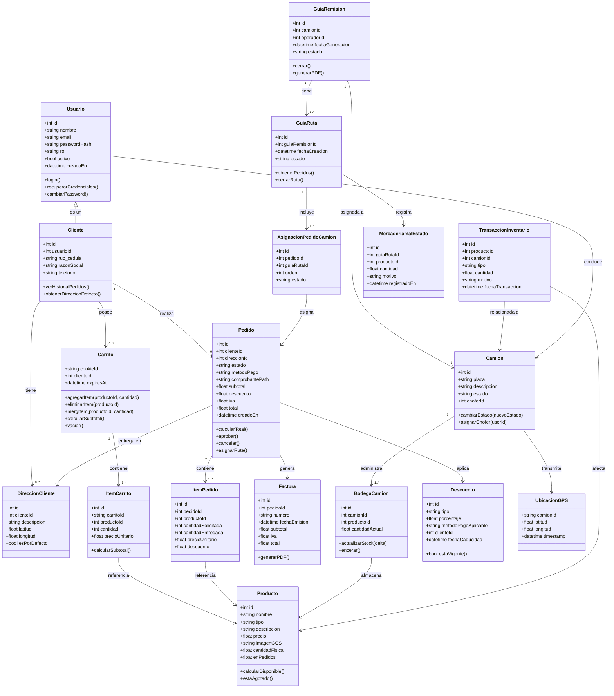

---

### 6.2 Diagrama de Casos de Uso

Modela las interacciones de los **cuatro actores** con el sistema, con relaciones `<<include>>` y `<<extend>>` que expresan dependencias y extensiones de comportamiento.


---

### 6.3 Diagramas de Secuencia — HU-001 a HU-007

Cada diagrama modela el flujo de mensajes entre actores y componentes del sistema para cada Historia de Usuario.

---

#### 6.3.1 HU-001 · Liquidación de Pago y Checkout

```mermaid
sequenceDiagram
    actor Cliente
    participant FE as Frontend
    participant API as Backend API
    participant DB as MySQL
    participant GCS as Cloud Storage
    participant Email as Email Service

    Cliente->>FE: Accede al carrito de compras
    FE->>FE: Lee cookie segura del carrito
    FE->>Cliente: Muestra ítems y subtotal

    Cliente->>FE: Inicia Checkout
    FE->>FE: Verifica token JWT
    alt No autenticado
        FE->>Cliente: Redirige a Login / Registro
        Cliente->>FE: Envía credenciales
        FE->>API: POST /auth/login
        API->>DB: Valida hash de contraseña
        DB-->>API: Usuario válido
        API-->>FE: JWT Token
    end

    FE->>Cliente: Muestra pantalla Checkout
    Cliente->>FE: Selecciona DireccionEntrega (mapa bidireccional)
    Cliente->>FE: Selecciona MetodoPago

    alt MetodoPago = Depósito | De Una
        Cliente->>FE: Adjunta comprobante (imagen/PDF)
        FE->>GCS: PUT /comprobantes/{filename}
        GCS-->>FE: URL pública del archivo
    end

    FE->>API: POST /pedidos {items, dirección, metodoPago, comprobante}
    API->>API: Sanitiza entrada (anti-XSS, anti-SQLi)
    API->>DB: SELECT cantidad_fisica - en_pedidos (por producto)

    alt Stock insuficiente
        API-->>FE: 422 Unprocessable — stock no disponible
        FE->>Cliente: Alerta visual de stock agotado
    else Stock OK
        API->>DB: INSERT pedidos (estado según método de pago)
        API->>DB: UPDATE productos SET en_pedidos += cantidad
        API->>DB: INSERT items_pedido
        API->>DB: INSERT bitacora_auditoria
        API-->>FE: 201 Created {pedidoId, estado}
        FE->>FE: Genera PDF proforma (lado cliente — sin servidor)
        FE->>Cliente: Confirmación + PDF descargable
        FE->>Email: Envía notificación pedido recibido
    end
```

---

#### 6.3.2 HU-002 · Asignación de Rutas y Generación de Guías

```mermaid
sequenceDiagram
    actor Operador as Operador de Ruta
    participant FE as Frontend
    participant API as Backend API
    participant DB as MySQL

    Operador->>FE: Abre módulo Gestión de Pedidos
    FE->>API: GET /pedidos?estado=en_espera_asignacion
    API->>DB: SELECT pedidos WHERE estado = 'en_espera_asignacion'
    DB-->>API: Lista de pedidos
    API-->>FE: Pedidos pendientes
    FE->>Operador: Muestra lista y mapa con pedidos

    Operador->>FE: Selecciona pedidos del mapa/lista
    Operador->>FE: Selecciona camión activo
    FE->>API: GET /camiones?estado=activo
    API->>DB: SELECT camiones WHERE estado = 'activo'
    DB-->>API: Lista de camiones
    API-->>FE: Camiones disponibles
    FE->>Operador: Muestra card de camión seleccionado

    Operador->>FE: Clic "Cerrar Asignación"
    FE->>API: POST /asignaciones {pedidoIds[], camionId}
    API->>DB: Verifica pedidos no asignados
    alt Pedido ya asignado
        API-->>FE: 409 Conflict — pedido ya en ruta
        FE->>Operador: Alerta pedido duplicado
    else Validación OK
        API->>DB: INSERT guias_remision
        API->>DB: INSERT guias_ruta
        API->>DB: INSERT asignacion_pedido_camion
        API->>DB: INSERT transacciones_inventario (ingreso bodega camión)
        API->>DB: UPDATE bodega_camion
        API->>DB: UPDATE pedidos SET estado = 'listo_para_entregar'
        API->>DB: INSERT bitacora_auditoria
        API-->>FE: 201 {guiaRemisionId, guiaRutaId}
        FE->>FE: Renderiza Guía Remisión PDF (lado cliente)
        FE->>FE: Renderiza Guía Ruta PDF (lado cliente)
        FE->>Operador: Muestra guías generadas
    end
```

---

#### 6.3.3 HU-003 · Ejecución de Entrega, Devolución y Facturación

```mermaid
sequenceDiagram
    actor Chofer
    participant FE as Frontend (PWA)
    participant API as Backend API
    participant DB as MySQL
    participant FS as Firestore GPS
    participant ExtMap as Google Maps / Waze

    Chofer->>FE: Abre módulo Entregas
    FE->>API: GET /guias-ruta?estado=activa&choferId={id}
    API->>DB: SELECT guias asignadas al chofer
    DB-->>API: Guías activas
    API-->>FE: Lista de guías
    FE->>Chofer: Muestra guías y mapa con pedidos puntuados

    Chofer->>FE: Selecciona guía de ruta
    FE->>FS: START watch ubicacion_camion/{camionId}
    Note over FE,FS: GPS se comparte en Firestore cada N segundos (configurable)

    Chofer->>FE: Selecciona pedido del mapa
    FE->>API: PATCH /pedidos/{id} {estado: listo_a_ser_entregado}
    API->>DB: UPDATE pedidos
    API-->>FE: OK
    FE->>ExtMap: Abre Google Maps / Waze con coordenadas cliente

    Chofer->>FE: Llega y registra entrega
    FE->>Chofer: Formulario — cantidad entregada / devuelta / estado mercadería

    alt Entrega total
        FE->>API: POST /entregas {pedidoId, cantidadEntregada: total, estado: entregado}
        API->>DB: UPDATE pedidos SET estado = 'entregado'
        API->>DB: UPDATE bodega_camion (egreso físico)
        API->>DB: UPDATE productos SET en_pedidos -= cantidad
        API->>DB: INSERT transacciones_inventario (egreso)
    else Entrega parcial (solo Efectivo)
        FE->>API: POST /entregas {pedidoId, cantidadEntregada, cantidadDevuelta, motivoDevolucion, estadoMercaderia}
        API->>DB: UPDATE pedidos SET estado = 'entregado_parcialmente'
        API->>DB: UPDATE bodega_camion
        API->>DB: UPDATE productos SET en_pedidos -= cantidadEntregada
        API->>DB: INSERT transacciones_inventario
    else Método pago != Efectivo y devolución parcial
        API-->>FE: 422 Error — devolución parcial no permitida
        FE->>Chofer: Mensaje — solo devolución total permitida
    end

    API->>DB: INSERT bitacora_auditoria {ubicacionGPS}
    API-->>FE: 201 {facturaData}
    FE->>FE: Genera Factura PDF (lado cliente — navegador)
    FE->>Chofer: Factura disponible para imprimir/compartir
```

---

#### 6.3.4 HU-004 · Aprobación Manual de Pagos con Comprobante

```mermaid
sequenceDiagram
    actor Operador as Operador de Ruta
    participant FE as Frontend
    participant API as Backend API
    participant DB as MySQL
    participant GCS as Cloud Storage
    participant Email as Email Service

    Operador->>FE: Abre lista de pedidos pendientes de aprobación
    FE->>API: GET /pedidos?estado=en_espera_aprobacion
    API->>DB: SELECT pedidos WHERE estado = 'en_espera_aprobacion'
    DB-->>API: Pedidos con método Depósito / De Una
    API-->>FE: Lista de pedidos
    FE->>Operador: Muestra pedidos con botón "Revisar"

    Operador->>FE: Selecciona pedido y abre comprobante
    FE->>API: GET /pedidos/{id}/comprobante
    API->>GCS: GET URL firmada del archivo
    GCS-->>API: URL
    API-->>FE: URL del comprobante
    FE->>Operador: Muestra imagen/PDF del comprobante

    alt Operador aprueba pago
        Operador->>FE: Clic "Aprobar Pago"
        FE->>API: PATCH /pedidos/{id}/aprobar
        API->>DB: UPDATE pedidos SET estado = 'en_espera_asignacion'
        API->>DB: INSERT bitacora_auditoria {operadorId, accion: 'pago_aprobado'}
        API-->>FE: 200 OK
        FE->>Email: Notifica al cliente — pago aprobado
        FE->>Operador: Confirmación visual
    else Operador rechaza pago
        Operador->>FE: Clic "Rechazar" + motivo
        FE->>API: PATCH /pedidos/{id}/rechazar {motivo}
        API->>DB: UPDATE pedidos SET estado = 'rechazado'
        API->>DB: UPDATE productos SET en_pedidos -= cantidad
        API->>DB: INSERT bitacora_auditoria
        API-->>FE: 200 OK
        FE->>Email: Notifica al cliente — pago rechazado con motivo
        FE->>Operador: Confirmación visual
    end
```

---

#### 6.3.5 HU-005 · Cierre de Guías, Arqueo y Encerado de Bodega

```mermaid
sequenceDiagram
    actor Chofer
    actor Operador as Operador de Ruta
    participant FE_CHO as Frontend Chofer
    participant FE_OPE as Frontend Operador
    participant API as Backend API
    participant DB as MySQL

    Chofer->>FE_CHO: Abre módulo Cierre de Caja
    FE_CHO->>API: GET /guias-ruta/{id}/resumen-caja
    API->>DB: SELECT pedidos entregados + montos por guía
    DB-->>API: Resumen financiero
    API-->>FE_CHO: Reporte visual por guía
    FE_CHO->>Chofer: Muestra dinero esperado por guía

    Chofer->>FE_CHO: Declara efectivo físico en mano
    FE_CHO->>API: POST /guias-ruta/{id}/arqueo {efectivoDeclarado}
    API->>DB: UPDATE guias_remision SET estado='confirmacion_cierre', efectivo_declarado
    API-->>FE_CHO: 200 OK — esperando confirmación del operador
    FE_CHO->>Chofer: Guía en estado pendiente de cierre

    Note over FE_OPE,Operador: Operador ve card de guías pendientes de cierre
    Operador->>FE_OPE: Abre guía en estado confirmacion_cierre
    FE_OPE->>API: GET /guias-remision/{id}/detalle
    API-->>FE_OPE: Detalle de mercadería a recibir y efectivo declarado
    FE_OPE->>Operador: Muestra formulario de recepción de mercadería

    Operador->>FE_OPE: Clasifica mercadería devuelta
    loop Por cada producto devuelto
        alt Mercadería en buen estado
            FE_OPE->>API: POST /inventario/ingreso {productoId, cantidad, motivo: 'devolucion_buen_estado'}
            API->>DB: UPDATE productos SET cantidad_fisica += cantidad
            API->>DB: INSERT transacciones_inventario (ingreso maestro)
        else Mercadería en mal estado
            FE_OPE->>API: POST /mercaderia-mal-estado {guiaRutaId, productoId, cantidad}
            API->>DB: INSERT mercaderia_mal_estado
        end
    end

    Operador->>FE_OPE: Confirma cierre
    FE_OPE->>API: PATCH /guias-remision/{id}/cerrar {efectivoRecibido}
    API->>DB: UPDATE guias_remision SET estado = 'cerrada'
    API->>DB: UPDATE bodega_camion SET cantidad_actual = 0 (encerado)
    API->>DB: INSERT bitacora_auditoria
    API-->>FE_OPE: 200 OK — bodega encerada
    FE_OPE->>Operador: Reporte de arqueo cerrado
```

---

#### 6.3.6 HU-006 · Filtros Temporales y de Estado Estilo Datadog

```mermaid
sequenceDiagram
    actor Usuario as Admin / Operador
    participant FE as Frontend
    participant API as Backend API
    participant DB as MySQL

    Usuario->>FE: Abre Módulo Gestión de Pedidos
    FE->>FE: Aplica filtro default: hoy + estado en_espera_asignacion
    FE->>API: GET /pedidos?fechaInicio=hoy&fechaFin=hoy&estado=en_espera_asignacion
    API->>DB: SELECT pedidos WHERE fecha BETWEEN ? AND ? AND estado = ?
    DB-->>API: Pedidos
    API-->>FE: Resultados
    FE->>Usuario: Muestra mapa + cards informativos por estado

    Usuario->>FE: Escribe atajo en textbox (ej. "1w")
    FE->>FE: Interpreta atajo → fechaInicio = hoy-7d, fechaFin = ahora
    FE->>API: GET /pedidos?fechaInicio={hace7d}&fechaFin={ahora}
    API->>DB: SELECT con rango calculado
    DB-->>API: Resultados
    API-->>FE: Pedidos
    FE->>Usuario: Actualiza vista

    alt Usuario ingresa rango custom > 30 días
        FE->>FE: Valida diferencia de fechas
        FE->>Usuario: Error — rango máximo de 30 días
        Note over FE: Bloquea la petición al API
    else Rango válido ≤ 30 días
        FE->>API: GET /pedidos?fechaInicio={fi}&fechaFin={ff}
        API->>DB: SELECT con rango custom
        DB-->>API: Pedidos
        API-->>FE: Resultados
        FE->>FE: Muestra textbox como "custom"
        FE->>Usuario: Vista actualizada
    end

    Usuario->>FE: Clic en Card Informativo de estado (ej. "En Ruta")
    FE->>FE: Aplica filtro estado = en_ruta
    FE->>API: GET /pedidos?estado=en_ruta&fechaInicio={fi}&fechaFin={ff}
    API->>DB: SELECT con estado filtrado
    DB-->>API: Pedidos en ruta
    API-->>FE: Resultados
    FE->>Usuario: Filtra lista y mapa por estado seleccionado
```

---

#### 6.3.7 HU-007 · Gestión del Carrito de Compras

```mermaid
sequenceDiagram
    actor Cliente
    participant FE as Frontend
    participant Cookie as Cookie Segura (navegador)
    participant API as Backend API
    participant DB as MySQL

    Cliente->>FE: Navega catálogo de productos
    FE->>API: GET /productos?tipo={filtro}&orden={orden}
    API->>DB: SELECT productos WHERE cantidad_fisica - en_pedidos > 0
    DB-->>API: Productos disponibles
    API-->>FE: Catálogo con stock lógico
    FE->>Cliente: Muestra catálogo con precio, tipo y alertas de stock bajo

    Cliente->>FE: Selecciona producto — especifica cantidad
    FE->>FE: Calcula subtotal del ítem
    FE->>FE: ¿Producto ya existe en carrito?

    alt Producto nuevo en carrito
        FE->>Cookie: Agrega item {productoId, cantidad, precio}
        Cookie-->>FE: Carrito actualizado
    else Producto ya en carrito — merge
        FE->>Cookie: Actualiza cantidad del item existente (+= nuevaCantidad)
        Cookie-->>FE: Cantidad fusionada
    end

    FE->>Cliente: Actualiza vista del carrito con nuevo subtotal

    Cliente->>FE: Modifica cantidad de ítem en carrito
    FE->>API: GET /productos/{id} — verifica stock actual
    API->>DB: SELECT cantidad_fisica - en_pedidos
    DB-->>API: Stock disponible
    alt Cantidad > stock disponible
        API-->>FE: Stock insuficiente
        FE->>Cliente: Alerta — cantidad máxima disponible: {X}
    else Cantidad válida
        FE->>Cookie: UPDATE item {nueva cantidad}
        FE->>Cliente: Subtotal recalculado
    end

    Cliente->>FE: Elimina producto del carrito
    FE->>Cookie: DELETE item {productoId}
    Cookie-->>FE: Item eliminado
    FE->>Cliente: Carrito actualizado

    Cliente->>FE: Abandona carrito (cierra/cancela)
    FE->>API: POST /carritos-abandonados {items, valorTotal, motivo}
    API->>DB: INSERT carritos_abandonados
    API-->>FE: Registrado
```

---

### 6.4 Diagramas de Colaboración — HU-001 a HU-007

Cada diagrama muestra los objetos participantes y los **mensajes numerados** que se intercambian para resolver cada historia de usuario.

---

#### 6.4.1 HU-001 · Colaboración — Checkout y Liquidación de Pago


---

#### 6.4.2 HU-002 · Colaboración — Asignación de Rutas y Generación de Guías


---

#### 6.4.3 HU-003 · Colaboración — Entrega, Devolución y Facturación


---

#### 6.4.4 HU-004 · Colaboración — Aprobación Manual de Pagos

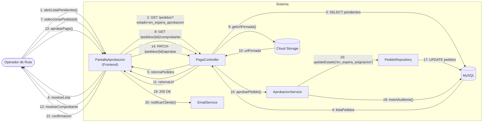

---

#### 6.4.5 HU-005 · Colaboración — Cierre de Guías y Encerado de Bodega

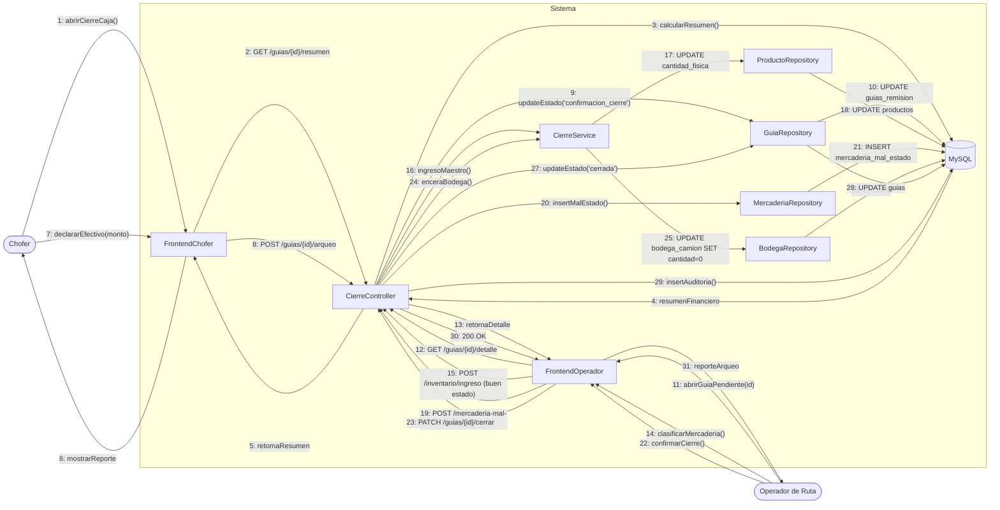

---

#### 6.4.6 HU-006 · Colaboración — Filtros Temporales Estilo Datadog


---

#### 6.4.7 HU-007 · Colaboración — Gestión del Carrito de Compras


---

### 6.5 Diagrama de Estado

Modela el **ciclo de vida completo de un Pedido**, desde su creación hasta su cierre.

```mermaid
stateDiagram-v2
    [*] --> CarritoActivo : Cliente agrega productos

    CarritoActivo --> CheckoutIniciado : Cliente inicia checkout
    CheckoutIniciado --> CarritoAbandonado : Cliente cancela
    CarritoAbandonado --> [*] : Registrado con motivo de cancelación

    CheckoutIniciado --> EsperaAprobacion : Pago = Depósito / De Una\n(comprobante adjunto)
    CheckoutIniciado --> EsperaAsignacion : Pago = TC / TD / Efectivo\n(aprobación automática)

    EsperaAprobacion --> EsperaAsignacion : Operador aprueba comprobante
    EsperaAprobacion --> Rechazado : Operador rechaza comprobante
    Rechazado --> [*]

    EsperaAsignacion --> ListoParaEntregar : Operador asigna pedido\na camión activo

    ListoParaEntregar --> EnRuta : Chofer selecciona pedido\nen mapa (GPS activo)

    EnRuta --> EntregadoTotalmente : Chofer registra entrega\ncompleta del pedido
    EnRuta --> EntregadoParcialmente : Chofer registra entrega\nparcial (solo Efectivo)
    EnRuta --> NoEntregado : Chofer no pudo entregar

    EntregadoTotalmente --> CierrePendiente : Factura PDF generada\nen navegador
    EntregadoParcialmente --> CierrePendiente : Factura recalculada\ngenerada en navegador
    NoEntregado --> CierrePendiente : Registrado como no entregado

    CierrePendiente --> CierreCaja : Operador confirma\nrecepción dinero y mercadería

    CierreCaja --> [*] : Bodega del camión\nencerada (stock = 0)
```

---

### 6.6 Diagrama de Paquetes

Muestra la **arquitectura modular** del sistema con sus dependencias entre capas y componentes.

```mermaid
flowchart TB
    subgraph Cliente_Browser["🌐 Navegador / PWA (Cliente)"]
        direction LR
        PKG_EC["📦 Módulo E-commerce\n(Catálogo, Carrito, Checkout,\nHistorial, Rastreo)"]
        PKG_PDF["📄 Generación PDF\n(Factura, lado cliente)"]
        PKG_MAP_CLI["🗺️ Mapas Cliente\n(Leaflet / Google Maps)"]
        PKG_CACHE["⚡ Caché de Imágenes\n(Service Worker / Cache API)"]
    end

    subgraph Frontend["🖥️ Frontend Laravel (Blade + JS)"]
        direction LR
        PKG_AUTH_FE["🔐 Módulo Autenticación\n(Login, Registro, Recuperación)"]
        PKG_DASH["📊 Módulo Dashboard\n(KPIs, Ventas, Stock)"]
        PKG_GP_FE["🗂️ Módulo Gestión Pedidos\n(Asignación, Aprobación,\nFiltros Datadog)"]
        PKG_ENT_FE["🚚 Módulo Entregas\n(Mapa Ruta, Entrega, Cierre)"]
        PKG_ADM_FE["⚙️ Módulo Administración\n(Usuarios, Vehículos)"]
    end

    subgraph Backend["⚙️ Backend Laravel REST API"]
        direction TB
        PKG_AUTH_BE["🔑 AuthService\n(JWT, Hash, Secret Manager)"]
        PKG_PEDIDOS["📋 PedidoService\n(CRUD, Estados, Auditoría)"]
        PKG_INV["📦 InventarioService\n(Stock, Transacciones, Bodega)"]
        PKG_RUTA["🗺️ RutaService\n(Guías, Asignación, GPS)"]
        PKG_NOTIFY["📧 NotificacionService\n(Email, Push PWA)"]
        PKG_VALID["🛡️ ValidationLayer\n(Anti-XSS, Anti-SQLi)"]
    end

    subgraph Datos["💾 Capa de Datos"]
        subgraph MySQL_DB["🐬 MySQL (Datos Transaccionales)"]
            T_USERS["usuarios / clientes"]
            T_PROD["productos / inventario"]
            T_PEDIDOS["pedidos / items_pedido"]
            T_GUIAS["guias_remision / guias_ruta"]
            T_BODEGA["bodega_camion / transacciones"]
            T_AUDIT["bitacora_auditoria"]
        end
        subgraph Firestore_DB["🔥 Firestore (Geolocalización)"]
            FS_GPS["ubicaciones_camion\n(lat, lng, timestamp)"]
        end
    end

    subgraph GCP["☁️ Google Cloud Platform"]
        GCS["🗄️ Google Cloud Storage\n(Imágenes productos,\ncomprobantes pago)"]
        GSM["🔒 Secret Manager\n(JWT Secret, DB Credentials)"]
        GCR["🐳 Container Registry\n(Docker Images)"]
    end

    subgraph Infra["🐳 Infraestructura Docker"]
        D_FE["Contenedor: Frontend"]
        D_BE["Contenedor: Backend API"]
        D_DB["Contenedor: MySQL"]
    end

    Cliente_Browser -->|"HTTPS / JWT"| Frontend
    Frontend -->|"REST API calls"| Backend
    Backend -->|"Queries ORM"| MySQL_DB
    Backend -->|"SDK Firebase"| Firestore_DB
    Backend -->|"SDK GCS"| GCS
    Backend -->|"SDK Secret Manager"| GSM
    PKG_MAP_CLI -->|"Firestore realtime"| Firestore_DB
    D_FE --> Frontend
    D_BE --> Backend
    D_DB --> MySQL_DB
    GCR --> D_FE
    GCR --> D_BE
```

---

### 6.7 Diagrama de Entidad-Relación

Esquema completo de la **base de datos MySQL** con todas las tablas, campos clave y relaciones del sistema.

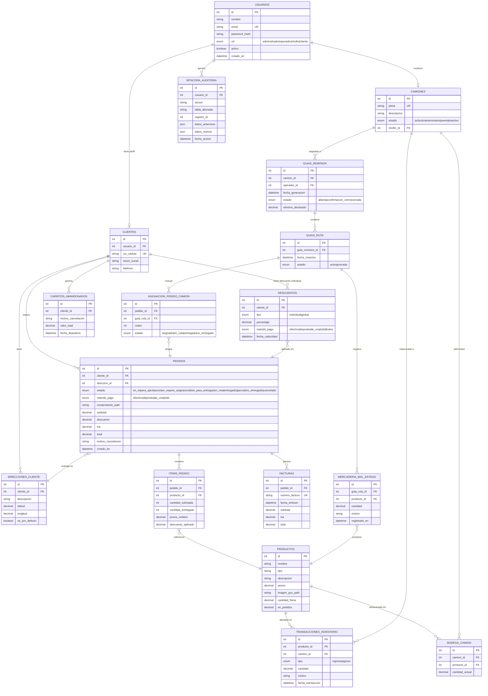

---

### 6.8 Diagrama de Flujo de Datos — Infraestructura GCP (Bajo Costo)

Arquitectura diseñada para **minimizar el costo mensual** en GCP. Se usan únicamente servicios con **capa gratuita generosa** o costo mínimo. La seguridad se gestiona con **HTTPS incluido en la URL de Cloud Run** y **JWT** en el backend, sin servicios de red adicionales pagos.

> **Estimado mensual:** ~$8–15 USD/mes (dominado por Cloud SQL `db-f1-micro`)

---

#### Nivel 0 — Contexto General (bajo costo)

```mermaid
flowchart TD
    CLI(["👤 Cliente\nNavegador / PWA"])
    OPE(["👤 Operador de Ruta"])
    CHO(["👤 Chofer"])
    ADM(["👤 Administrador"])

    subgraph GCP["☁️ Google Cloud Platform — Fritolay Ambato"]
        FE["📄 frontend-service\nhttps://frontend-xxxx-uc.a.run.app"]
        BE["⚙️ backend-api-service\nhttps://api-xxxx-uc.a.run.app"]
    end

    CLI -->|"HTTPS (incluido en Cloud Run URL)"| FE
    OPE -->|"HTTPS + JWT"| FE
    CHO -->|"HTTPS + JWT"| FE
    ADM -->|"HTTPS + JWT"| FE
    FE  -->|"REST API calls + JWT"| BE
    BE  -->|"JSON responses"| FE
```

---

#### Nivel 1 — Flujo Detallado por Servicios (bajo costo)

Cada servicio incluye su **costo estimado mensual** y si aplica **capa gratuita**.

```mermaid
flowchart TD
    %% ── Actores ─────────────────────────────────────────────────────────
    CLI(["👤 Cliente"])
    OPE(["👤 Operador / Admin"])
    CHO(["👤 Chofer"])

    %% ── Cloud Run (GRATIS hasta 2M requests/mes) ─────────────────────────
    subgraph CR["🐳 Cloud Run — $0 capa gratuita"]
        direction LR
        FE_SVC["📄 frontend-service\n*.run.app — HTTPS gratis\n(PWA · Service Worker · Blade)"]
        BE_SVC["⚙️ backend-api-service\n*.run.app — HTTPS gratis\n(Laravel API · JWT · SOLID)"]
    end

    %% ── Cloud SQL MySQL ──────────────────────────────────────────────────
    subgraph SQL["🐬 Cloud SQL MySQL — ~$8/mes"]
        DB[("`db-f1-micro (1 vCPU / 614 MB)
        10 GB SSD · Backups diarios
        pedidos · inventario · guías
        auditoría · usuarios`")]
    end

    %% ── Firestore ────────────────────────────────────────────────────────
    subgraph FS["🔥 Firestore — $0 capa gratuita"]
        FS_GPS[("1 GB storage gratis
        50K lecturas/día gratis
        ubicaciones_camion GPS
        lat · lng · timestamp")]
    end

    %% ── Cloud Storage ────────────────────────────────────────────────────
    subgraph GCS["🗄️ Cloud Storage — ~$0.02/GB/mes"]
        GCS_IMG[("Bucket: imágenes-productos
        Acceso público · CDN gratis
        Cache-Control: max-age=14400
        (4h en navegador — 0 costo extra)")]
        GCS_DOC[("Bucket: comprobantes-pago
        Acceso privado
        URL firmadas (signed URLs)")]
    end

    %% ── Secret Manager ───────────────────────────────────────────────────
    subgraph SM_BOX["🔑 Secret Manager — ~$0.06/mes"]
        SM["JWT_SECRET · DB_PASSWORD
        FIREBASE_KEY · MAIL_PASS
        GCS_SA_KEY"]
    end

    %% ── CI/CD ────────────────────────────────────────────────────────────
    subgraph CICD["🔄 CI/CD — $0 (GitHub Actions gratis)"]
        direction LR
        GH["📁 GitHub\nRepositorio público"]
        GHA["⚙️ GitHub Actions\nbuild · test · push\n(2000 min/mes gratis)"]
        AR["📦 Artifact Registry\n0.5 GB gratis\nImágenes Docker"]
    end

    %% ── Email ────────────────────────────────────────────────────────────
    subgraph EMAIL_BOX["✉️ Email — $0 (Gmail SMTP)"]
        GMAIL["Gmail SMTP\nsmtp.gmail.com:587\nApp Password en .env\n(500 emails/día gratis)"]
    end

    %% ── FCM ──────────────────────────────────────────────────────────────
    subgraph FCM_BOX["🔔 Push Notifications — $0 (FCM)"]
        FCM["Firebase Cloud Messaging\nWeb Push / PWA\n(completamente gratis)"]
    end

    %% ── FLUJOS DE ACCESO ────────────────────────────────────────────────
    CLI -->|"HTTPS — URL *.run.app\n(TLS incluido, sin LB)"| FE_SVC
    OPE -->|"HTTPS + JWT Bearer"| FE_SVC
    CHO -->|"HTTPS + JWT Bearer\n+ GPS coords"| FE_SVC

    %% ── FLUJOS FRONTEND ↔ BACKEND ───────────────────────────────────────
    FE_SVC -->|"POST/GET/PATCH JSON\nAuthorization: Bearer JWT"| BE_SVC
    BE_SVC -->|"JSON response\n+ Signed URL GCS"| FE_SVC

    %% ── FLUJOS BACKEND ↔ DATOS ──────────────────────────────────────────
    BE_SVC -->|"Eloquent ORM queries\n(TCP · VPC Connector)"| DB
    DB     -->|"Result sets"| BE_SVC
    BE_SVC -->|"Firebase Admin SDK\nwriteDocument(GPS)"| FS_GPS
    FS_GPS -->|"onSnapshot() realtime\n(WebSocket — gratis)"| FE_SVC

    %% ── FLUJOS ALMACENAMIENTO ───────────────────────────────────────────
    BE_SVC   -->|"PUT multipart/form-data"| GCS_DOC
    GCS_DOC  -->|"Signed URL (15min TTL)"| BE_SVC
    BE_SVC   -->|"URL pública guardada en MySQL"| GCS_IMG
    GCS_IMG  -->|"GET imagen\nCache-Control: 4h"| FE_SVC

    %% ── FLUJOS SECRETOS ─────────────────────────────────────────────────
    SM -->|"env vars en startup\n(gratis hasta 6 secretos)"| BE_SVC

    %% ── FLUJOS CI/CD ────────────────────────────────────────────────────
    GH  -->|"push main\nworkflow trigger"| GHA
    GHA -->|"docker push"| AR
    AR  -->|"deploy --image\ngcloud run deploy"| FE_SVC
    AR  -->|"deploy --image\ngcloud run deploy"| BE_SVC

    %% ── FLUJOS EMAIL Y PUSH ─────────────────────────────────────────────
    BE_SVC -->|"Laravel Mail\nSMTP TLS"| GMAIL
    GMAIL  -->|"Email entregado"| CLI
    BE_SVC -->|"FCM HTTP v1 API"| FCM
    FCM    -->|"Web Push\nService Worker"| CLI
```

---

#### Nivel 2 — Flujo por Proceso de Negocio (bajo costo)

```mermaid
flowchart LR
    subgraph P1["🛒 Checkout"]
        direction TB
        A1["Cliente → FE\n(Cloud Run URL HTTPS)"]
        A2["FE → BE API\n(JWT en header)"]
        A3["BE valida JWT\n(sin servicio externo)"]
        A4["Comprobante → GCS\n(bucket docs privado)"]
        A5["Pedido → Cloud SQL\n(INSERT)"]
        A6["Email → Gmail SMTP\n(gratis)"]
        A1 --> A2 --> A3 --> A4 --> A5 --> A6
    end

    subgraph P2["🚚 Tracking GPS"]
        direction TB
        B1["Chofer abre guía\n(Cloud Run URL)"]
        B2["PWA activa GPS\n(Geolocation API)"]
        B3["Coords → Firestore\n(gratis hasta 50K/día)"]
        B4["onSnapshot() listener"]
        B5["Cliente ve mapa\nen tiempo real"]
        B6["FCM Push\n(pedido listo — gratis)"]
        B1 --> B2 --> B3 --> B4 --> B5 --> B6
    end

    subgraph P3["📦 Imágenes — Caché sin costo"]
        direction TB
        C1["Admin sube imagen"]
        C2["Backend → PUT GCS\n(bucket público)"]
        C3["URL en MySQL"]
        C4["Cliente pide imagen"]
        C5["¿Cache navegador?"]
        C6["HIT → 0 costo GCS\n(servido localmente)"]
        C7["MISS → GCS fetch\n→ Cache 4h gratis"]
        C1 --> C2 --> C3 --> C4 --> C5
        C5 -->|"HIT"| C6
        C5 -->|"MISS"| C7
    end

    subgraph P4["🔄 Deploy — GitHub Actions"]
        direction TB
        D1["git push main\n(GitHub gratis)"]
        D2["GitHub Actions\n(2000 min/mes gratis)"]
        D3["docker build + test\nphp artisan test"]
        D4["docker push\nArtifact Registry"]
        D5["gcloud run deploy\n(Cloud Run revision)"]
        D1 --> D2 --> D3 --> D4 --> D5
    end
```

---

#### Nivel 3 — Tabla de Costos Estimados

| Servicio GCP | Uso estimado | Capa gratuita | Costo/mes |
|---|---|---|---|
| **Cloud Run** (frontend + backend) | ~500K requests/mes | 2M requests gratis | **$0** |
| **Cloud SQL MySQL** `db-f1-micro` | Siempre activo | Sin capa gratuita | **~$8–10** |
| **Firestore** | GPS realtime, <1 GB | 1 GB + 50K reads/día gratis | **$0** |
| **Cloud Storage** | ~5 GB imágenes + docs | 5 GB gratis (primeros 90 días) | **~$0.10** |
| **Secret Manager** | 5–6 secretos | 6 secretas gratis/mes | **$0** |
| **Artifact Registry** | 2 imágenes Docker | 0.5 GB gratis | **$0** |
| **GitHub Actions** | CI/CD build + deploy | 2000 min/mes gratis (repo público) | **$0** |
| **Gmail SMTP** | Notificaciones email | 500 emails/día gratis | **$0** |
| **FCM** | Push notifications PWA | Completamente gratis | **$0** |
| **HTTPS / TLS** | Incluido en Cloud Run URL | Incluido siempre | **$0** |
| | | **Total estimado** | **~$8–10/mes** |

> [!TIP]
> **Optimización adicional:** Configura Cloud SQL con **"Stop instance on schedule"** fuera de horario laboral (ej. 22h–6h) para reducir el costo de Cloud SQL hasta un **~60%**, llevando el total a **~$3–5/mes**.

#### Nivel 4 — Flujo de Seguridad con Cloud Run URL (sin servicios pagos)

```mermaid
flowchart LR
    subgraph Usuario["👤 Usuario (cualquier rol)"]
        BROWSER["Navegador / PWA"]
    end

    subgraph CR_SEC["🔒 Seguridad incluida en Cloud Run (gratis)"]
        direction TB
        TLS["✅ TLS 1.3 HTTPS\nincluido en *.run.app\n(sin Load Balancer)"]
        JWT_V["✅ JWT Validation\nMiddleware Laravel\n(sin servicio externo)"]
        VAL["✅ Validación inputs\nanti-XSS · anti-SQLi\nLaravel FormRequest"]
        HASH["✅ bcrypt password hash\nLaravel Hash facade"]
        CORS["✅ CORS configurado\nen Laravel (solo dominios propios)"]
    end

    subgraph DATA["💾 Datos protegidos"]
        SM2["🔑 Secret Manager\n(JWT_SECRET · DB_PASS)\n~$0.06/mes"]
        DB2[("🐬 Cloud SQL\nVPC privado\n(sin IP pública)")]
    end

    BROWSER -->|"HTTPS *.run.app"| TLS
    TLS --> JWT_V
    JWT_V --> VAL
    VAL --> HASH
    HASH --> CORS
    CORS -->|"Solo si JWT válido\ny rol autorizado"| DB2
    SM2 -->|"Secretos en env vars\nal arrancar contenedor"| JWT_V
```