## Sistema E-commerce y Gesti├│n de Pedidos "Fritolay Ambato" 1. Objetivos del Proyecto Objetivo General

- Construir una aplicaci├│n que debe ser web y compatible con PWA.

- Desarrollar un sistema capaz de captar pedidos, ver en tiempo real su entrega, gestionar pedidos, guías de remisión de camiones y rutas.

## Objetivos Específicos de Arquitectura

- La aplicaci├│n debe estar en la nube y ser una aplicaci├│n orientada a microservicios y dockers.

- Ejecuci├│n en Desarrollo: Aunque la arquitectura es nativa de la nube, debe garantizarse que la aplicaci├│n tambi├®n se pueda ejecutar en el local para el desarrollo de la misma.

- Debe existir separaci├│n estricta entre front end, back end, MySQL para datos transaccionales y Firestore para datos de geolocalizaci├│n del cami├│n.

- La aplicaci├│n debe ser desarrollada en Laravel con PHP tanto el backend y el front end y de forma independiente en el mismo repositorio de Git.

- Para los análisis y construcción de la aplicación debe usar pony tail (https://github.com/dietrichgebert/ponytail) para optimizar el uso de tokens.

- Aplicar los principios de SOLID en la construcci├│n con agentes de IA para la aplicaci├│n, en especial el de responsabilidad ├║nica, y aplica tambi├®n la Programaci├│n Orientada a Objetos.

- Las entradas del REST API o backend deben ser validadas para no recibir ataques de XSS o SQL Injection.

- Agregar test en el desarrollo del backend y front end

- 2. UI/UX e Identidad Visual

- Dise├▒o y Usabilidad: Todo el sistema debe estar enfocado en un dise├▒o minimalista y adaptable, priorizando la usabilidad y un buen dise├▒o.

- Identidad Corporativa: La página debe tener los colores institucionales donde debe existir una combinación entre estas dos páginas https://www.lays.com/ y https://www.fritolay.com/ que son sus productos estrellas.

- 3. Seguridad, Gesti├│n de Estado y Variables de Entorno (Environment)

- Autenticaci├│n API: Implementar JWT y usar Secret Manager en GCP para resguardar los secretos de infraestructura y JWT.


- Gesti├│n de Contrase├▒as: Usar hash para comparaci├│n de las contrase├▒as y no est├®n en la base de datos en texto claro. La clave para generar el hash debe estar en un archivo environment.

- Recuperación de Credenciales: Todos los usuarios pueden recuperar sus credenciales mediante su correo electrónico con un pin de 6 dígitos aleatorios por defecto. La cantidad de dígitos debe ser configurada con una variable de entorno.

- Mensajería: Para la configuración del email para mensajería debe estar configurado en un environment en el backend para las funcionalidades.

- Persistencia Temporal: Uso de cookies seguras expirables para mantener el estado del carrito.

- Cach├®: Las im├ígenes (de GCS) deben guardarse en cach├® del lado del cliente o navegador con una duraci├│n configurable (por defecto 4 horas) que sea expirable.

## 4. Roles y Permisos

- Rol Administrador: Este usuario es capaz de crear, inactivar o resetear contraseñas de usuarios tipo empleados u otro rol de administración. Pueden ver el Módulo Dashboard de Gestión de Pedidos. Tendrá acceso al visor de facturas y exportación PDF.

- Rol Operador de Ruta: Este usuario gestionará los pedidos a entregar, como la asignación de los pedidos para un camión, aprobación de pedidos, asignación de rutas con la creación de guía de ruta y la guía de remisión, visor de facturas y cierre de caja del camión. Prácticamente estará usando el Módulo de Gestión de Pedidos.

- Rol Chofer: Este usuario es el chofer del cami├│n, ├®l tendr├í accesos a su ruta asignada del M├│dulo Entregas.

- Rol Cliente: Una funcionalidad que no necesariamente debe ser autentificada es la de agregar productos al carrito de compras, la página de inicio debe ser esta y debe incluir inicio de sesión en el home page.

- 5. M├│dulos del Sistema y L├│gica de Negocio

- 5.1. Dashboard 1: Estadísticas y KPIs (Módulo Dashboard de Gestión de Pedidos)

- Indicadores: Efectividad de entrega por cami├│n, pedidos entregados, efectividad de entrega general y tiempos de entrega promedio.

- Ventas: Debe mostrar las ventas por día, por sector y por camión.

- Recaudaci├│n: Recaudaci├│n total y separado en efectivo, dep├│sitos, cheques, De Una, Tarjeta de Cr├®dito y Tarjetas de D├®bito.

- Carritos Abandonados: Compras no concretadas que el usuario haya creado el carrito y haya cancelado la compra. Al cancelar, debe poner opciones de por qu├® cancela el pedido; las comunes son: No lo necesito, Era una proforma, Pedido Equivocado, No es lo que requiero, y otros.


- Control de Stock: En el dashboard puede consultar el stock de los productos de las bodegas, de la bodega master y de los vehículos.

## 5.2. M├│dulo de Gesti├│n de Pedidos (Operativo y Administrativo)

- Rastreo en Vivo: La última ubicación estará siempre visible en el Módulo de Gestión de Pedidos.

- Filtros de Fechas (Estilo Datadog): Se debe presentar un mapa el cual debe usar filtros de fechas especificando inicio y fin, este inicio y fin no puede ser mayor a un mes. Usar un textbox donde el usuario pueda escribir y las fechas deben cambiar (límite es 30 días por consulta):

- o Hoy = Fecha de inicio y fin deben estar configuradas como del día de hoy.

- o Ayer = Fechas inicio y fin del día de ayer.

- o 1d, 2d... 30d = Fechas configuradas de inicio 1 a 30 días antes de la fecha y hora actual, y fecha final la fecha y hora actual.

- o 1w, 2w, 3w y 4w = Fechas configuradas de inicio 1 a 4 semanas antes, y fecha final la fecha y hora actual.

- o Cuando haga una consulta custom, el cuadro de texto debe aparecer como custom, la validación que no debe pasarse de 30 días.

- Filtros por Estado: Usar tambi├®n filtros de estado y por defecto debe aparecer los pedidos en espera de asignaci├│n de ruta y los camiones que no tienen asignado rutas.

- Cards Informativos: Debe tener unos cards como tipo informativo de la cantidad de pedidos por estado, y cuando d├® un clic en el card este filtre por el estado. Los estados son: En espera de asignaci├│n de ruta, No entregado, Entregado Parcialmente, Entregados, Pendiente de Aprobaci├│n, Listo Para entregar, En Ruta, Todos.

- Ordenamiento: Los pedidos pueden ordenarse por: antig├╝edad del pedido (Por defecto), nombre del cliente y valor del pedido.

- Descuentos: El usuario puede asignar descuentos a clientes por tipo de pago, una sola configuración que aplicará en las siguientes compras. El usuario puede configurar descuentos a tipos de pagos para todos los clientes como un descuento adicional, este tiene que tener una fecha de caducidad.

- Asignaci├│n de Ruta y Bodegas M├│viles:

- o Puede seleccionar del mapa o de una lista de pedidos en espera de asignaci├│n de ruta para ir asignando los pedidos a un cami├│n activo.

- o Este tambi├®n tendr├í un card donde se ven los veh├¡culos que se est├ín asignado los pedidos.

- o La asignación termina cuando el gestor de ruta cierre la asignación y esto crea una guía de remisión visual igual a las sugeridas por el SRI y una guía de ruta con los negocios a visitar, con montos a cobrar y tipos de pagos.


- o Cuando se genere debe crear una transacción de ingreso a la bodega del camión. Cada camión administrará su bodega con transacciones de ingresos y egresos en la base de datos.

- o El módulo debe ser capaz de gestionar los vehículos, crear camiones, cambiar de estado por temas de mantenimiento y averías, y asignar choferes los cuales son usuarios tipo chofer.

- Aprobación de Pagos: Aprobar pedidos con tipo de pagos de depósito y de la aplicación De Una. Cuando un usuario haya hecho un pedido con estos pagos debe pasar por una aprobación y los requisitos son el comprobante de depósito para validar el pago. El pedido está en estado en espera por aprobación de pago. Los pagos de TC, TD y Efectivo estos se aprueban automáticamente y se dejan en espera de asignación de ruta.

- Cierres de Guías y Arqueo (Encerar Bodega):

- o Cuando el chofer haga su arqueo de caja, este aparecerá en estado de confirmación de cierre en la guía y en el camión.

- o En la página principal de la gestión debe aparecer un card de guías pendientes por cerrar.

- o El gestor confirma la recepción de la mercadería devuelta y el dinero para cerrar la caja y encerar la bodega (dejar el inventario del camión en cero).

- o Si los productos están en buen estado, debe actualizar el inventario master de los productos y generar transacciones de ingreso por mercadería en buen estado.

- o La de mal estado no debe ingresar, esta debe registrarse como mercadería mal estado en otra tabla.

- Listado de Facturas (Simuladas): Pantalla con filtros donde Administradores/Operadores visualizan facturas y pueden exportar a PDF (procesado del lado del cliente).

## 5.3. M├│dulo de Entregas (Chofer)

- Inventario Físico: Debe ser capaz de ver los productos del camión existentes en el camión e ir actualizando el inventario.

- Mapas y Navegaci├│n: Al momento de seleccionar la gu├¡a debe desplegarse el mapa donde estar├ín puntillado los pedidos a entregar. Estas deben permitir ordenar por el punto m├ís cercano de la ubicaci├│n actual y tambi├®n por la antig├╝edad que tiene el pedido solicitado, el ordenamiento debe realizarlo el front end. Cuando ocurra la selecci├│n del pedido, este pasar├í a estado Listo a ser entregado. Este debe ser seleccionado en el mapa de la aplicaci├│n web y cuando ocurra la aplicaci├│n direccionar├í a Google Maps o a Waze la ubicaci├│n y el chofer pueda navegar en estos mapas de aplicaciones externas y dirigirse a la ubicaci├│n de entrega.

- Tracking Constante: Al momento de seleccionar la guía debe compartirse la ubicación y esta debe ser guardada en Firestore cada cierto tiempo configurado en un environment.


- Ejecuci├│n y Facturaci├│n: Cuando se entregue un pedido de forma parcial o individual, generar una factura muy parecida a las autorizadas por el SRI como simulaci├│n. Crear una transacci├│n para disminuir la cantidad fsica y la cantidad en pedido.

- Devoluciones: Las devoluciones parciales solo aplican en pedidos en efectivo, si el pago es de otro tipo la devoluci├│n es total.

- Cierre de Caja: Guías pendientes de cierre, un reporte visual dinero por cada guía de ruta para realizar el cierre de la caja del camión, tener la opción de cierre donde debe declarar el valor en efectivo actual.

## 5.4. M├│dulo de Clientes (E-commerce)

- Cat├ílogo y Cach├®: Los productos deben mostrarse como una p├ígina e-commerce de f├ícil uso. La foto esta debe obtenerse de GCS y de ser posible que se guarde en cach├® del lado del cliente con una duraci├│n de 4 horas para ahorrar costos de GCS, el tiempo de permanencia de cach├® debe ser configurable.

- Detalles y Alertas: Mostrar informaci├│n del producto como peso, tipo de producto (Cheetos, Papas, Doritos, Tostitos, etc.), y una breve descripci├│n. Tambi├®n informaci├│n de descuento y, cuando el producto se acerque a un porcentaje de agotamiento de stock, mostrar las unidades disponibles. Cuando no tenga stock este debe mostrar informaci├│n que no hay ├¡tems disponibles y solo va a permitir ver informaci├│n del producto. Los productos pueden filtrarse por tipo de producto y ordenarse por tipo, por precio, por nombre.

- Carrito de Compras: Un usuario sin autentificarse o autentificado puede seleccionar productos y subir al carrito de compras. Cuando el usuario est├® por seleccionar producto al carrito de compras, antes debo especificar la cantidad y debe mostrarme el subtotal. Si escoge el mismo producto debe realizar un merge aumentando la cantidad. Puede modificar el carrito de compras, eliminar productos, agregar cantidades o disminuir.

- Checkout y Autenticaci├│n: Cuando quiera hacer el checkout debe pedir autentificarse o crear un usuario.

- Inventario Lógico: En el inventario master habrá una funcionalidad, cuando finalice el checkout el inventario debe tener tres campos: CantidadFisica, EnPedidos y la disponible será la cantidad fsica menos la cantidad en pedidos.

- Gesti├│n de Direcciones y Mapa (Bidireccional):

- o Los datos requeridos para el cliente es información de facturación, y puede registrar más de una dirección con ubicación del mapa.

- o Por defecto debe usar la ubicaci├│n actual, mover el punto de entrega y su direcci├│n debe aparecer en el cuadro de texto.

- o Tambi├®n debe permitir buscar una direcci├│n o coordenadas con un cuadro de texto, cuando ocurra esto el ping en el mapa debe moverse a lo que indica el cuadro de texto.


- o Puede seleccionar la dirección por defecto que aparecerá en los pedidos. El usuario debe permitir cambiar con otra o crear, editar o eliminar direcciones en el proceso de ingreso de datos o checkout.

- Liquidación de Pago: En el proceso de check out debe aparecer el detalle de los productos y cálculo de descuentos, impuesto IVA, total y sub total. Siempre debe mostrar el total del pedido y el ahorro por los descuentos configurados.

- Pasarela (Simulada): Simular el pago de tarjeta de d├®bito, de cr├®dito y el QR de De Una para pagos con De Una.

- Historial y PDF (Lado del Cliente): M├│dulo de historial de pedidos pasados. Generaci├│n de facturas en PDF procesada estrictamente utilizando los recursos del navegador/dispositivo del usuario para no recargar el servidor.

- Rastreo del Cliente: El cliente puede ver y recibir una notificación de la aplicación si el chofer eligió el pedido como "Listo para entregar". El cliente solo verá la ubicación del camión cuando el chofer seleccione el pedido y este pasará a este estado. Puede visualizar en el mapa la ubicación, el refresco de la ubicación del mapa será configurada en el archivo de environment.

## Análisis Previo del Sistema

A continuación, se detalla el análisis estructurado de la información proporcionada para establecer el contexto de la aplicación.

## Actores Involucrados

- Administrador: Gestiona usuarios (crear, inactivar, resetear contrase├▒as), visualiza el Dashboard de KPIs y tiene acceso a visores de facturas y exportaci├│n PDF.

- Operador de Ruta: Gestiona pedidos, aprueba pagos, asigna rutas a camiones, genera guías de remisión/rutas y supervisa el cierre de caja de camiones.

- Chofer: Gestiona la entrega en ruta, usa navegaci├│n en vivo, registra entregas/devoluciones, genera facturas simuladas y realiza su arqueo/cierre de caja.

- Cliente (Invitado/Registrado): Explora el catálogo, gestiona el carrito de compras, realiza el checkout (requiere registro), sube comprobantes y rastrea su pedido.

## Procesos Principales

- Exploración de catálogo y gestión de carrito de compras.

- Checkout, c├ílculo de totales y selecci├│n de m├®todo de pago.

- Aprobación de pagos (manual para depósitos/De Una, automática para el resto).

- Asignación de rutas y generación de guías (remisión y ruta).

- Navegaci├│n GPS, entrega de pedidos y facturaci├│n in situ.

- Cierre de caja, encerado de bodega móvil y actualización de inventario máster.

- Visualizaci├│n de m├®tricas y filtrado de datos (m├íximo 30 d├¡as).


## Reglas de Negocio Principales

- RN-A: Los pedidos pagados con Depósito o "De Una" requieren carga de comprobante y aprobación manual por el Operador de Ruta. Los pagos con TC, TD o Efectivo se aprueban automáticamente.

- RN-B: Las devoluciones parciales de mercader├¡a durante la entrega solo est├ín permitidas si el m├®todo de pago original es Efectivo. Para otros m├®todos, la devoluci├│n debe ser total.

- RN-C: Las consultas con filtros de fechas personalizadas tienen un límite estricto de máximo 30 días de rango entre la fecha de inicio y fin.

- RN-D: La mercadería devuelta en buen estado incrementa el inventario máster. La mercadería en mal estado se registra en una tabla separada y no afecta el stock disponible de venta.

## Fórmulas de Cálculo

- Inventario L├│gico: \$CantidadDisponible = CantidadFisica - EnPedidos\$.

- Liquidaci├│n de Pedido: \$TotalPedido = (Subtotal - Descuentos) + ImpuestoIVA\$.

## Excepciones

- Intentar buscar datos con un rango de fechas mayor a 30 días.

- Intentar realizar una devoluci├│n parcial en un pedido pagado con Tarjeta de Cr├®dito/D├®bito.

- Intentar agregar un producto al carrito cuando la cantidad solicitada supera la \$CantidadDisponible\$.

## Evidencias Requeridas

- Guías de Remisión y Guías de Ruta.

- Comprobantes de pago (imágenes/PDF subidos por el cliente).

- Facturas simuladas en formato PDF (procesadas del lado del cliente).

- Bitácoras de auditoría y tracking GPS guardado en Firestore.

## Reportes Necesarios

- Dashboard de KPIs (Efectividad, Ventas, Recaudaci├│n, Carritos Abandonados, Stock).

- Visor y exportaci├│n de Facturas.

- Reporte de Cierre de Caja por cami├│n.

Épica: Módulo de Clientes (E-commerce)

## HU-001 - Liquidaci├│n de Pago y Checkout

Como: Cliente registrado Quiero: Visualizar el detalle de mi carrito, aplicar descuentos, calcular el IVA y elegir un m├®todo de pago Para: Completar mi compra con total claridad sobre los montos facturados y asegurar el stock de mis productos. Prioridad: Alta


## Reglas de negocio

- RN-01: El sistema debe calcular el total utilizando la f├│rmula \$TotalPedido = (Subtotal - Descuentos) + ImpuestoIVA\$.

- RN-02: Si el cliente elige "Depósito" o "De Una", debe obligatoriamente adjuntar un comprobante. El pedido quedará en estado "En espera por aprobación".

- RN-03: Al finalizar el checkout, el inventario del producto debe actualizarse afectando el campo EnPedidos.

## Criterios de aceptaci├│n en Gherkin

Característica: Checkout y Liquidación de compras

Escenario: Flujo principal exitoso con pago en efectivo Dado que el cliente tiene productos en su carrito de compras Y se encuentra autenticado en el sistema Cuando procede a la pantalla de checkout y selecciona "Efectivo" como m├®todo de pago Entonces el sistema calcula y muestra el \$TotalPedido\$ Y el sistema registra el pedido en estado "En espera de asignaci├│n de ruta" Y el sistema actualiza el inventario sumando la cantidad solicitada al campo EnPedidos.

Escenario: Validaci├│n obligatoria de comprobante para dep├│sito Dado que el cliente selecciona "Dep├│sito" en el checkout Cuando intenta finalizar el pedido sin adjuntar un documento Entonces el sistema bloquea la acci├│n Y muestra un mensaje de error "Debe adjuntar el comprobante de dep├│sito para continuar".

Escenario: Excepción por datos incompletos en la dirección Dado que el cliente se encuentra en la pantalla de checkout Cuando no selecciona ni registra una dirección de entrega válida en el mapa bidireccional Entonces el botón de "Finalizar Compra" se deshabilita Y se genera una alerta visual indicando "Dirección de entrega obligatoria".

## Datos o campos requeridos

| Campo | Tipo de dato | Obligatorio | Validaci├│n |
| --- | --- | --- | --- |
|   |   |   | Valores permitidos: |
| MetodoPago | Lista desplegable | Sí | Efectivo, Depósito, De |
|   |   |   | Una, TC, TD |
| Comprobante | Archivo | Condicional | Obligatorio si MetodoPago |
|   | (Imagen/PDF) |   | es Dep├│sito o De Una |
| DireccionEntrega Coordenadas/Texto Sí |   |   | Debe existir en la base o |
|   |   |   | seleccionarse del mapa |

## Dependencias

- Historia o m├│dulo relacionado: M├│dulo de Gesti├│n de Direcciones y Mapa Bidireccional; M├│dulo de Autenticaci├│n de Usuarios.

## Evidencias esperadas


- Registro generado en la base de datos MySQL (Tabla de Pedidos).

- Documento o archivo adjunto guardado en Google Cloud Storage (GCS).

- Bitácora de auditoría detallando la fecha, hora y usuario que generó el pedido.

Épica: Módulo de Gestión de Pedidos

## HU-002 - Asignación de Rutas y Generación de Guías

Como: Operador de Ruta Quiero: Seleccionar pedidos en espera y asignarlos a un camión activo Para: Generar automáticamente la guía de remisión, la guía de ruta y registrar el ingreso de inventario en la bodega móvil del vehículo. Prioridad: Alta

## Reglas de negocio

- RN-01: Solo los camiones en estado "Activo" pueden recibir asignaciones de pedidos.

- RN-02: Un pedido no puede asignarse a más de un camión simultáneamente.

- RN-03: Al cerrar la asignación, se genera una transacción automática de ingreso desde la bodega máster a la bodega del camión seleccionado.

## Criterios de aceptaci├│n en Gherkin

Característica: Asignación de pedidos a camiones

Escenario: Flujo principal exitoso de asignación Dado que existen pedidos en estado "En espera de asignación de ruta" Y el Operador de Ruta tiene un camión "Activo" seleccionado Cuando asigna los pedidos y hace clic en "Cerrar Asignación" Entonces el sistema genera una Guía de Remisión visual Y genera una Guía de Ruta con los negocios, montos y tipos de pago Y crea una transacción de ingreso de inventario en la bodega del camión.

Escenario: Prevención de registros duplicados Dado que un pedido con ID "PED-123" ya fue asignado al "Camión A" Cuando el Operador de Ruta intenta asignarlo al "Camión B" Entonces el sistema rechaza la operación Y muestra una alerta "El pedido ya se encuentra en ruta con otro vehículo".

Escenario: Permisos seg├║n el rol del usuario Dado que un usuario con rol "Chofer" inicia sesi├│n en el sistema Cuando intenta acceder a la pantalla de Asignaci├│n de Rutas Entonces el sistema deniega el acceso Y redirige al usuario a su M├│dulo de Entregas con el mensaje "No tiene permisos para esta acci├│n".

## Datos o campos requeridos

| Campo | Tipo de | Obligatorio | Validaci├│n |
| --- | --- | --- | --- |
|   | dato |   |   |
| ID_Pedido Entero |   | Sí | Debe existir y estar en estado "En espera |
|   |   |   | de asignaci├│n" |
| ID_Camion Entero |   | Sí | Debe existir y estar en estado "Activo" |


## Dependencias

- Historia o módulo relacionado: Aprobación de Pagos (solo llegan pedidos aprobados o automáticos); Módulo de Autenticación.

## Evidencias esperadas

- Registro generado: Guía de Remisión y Guía de Ruta en MySQL.

- Transacci├│n de inventario en la base de datos de bodegas m├│viles.

- Bitácora de auditoría con la trazabilidad de la asignación (Operador, Camión, Fecha).

Épica: Módulo de Entregas (Chofer)

## HU-003 - Ejecuci├│n de Entrega, Devoluci├│n y Facturaci├│n

Como: Chofer Quiero: Registrar la entrega parcial o total de un pedido en la ubicaci├│n del cliente Para: Descontar el inventario fsico del cami├│n y generar la factura simulada en formato PDF. Prioridad: Alta

## Reglas de negocio

- RN-01: Si el pedido fue pagado con Efectivo, el chofer puede registrar una entrega parcial (devoluci├│n parcial).

- RN-02: Si el pedido fue pagado por m├®todos distintos a Efectivo, cualquier devoluci├│n debe ser obligatoriamente total.

- RN-03: Al confirmar la entrega, la factura PDF debe procesarse estrictamente del lado del cliente (navegador/dispositivo) para no recargar el servidor.

## Criterios de aceptaci├│n en Gherkin

Característica: Entrega de pedidos y facturación

Escenario: Flujo principal exitoso de entrega total Dado que el Chofer se encuentra en la ubicación del cliente Y el pedido está en estado "Listo a ser entregado" Cuando marca el pedido como "Entregado totalmente" Entonces el sistema descuenta la cantidad fsica del inventario del camión Y descuenta la cantidad en pedido del inventario Y genera

automáticamente la factura en PDF procesada en el navegador.

Escenario: Excepciones establecidas por la normativa (Devoluci├│n parcial no permitida) Dado que el pedido fue pagado con "Tarjeta de Cr├®dito" Cuando el Chofer intenta registrar una devoluci├│n parcial de mercader├¡a Entonces el sistema bloquea la entrada de cantidades menores al total Y muestra el mensaje de error "Las devoluciones parciales solo aplican para

pagos en efectivo. Proceda con devoluci├│n total o entrega completa."

Escenario: Cálculo automático en entrega parcial (Efectivo) Dado que un pedido de 10

unidades fue pagado en Efectivo Cuando el Chofer registra la entrega de 8 unidades y 2 unidades como devolución Entonces el sistema actualiza el valor a cobrar basado en las 8 unidades Y genera la factura únicamente por el valor recalculado de los artículos entregados Y el estado del pedido cambia a "Entregado Parcialmente".

## Datos o campos requeridos


| Campo | Tipo de | Obligatorio | Validaci├│n |
| --- | --- | --- | --- |
|   | dato |   |   |
| CantidadEntregada Entero |   | Sí | Debe ser mayor a 0 y menor o igual |
|   |   |   | a lo solicitado |
| MotivoDevolucion Texto |   | Condicional | Obligatorio si CantidadEntregada < |
|   |   |   | CantidadSolicitada |
| EstadoMercaderia Lista |   | Condicional | Valores: Buen estado, Mal estado |
|   |   |   | (si hay devoluci├│n) |

## Dependencias

- Historia o módulo relacionado: Módulo de Navegación GPS (Waze/Google Maps); Inventario Físico de Camiones.

## Evidencias esperadas

- Reporte: Factura simulada generada en PDF.

- Registro de transacci├│n restando el inventario fsico del cami├│n.

- Bitácora de auditoría detallando la ubicación GPS (Firestore) al momento de marcar la entrega.

Épica: Módulo de Gestión de Pedidos (Operativo)

## HU-004 - Aprobaci├│n Manual de Pagos con Comprobante

Como: Operador de Ruta Quiero: Revisar y aprobar los pedidos que fueron pagados mediante Dep├│sito o la aplicaci├│n "De Una" Para: Validar la legitimidad del pago mediante el comprobante antes de que el pedido pase a la fase de asignaci├│n de ruta. Prioridad: Alta

## Reglas de negocio

- RN-01: Los pedidos realizados con pagos de Tarjeta de Cr├®dito (TC), Tarjeta de D├®bito (TD) y Efectivo se aprueban autom├íticamente y pasan directo a espera de asignaci├│n de ruta.

- RN-02: Los pedidos con m├®todos de pago "Dep├│sito" o "De Una" deben permanecer en estado "En espera por aprobaci├│n de pago" hasta que un operador valide el comprobante.

## Criterios de aceptaci├│n en Gherkin

Característica: Aprobación de pagos en pedidos

Escenario: Flujo principal exitoso de aprobaci├│n manual Dado que un pedido se encuentra en estado "En espera por aprobaci├│n de pago" Y el cliente adjunt├│ el comprobante de dep├│sito Cuando el Operador de Ruta revisa el documento y selecciona "Aprobar Pago" Entonces el


sistema cambia el estado del pedido a "En espera de asignación de ruta" Y genera un registro en la bitácora de auditoría detallando la acción.

Escenario: Excepci├│n por m├®todo de pago de aprobaci├│n autom├ítica Dado que un cliente finaliza un checkout con m├®todo de pago "Efectivo" Cuando el sistema procesa la orden Entonces el sistema aprueba autom├íticamente el pedido sin requerir intervenci├│n del operador Y lo coloca directamente en la lista de pedidos listos para asignaci├│n de ruta.

## Datos o campos requeridos

| Campo Tipo de dato ID_Pedido Entero EstadoActual Texto Archivo | Obligatorio Sí Sí | Validación El pedido debe existir Debe ser "En espera por aprobación de pago" Documento adjunto por el |   |
| --- | --- | --- | --- |
| ComprobantePago (Imagen/PDF) | Sí | cliente en el checkout |   |

## Dependencias

- Historia o m├│dulo relacionado: M├│dulo de Clientes (Liquidaci├│n de Pago y Checkout).

## Evidencias esperadas

- Registro generado con la actualizaci├│n del estado del pedido.

- Bit├ícora de auditor├¡a indicando qu├® operador aprob├│ la transacci├│n.

Épica: Módulo de Gestión de Pedidos (Operativo)

## HU-005 - Cierre de Guías, Arqueo y Encerado de Bodega

Como: Operador de Ruta Quiero: Confirmar la recepción del dinero en efectivo y procesar la mercadería devuelta por los camiones Para: Realizar el cierre de la guía de ruta, saldar la caja y encerar (dejar en cero) el inventario de la bodega del camión. Prioridad: Alta

## Reglas de negocio

- RN-01: La mercadería devuelta catalogada en "Buen estado" debe generar transacciones de ingreso y actualizar positivamente el inventario máster de productos.

- RN-02: La mercadería devuelta en "Mal estado" no debe ingresar al inventario máster y debe registrarse en una tabla independiente.

## Criterios de aceptaci├│n en Gherkin

Característica: Cierre de caja y encerado de bodegas móviles

Escenario: Flujo principal exitoso de cierre con mercadería en buen estado Dado que un camión tiene una guía en estado de "Confirmación de cierre" Y el chofer ha declarado el valor en efectivo actual en su arqueo Cuando el Operador de Ruta confirma la recepción del dinero y


de los productos devueltos en buen estado Entonces el sistema actualiza el inventario máster sumando los productos recibidos Y genera las transacciones de ingreso correspondientes Y el sistema encera el inventario del camión dejándolo en cero.

Escenario: Validación de mercadería en mal estado Dado que el Operador de Ruta procesa el cierre de una guía con productos devueltos Cuando clasifica una parte de la mercadería como "Mal estado" Entonces el sistema registra estos ítems en la tabla exclusiva de mercadería en mal estado Y omite la actualización de estos ítems en el inventario máster disponible.

## Datos o campos requeridos

| Tipo de Campo dato ID_Guia Entero |   | Obligatorio Sí |   |   | Validación |   | Debe estar en estado "Confirmación de cierre" |   |
| --- | --- | --- | --- | --- | --- | --- | --- | --- |
| EfectivoRecibido Decimal EstadoMercaderia Lista |   | Sí Sí |   |   |   |   | Monto entregado por el chofer "Buen estado" o "Mal estado" |   |

## Dependencias

- Historia o m├│dulo relacionado: M├│dulo de Entregas (Cierre de Caja del Chofer).

## Evidencias esperadas

- Registro generado en el Inventario Máster (si aplica buen estado).

- Registro generado en la tabla de mercadería en mal estado (si aplica).

- Reporte de arqueo de caja cerrado exitosamente.

Épica: Módulo Dashboard y Estadísticas

## HU-006 - Filtros Temporales y de Estado Estilo Datadog

Como: Administrador / Operador de Ruta Quiero: Visualizar los pedidos en un mapa utilizando filtros por rangos de fechas personalizables y tarjetas de estados Para: Monitorizar la operación y localizar rápidamente los pedidos según su situación actual. Prioridad: Media

## Reglas de negocio

- RN-01: El filtro de fechas personalizado no puede exceder un límite de consulta máximo de 30 días entre la fecha de inicio y la fecha fin.

- RN-02: Al presionar un "Card Informativo" de estado, el sistema debe filtrar automáticamente la vista principal mostrando únicamente los pedidos con dicho estado.

## Criterios de aceptaci├│n en Gherkin

Característica: Filtros de búsqueda estilo Datadog y tarjetas informativas


Escenario: Flujo principal exitoso con atajo de filtro Dado que el usuario se encuentra en el M├│dulo de Gesti├│n de Pedidos Cuando ingresa el comando "1w" en el cuadro de texto de fechas Entonces el sistema configura la fecha de inicio a 1 semana antes de la fecha actual Y configura la fecha final como la fecha y hora actual Y actualiza la informaci├│n mostrada en pantalla.

Escenario: Validación obligatoria de límite de 30 días en consulta custom Dado que el usuario utiliza el filtro custom ingresando fechas manualmente Cuando define un rango superior a 30 días entre inicio y fin Entonces el sistema bloquea la búsqueda Y genera un mensaje de error indicando que la consulta no puede sobrepasar los 30 días.

## Datos o campos requeridos

| Tipo de Campo dato | Obligatorio | Validaci├│n Valores como: Hoy, Ayer, 1d-30d, 1w- |   |
| --- | --- | --- | --- |
| FiltroFecha Texto/Atajo Sí |   |   |   |
| RangoFechas Date | Condicional | 4w, o custom La diferencia entre fechas no puede superar 30 días |   |
| FiltroEstado Bot├│n/Card No |   | Estados: En espera, Entregados, En Ruta, etc. |   |

## Dependencias

- Historia o m├│dulo relacionado: M├│dulo de Gesti├│n de Pedidos.

## Evidencias esperadas

- Reporte visual filtrado exitosamente en la interfaz (Front end).

Épica: Módulo de Clientes (E-commerce)

## HU-007 - Gesti├│n del Carrito de Compras

Como: Cliente Quiero: Agregar productos al carrito, modificar sus cantidades y visualizar el subtotal de mi pedido Para: Preparar mi orden de compra guardando el estado de mi selecci├│n sin necesidad inmediata de iniciar sesi├│n. Prioridad: Alta

## Reglas de negocio

- RN-01: Si el usuario selecciona un producto que ya se encuentra en el carrito, el sistema debe realizar un merge (fusión) aumentando únicamente la cantidad de dicho ítem.

- RN-02: El estado del carrito de compras debe preservarse utilizando cookies seguras expirables (Persistencia Temporal).

## Criterios de aceptaci├│n en Gherkin


Característica: Administración de ítems en el carrito de compras

Escenario: Flujo principal exitoso agregando cantidades al carrito Dado que el usuario está visualizando el catálogo de productos Y selecciona un ítem disponible Cuando especifica la cantidad deseada y lo añade al carrito de compras Entonces el sistema agrega el ítem al listado del carrito Y muestra inmediatamente el subtotal calculado.

Escenario: Prevención de duplicados mediante merge de productos Dado que el cliente tiene 2 unidades de "Papas Lays" en su carrito Cuando vuelve al catálogo y añade 3 unidades más del mismo producto Entonces el sistema no crea una nueva línea en el carrito Y realiza un merge actualizando la cantidad del producto a 5 unidades.

## Datos o campos requeridos

| Tipo de Campo dato ID_Producto Entero | Obligatorio Sí | Validación Debe existir en el catálogo e-commerce |   |
| --- | --- | --- | --- |
| Cantidad Entero | Sí | Debe ser mayor a cero y menor o igual al stock disponible |   |
| CookieSesion Texto | Automático | Se gestiona de forma segura expirable en el navegador |   |

## Dependencias

- Historia o módulo relacionado: Catálogo e Inventario Lógico.

## Evidencias esperadas

- Registro temporal generado en la cookie segura del cliente.

---

## 6. Diagramas UML

A continuaci├│n se presentan los diagramas UML del sistema **Fritolay Ambato**, modelando su arquitectura, comportamiento y base de datos.

---

### 6.1 Diagrama de Clases

Representa la estructura orientada a objetos del sistema, con sus entidades principales, atributos y relaciones.


---

### 6.2 Diagrama de Casos de Uso

Modela las interacciones de los **cuatro actores** con el sistema, con relaciones `<<include>>` y `<<extend>>` que expresan dependencias y extensiones de comportamiento.


---

### 6.3 Diagramas de Secuencia ÔÇö HU-001 a HU-007

Cada diagrama modela el flujo de mensajes entre actores y componentes del sistema para cada Historia de Usuario.

---

#### 6.3.1 HU-001 ┬À Liquidaci├│n de Pago y Checkout

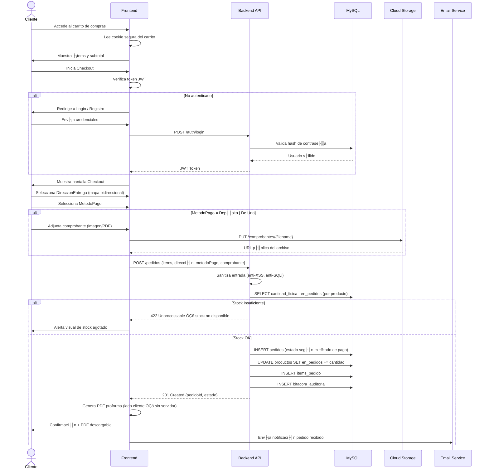

---

#### 6.3.2 HU-002 ┬À Asignaci├│n de Rutas y Generaci├│n de Gu├¡as

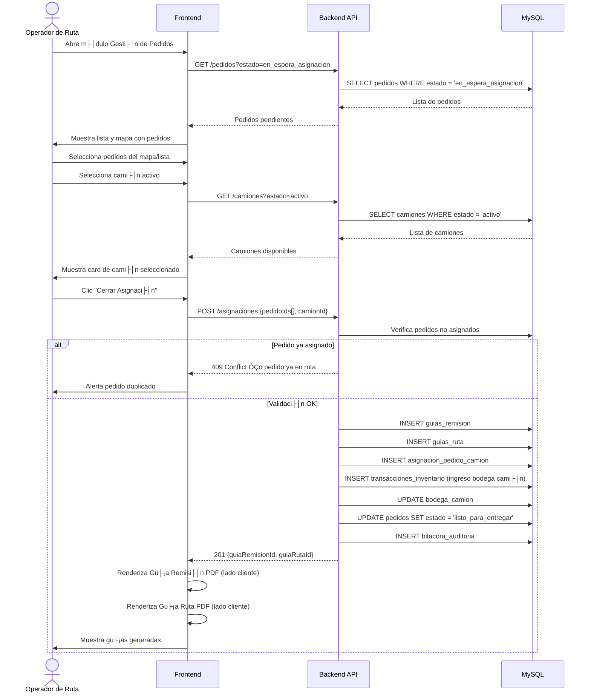

---

#### 6.3.3 HU-003 ┬À Ejecuci├│n de Entrega, Devoluci├│n y Facturaci├│n

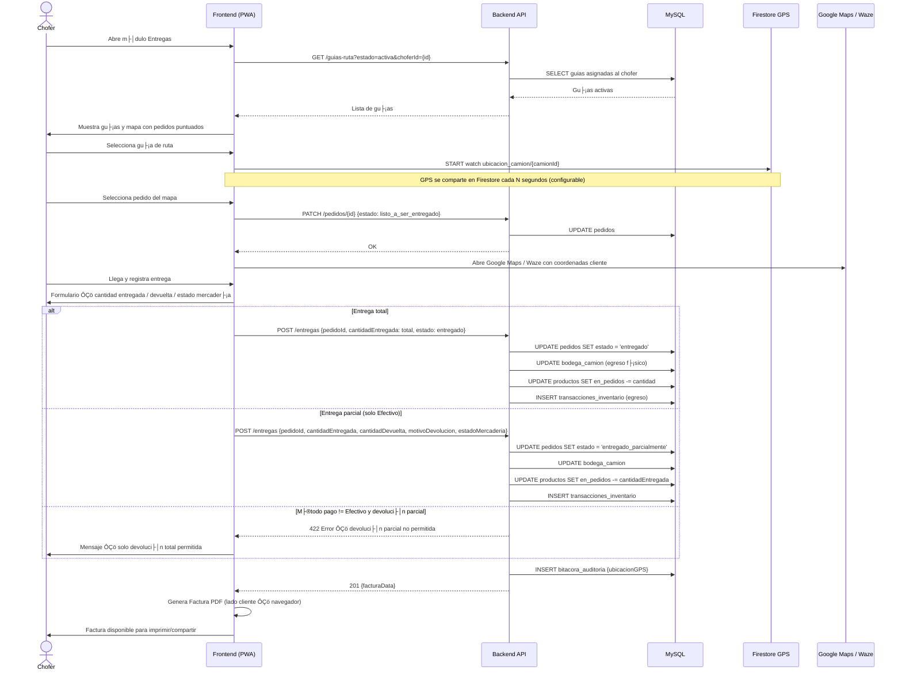

---

#### 6.3.4 HU-004 ┬À Aprobaci├│n Manual de Pagos con Comprobante

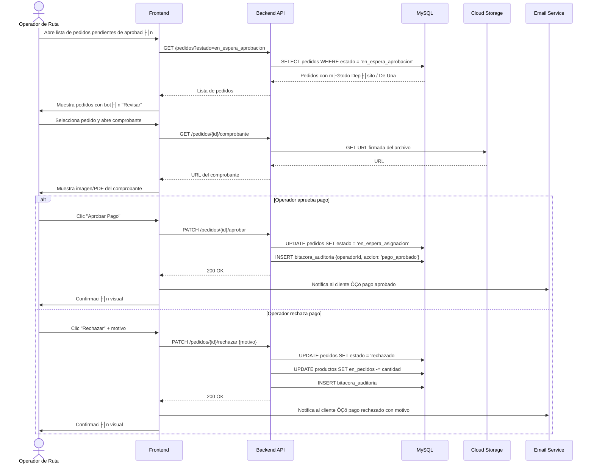

---

#### 6.3.5 HU-005 ┬À Cierre de Gu├¡as, Arqueo y Encerado de Bodega

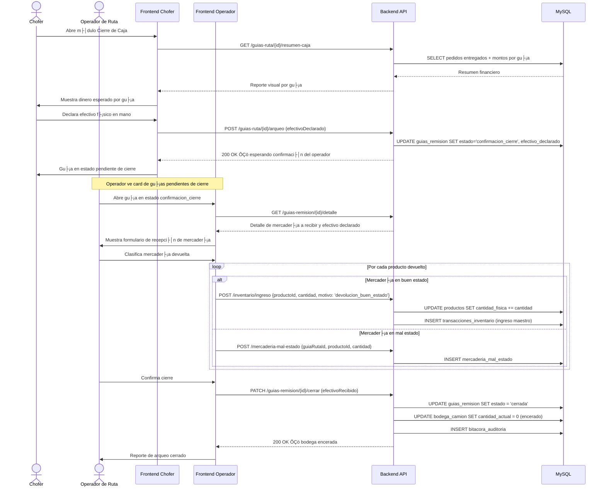

---

#### 6.3.6 HU-006 ┬À Filtros Temporales y de Estado Estilo Datadog

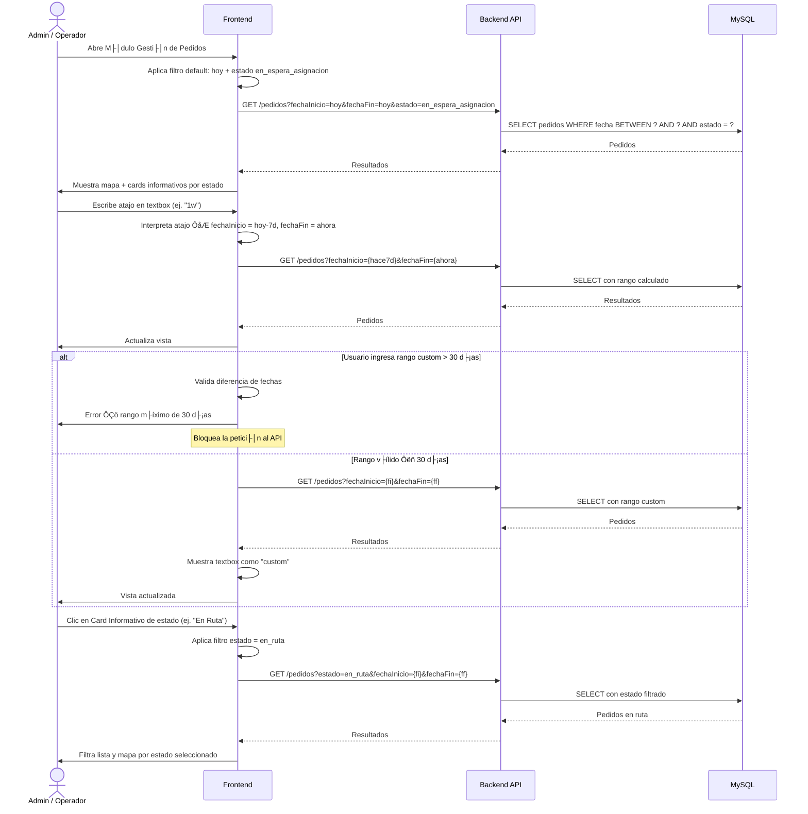

---

#### 6.3.7 HU-007 ┬À Gesti├│n del Carrito de Compras

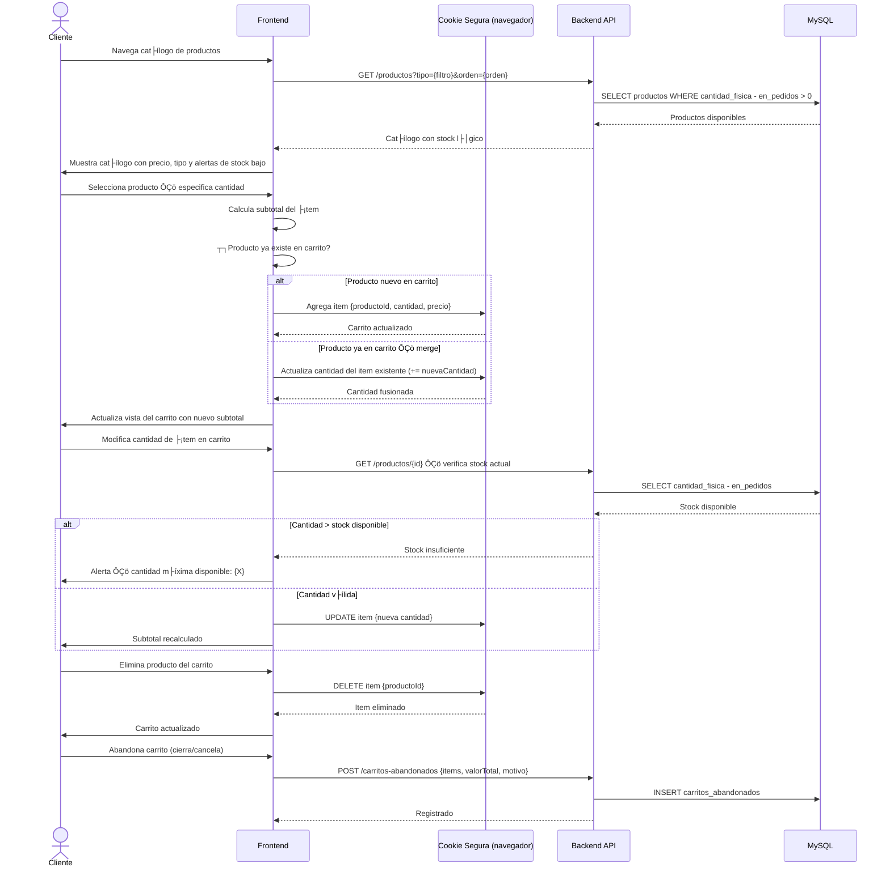

---

### 6.4 Diagramas de Colaboraci├│n ÔÇö HU-001 a HU-007

Cada diagrama muestra los objetos participantes y los **mensajes numerados** que se intercambian para resolver cada historia de usuario.

---

#### 6.4.1 HU-001 ┬À Colaboraci├│n ÔÇö Checkout y Liquidaci├│n de Pago

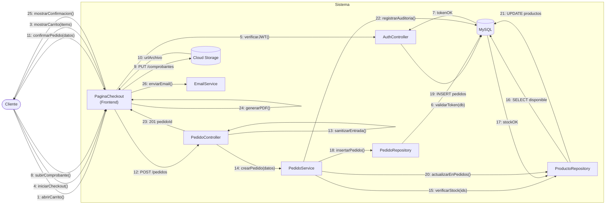

---

#### 6.4.2 HU-002 ┬À Colaboraci├│n ÔÇö Asignaci├│n de Rutas y Generaci├│n de Gu├¡as

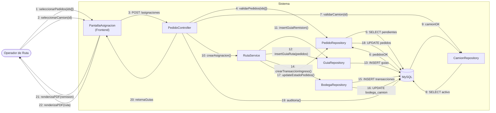

---

#### 6.4.3 HU-003 ┬À Colaboraci├│n ÔÇö Entrega, Devoluci├│n y Facturaci├│n

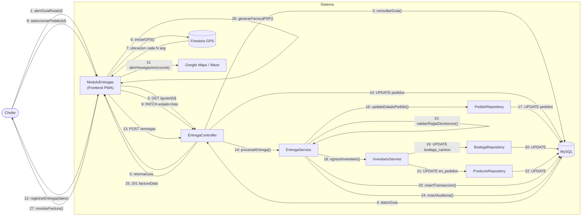

---

#### 6.4.4 HU-004 ┬À Colaboraci├│n ÔÇö Aprobaci├│n Manual de Pagos


---

#### 6.4.5 HU-005 ┬À Colaboraci├│n ÔÇö Cierre de Gu├¡as y Encerado de Bodega


---

#### 6.4.6 HU-006 ┬À Colaboraci├│n ÔÇö Filtros Temporales Estilo Datadog


---

#### 6.4.7 HU-007 ┬À Colaboraci├│n ÔÇö Gesti├│n del Carrito de Compras


---

### 6.5 Diagrama de Estado

Modela el **ciclo de vida completo de un Pedido**, desde su creaci├│n hasta su cierre.


---

### 6.6 Diagrama de Paquetes

Muestra la **arquitectura modular** del sistema con sus dependencias entre capas y componentes.


---

### 6.7 Diagrama de Entidad-Relaci├│n

Esquema completo de la **base de datos MySQL** con todas las tablas, campos clave y relaciones del sistema.


---

### 6.8 Diagrama de Flujo de Datos — Infraestructura GCP (Bajo Costo)

Arquitectura diseñada para **minimizar el costo mensual** en GCP. Se usan únicamente servicios con **capa gratuita generosa** o costo mínimo. La seguridad se gestiona con **HTTPS incluido en la URL de Cloud Run** y **JWT** en el backend, sin servicios de red adicionales pagos.

> **Estimado mensual:** ~$8–10 USD/mes (dominado por Cloud SQL `db-f1-micro`)

---

#### Nivel 0 — Contexto General

Vista de alto nivel: los cuatro actores acceden directamente a los servicios de Cloud Run por su URL pública con HTTPS incluido — sin Load Balancer ni firewall de pago.

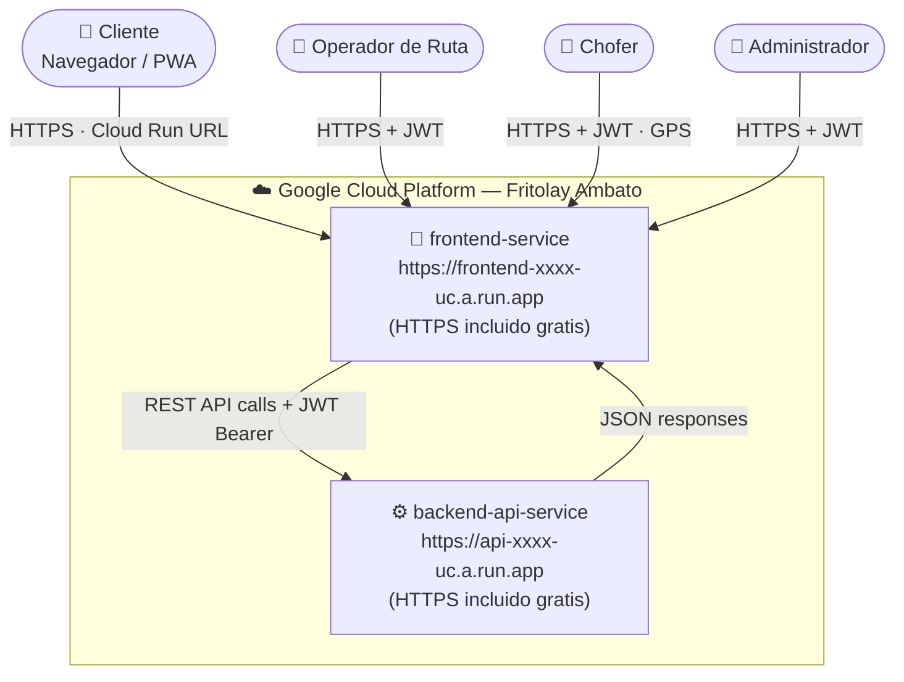

---

#### Nivel 1 — Flujo Detallado por Servicios (bajo costo)

Cada servicio muestra su costo mensual estimado y si aplica capa gratuita.

```mermaid
flowchart TD
    CLI(["👤 Cliente"])
    OPE(["👤 Operador / Admin"])
    CHO(["👤 Chofer"])

    subgraph CR["🐳 Cloud Run — $0 capa gratuita"]
        direction LR
        FE_SVC["📄 frontend-service\n*.run.app — HTTPS gratis\n(PWA · Service Worker · Blade)"]
        BE_SVC["⚙️ backend-api-service\n*.run.app — HTTPS gratis\n(Laravel API · JWT · SOLID)"]
    end

    subgraph SQL["🐬 Cloud SQL MySQL — ~$8/mes"]
        DB[("db-f1-micro · 1 vCPU · 614 MB\n10 GB SSD · Backups diarios\npedidos · inventario · guias\nauditoria · usuarios")]
    end

    subgraph FS["🔥 Firestore — $0 capa gratuita"]
        FS_GPS[("1 GB storage gratis\n50K lecturas/dia gratis\nubicaciones_camion GPS\nlat · lng · timestamp")]
    end

    subgraph GCS["🗄️ Cloud Storage — ~$0.02/GB/mes"]
        GCS_IMG[("Bucket: imagenes-productos\nAcceso publico · CDN gratis\nCache-Control: max-age=14400\n(4h en navegador — 0 costo extra)")]
        GCS_DOC[("Bucket: comprobantes-pago\nAcceso privado\nURL firmadas — Signed URLs")]
    end

    subgraph SM_BOX["🔑 Secret Manager — ~$0.06/mes"]
        SM["JWT_SECRET · DB_PASSWORD\nFIREBASE_KEY · MAIL_PASS\nGCS_SA_KEY"]
    end

    subgraph CICD["🔄 CI/CD — $0 GitHub Actions gratis"]
        direction LR
        GH["📁 GitHub\nRepositorio"]
        GHA["⚙️ GitHub Actions\nbuild · test · push\n2000 min/mes gratis"]
        AR["📦 Artifact Registry\n0.5 GB gratis\nImagenes Docker"]
    end

    subgraph EMAIL_BOX["✉️ Email — $0 Gmail SMTP"]
        GMAIL["Gmail SMTP\nsmtp.gmail.com:587\nApp Password en .env\n500 emails/dia gratis"]
    end

    subgraph FCM_BOX["🔔 Push Notifications — $0 FCM"]
        FCM["Firebase Cloud Messaging\nWeb Push / PWA\ncompletamente gratis"]
    end

    CLI -->|"HTTPS — URL *.run.app\nTLS incluido, sin LB"| FE_SVC
    OPE -->|"HTTPS + JWT Bearer"| FE_SVC
    CHO -->|"HTTPS + JWT Bearer\n+ GPS coords"| FE_SVC

    FE_SVC -->|"POST/GET/PATCH JSON\nAuthorization: Bearer JWT"| BE_SVC
    BE_SVC -->|"JSON response + Signed URL GCS"| FE_SVC

    BE_SVC -->|"Eloquent ORM queries\nTCP · VPC Connector"| DB
    DB     -->|"Result sets"| BE_SVC
    BE_SVC -->|"Firebase Admin SDK\nwriteDocument GPS"| FS_GPS
    FS_GPS -->|"onSnapshot realtime\nWebSocket — gratis"| FE_SVC

    BE_SVC   -->|"PUT multipart/form-data"| GCS_DOC
    GCS_DOC  -->|"Signed URL 15min TTL"| BE_SVC
    BE_SVC   -->|"URL publica guardada en MySQL"| GCS_IMG
    GCS_IMG  -->|"GET imagen\nCache-Control: 4h"| FE_SVC

    SM -->|"env vars en startup\ngratis hasta 6 secretos"| BE_SVC

    GH  -->|"push main\nworkflow trigger"| GHA
    GHA -->|"docker push"| AR
    AR  -->|"deploy --image\ngcloud run deploy"| FE_SVC
    AR  -->|"deploy --image\ngcloud run deploy"| BE_SVC

    BE_SVC -->|"Laravel Mail\nSMTP TLS"| GMAIL
    GMAIL  -->|"Email entregado"| CLI
    BE_SVC -->|"FCM HTTP v1 API"| FCM
    FCM    -->|"Web Push\nService Worker"| CLI
```

---

#### Nivel 2 — Flujo por Proceso de Negocio (bajo costo)

```mermaid
flowchart LR
    subgraph P1["🛒 Checkout"]
        direction TB
        A1["Cliente accede\nCloud Run URL HTTPS"]
        A2["FE llama BE API\nJWT en header"]
        A3["BE valida JWT\nsin servicio externo"]
        A4["Comprobante a GCS\nbucket docs privado"]
        A5["Pedido a Cloud SQL\nINSERT"]
        A6["Email via Gmail SMTP\ngratis"]
        A1 --> A2 --> A3 --> A4 --> A5 --> A6
    end

    subgraph P2["🚚 Tracking GPS"]
        direction TB
        B1["Chofer abre guia\nCloud Run URL"]
        B2["PWA activa GPS\nGeolocation API"]
        B3["Coords a Firestore\ngratis hasta 50K/dia"]
        B4["onSnapshot listener"]
        B5["Cliente ve mapa\nen tiempo real"]
        B6["FCM Push\npedido listo — gratis"]
        B1 --> B2 --> B3 --> B4 --> B5 --> B6
    end

    subgraph P3["📦 Imagenes — Cache sin costo"]
        direction TB
        C1["Admin sube imagen"]
        C2["Backend PUT GCS\nbucket publico"]
        C3["URL guardada en MySQL"]
        C4["Cliente pide imagen"]
        C5["En cache navegador?"]
        C6["HIT: 0 costo GCS\nservido localmente"]
        C7["MISS: GCS fetch\nCache 4h gratis"]
        C1 --> C2 --> C3 --> C4 --> C5
        C5 -->|"HIT"| C6
        C5 -->|"MISS"| C7
    end

    subgraph P4["🔄 Deploy — GitHub Actions"]
        direction TB
        D1["git push main\nGitHub gratis"]
        D2["GitHub Actions\n2000 min/mes gratis"]
        D3["docker build + test\nphp artisan test"]
        D4["docker push\nArtifact Registry"]
        D5["gcloud run deploy\nCloud Run revision"]
        D1 --> D2 --> D3 --> D4 --> D5
    end
```

---

#### Nivel 3 — Tabla de Costos Estimados

| Servicio GCP | Uso estimado | Capa gratuita | Costo/mes |
|---|---|---|---|
| **Cloud Run** (frontend + backend) | ~500K requests/mes | 2M requests gratis | **$0** |
| **Cloud SQL MySQL** `db-f1-micro` | Horario laboral | Sin capa gratuita | **~$8–10** |
| **Firestore** | GPS realtime, <1 GB | 1 GB + 50K reads/dia gratis | **$0** |
| **Cloud Storage** | ~5 GB imagenes + docs | 5 GB gratis primeros 90 dias | **~$0.10** |
| **Secret Manager** | 5 secretos | 6 secretos gratis/mes | **$0** |
| **Artifact Registry** | 2 imagenes Docker | 0.5 GB gratis | **$0** |
| **GitHub Actions** | CI/CD build + deploy | 2000 min/mes gratis | **$0** |
| **Gmail SMTP** | Notificaciones email | 500 emails/dia gratis | **$0** |
| **FCM** | Push notifications PWA | Completamente gratis | **$0** |
| **HTTPS / TLS** | Incluido en Cloud Run URL | Incluido siempre | **$0** |
| | | **Total estimado** | **~$8–10/mes** |

> [!TIP]
> **Optimizacion de costo:** Configura Cloud SQL con parada programada fuera de horario laboral (22h–6h) para reducir el costo hasta **~$3–5/mes**.

---

#### Nivel 4 — Seguridad con Cloud Run URL (sin servicios pagos)

La seguridad del sistema se implementa dentro de la propia aplicacion Laravel — sin Cloud Armor, sin IAP, sin Load Balancer.

```mermaid
flowchart LR
    subgraph Usuario["👤 Usuario — cualquier rol"]
        BROWSER["Navegador / PWA"]
    end

    subgraph CR_SEC["🔒 Seguridad en Cloud Run — gratis"]
        direction TB
        TLS["TLS 1.3 HTTPS\nincluido en *.run.app\nsin Load Balancer"]
        JWT_V["JWT Validation\nMiddleware Laravel\nsin servicio externo"]
        VAL["Validacion inputs\nanti-XSS · anti-SQLi\nLaravel FormRequest"]
        HASH["bcrypt password hash\nLaravel Hash facade"]
        CORS["CORS configurado\nen Laravel\nsolo dominios propios"]
    end

    subgraph DATA["💾 Datos protegidos"]
        SM2["Secret Manager\nJWT_SECRET · DB_PASS\n~$0.06/mes"]
        DB2[("Cloud SQL MySQL\nVPC privado\nsin IP publica")]
    end

    BROWSER -->|"HTTPS *.run.app"| TLS
    TLS --> JWT_V
    JWT_V --> VAL
    VAL --> HASH
    HASH --> CORS
    CORS -->|"Solo si JWT valido\ny rol autorizado"| DB2
    SM2 -->|"Secretos en env vars\nal arrancar contenedor"| JWT_V
```
