## Sistema E-commerce y Gestión de Pedidos "Fritolay Ambato" 1. Objetivos del Proyecto Objetivo General

- Construir una aplicación que debe ser web y compatible con PWA.

- Desarrollar un sistema capaz de captar pedidos, ver en tiempo real su entrega, gestionar pedidos, guías de remisión de camiones y rutas.

## Objetivos Específicos de Arquitectura

- La aplicación debe estar en la nube y ser una aplicación orientada a microservicios y dockers.

- Ejecución en Desarrollo: Aunque la arquitectura es nativa de la nube, debe garantizarse que la aplicación también se pueda ejecutar en el local para el desarrollo de la misma.

- Debe existir separación estricta entre front end, back end, MySQL para datos transaccionales y Firestore para datos de geolocalización del camión.

- La aplicación debe ser desarrollada en Laravel con PHP tanto el backend y el front end y de forma independiente en el mismo repositorio de Git.

- Para los análisis y construcción de la aplicación debe usar pony tail (https://github.com/dietrichgebert/ponytail) para optimizar el uso de tokens.

- Aplicar los principios de SOLID en la construcción con agentes de IA para la aplicación, en especial el de responsabilidad única, y aplica también la Programación Orientada a Objetos.

- Las entradas del REST API o backend deben ser validadas para no recibir ataques de XSS o SQL Injection.

- Agregar test en el desarrollo del backend y front end

- 2. UI/UX e Identidad Visual

- Diseño y Usabilidad: Todo el sistema debe estar enfocado en un diseño minimalista y adaptable, priorizando la usabilidad y un buen diseño.

- Identidad Corporativa: La página debe tener los colores institucionales donde debe existir una combinación entre estas dos páginas https://www.lays.com/ y https://www.fritolay.com/ que son sus productos estrellas.

- 3. Seguridad, Gestión de Estado y Variables de Entorno (Environment)

- Autenticación API y JWT: Implementar JWT y usar Secret Manager en GCP para resguardar los secretos de infraestructura y JWT. El sistema utiliza `config('jwt.secret')` de forma estricta evitando llamadas directas a `env()` en ejecución para permitir el soporte de `config:cache`.

- Funcionalidad "Recuérdame" y Cookies Seguras: Opción de "Recuérdame" (Remember Me) en el formulario de inicio de sesión. Manejo de tokens y sesiones mediante cookies seguras configuradas con las directivas `HttpOnly`, `Secure` (para HTTPS) y `SameSite` (`Strict`/`Lax`) para prevenir vulnerabilidades XSS y CSRF.

- Políticas de Expiración de Sesión por Rol (TTL Dinámico):
  - **Límite General (Sin Recuérdame):** La sesión para todos los usuarios (Administrador, Operador, Chofer, Cliente) caduca exactamente en **1 hora** (60 minutos).
  - **Límite Extendido (Con "Recuérdame" Activo):**
    - **Administrador y Operador:** **8 horas** (equivalente a 1 jornada laboral continua).
    - **Chofer:** **12 horas** (cobertura completa de la jornada de ruta extendida).
    - **Cliente:** **30 días** (persistencia prolongada para experiencias de e-commerce).

- Gestión de Contraseñas: Usar hash Bcrypt para comparación de contraseñas de forma segura. Todas las cuentas iniciales de entorno local y GCP Cloud SQL cuentan con el estándar unificado `password123`.

- Recuperación de Credenciales: Todos los usuarios pueden recuperar sus credenciales mediante su correo electrónico con un PIN aleatorio (por defecto 6 dígitos, configurable por variable de entorno).

- Mensajería: Configuración de email para mensajería mediante variables de entorno en el backend.

- Persistencia Temporal del Carrito: Cookies seguras expirables para mantener el estado del carrito.

- Caché: Las imágenes (de GCS) deben guardarse en caché del lado del cliente/navegador con una duración expirable (por defecto 4 horas).


## 4. Roles y Permisos

- Rol Administrador: Este usuario es capaz de crear, inactivar o resetear contraseñas de usuarios tipo empleados u otro rol de administración. Pueden ver el Módulo Dashboard de Gestión de Pedidos. Tendrá acceso al visor de facturas y exportación PDF.

- Rol Operador de Ruta: Este usuario gestionará los pedidos a entregar, como la asignación de los pedidos para un camión, aprobación de pedidos, asignación de rutas con la creación de guía de ruta y la guía de remisión, visor de facturas y cierre de caja del camión. Prácticamente estará usando el Módulo de Gestión de Pedidos.

- Rol Chofer: Este usuario es el chofer del camión, él tendrá accesos a su ruta asignada del Módulo Entregas.

- Rol Cliente: Una funcionalidad que no necesariamente debe ser autentificada es la de agregar productos al carrito de compras, la página de inicio debe ser esta y debe incluir inicio de sesión en el home page.

- 5. Módulos del Sistema y Lógica de Negocio

- 5.1. Dashboard 1: Estadísticas y KPIs (Módulo Dashboard de Gestión de Pedidos)

- Indicadores: Efectividad de entrega por camión, pedidos entregados, efectividad de entrega general y tiempos de entrega promedio.

- Ventas: Debe mostrar las ventas por día, por sector y por camión.

- Recaudación: Recaudación total y separado en efectivo, depósitos, cheques, De Una, Tarjeta de Crédito y Tarjetas de Débito.

- Carritos Abandonados: Compras no concretadas que el usuario haya creado el carrito y haya cancelado la compra. Al cancelar, debe poner opciones de por qué cancela el pedido; las comunes son: No lo necesito, Era una proforma, Pedido Equivocado, No es lo que requiero, y otros.
  - **Badge del Carrito:** El ícono del carrito en la barra de navegación muestra el número de **ítems únicos** (productos distintos), NO la suma total de unidades.
  - **Vaciado con Registro de Abandono:** Cuando el usuario hace clic en "Vaciar Carrito", el sistema debe mostrar un modal de confirmación (SweetAlert) y, si acepta, registrar automáticamente un `POST /api/carritos-abandonados` con el `valor_total` del carrito y el motivo `'Carrito vaciado manualmente por el usuario'` antes de limpiar la cookie.
  - **Vaciado al Finalizar Compra:** Al completar un pedido exitosamente, el sistema debe vaciar automáticamente el carrito (`CarritoManager.vaciar()`) antes de redirigir a la pantalla de confirmación. No se registra abandono en este caso (el pedido fue concretado).


- Control de Stock: En el dashboard puede consultar el stock de los productos de las bodegas, de la bodega master y de los vehículos. Para el inventario de los vehículos, el sistema debe omitir (filtrar) aquellos productos cuya cantidad física sea 0 para mantener la interfaz limpia y enfocada en la mercadería real a bordo.

## 5.2. Módulo de Gestión de Pedidos (Operativo y Administrativo)

- Rastreo en Vivo: La última ubicación estará siempre visible en el Módulo de Gestión de Pedidos.

- Filtros de Fechas (Estilo Datadog): Se debe presentar un mapa el cual debe usar filtros de fechas especificando inicio y fin, este inicio y fin no puede ser mayor a un mes. Usar un textbox donde el usuario pueda escribir y las fechas deben cambiar (límite es 30 días por consulta):

- o Hoy = Fecha de inicio y fin deben estar configuradas como del día de hoy.

- o Ayer = Fechas inicio y fin del día de ayer.

- o 1d, 2d... 30d = Fechas configuradas de inicio 1 a 30 días antes de la fecha y hora actual, y fecha final la fecha y hora actual.

- o 1w, 2w, 3w y 4w = Fechas configuradas de inicio 1 a 4 semanas antes, y fecha final la fecha y hora actual.

- o Cuando haga una consulta custom, el cuadro de texto debe aparecer como custom, la validación que no debe pasarse de 30 días.

- Filtros por Estado: Usar también filtros de estado y por defecto debe aparecer los pedidos en espera de asignación de ruta y los camiones que no tienen asignado rutas.

- Cards Informativos: Debe tener unos cards como tipo informativo de la cantidad de pedidos por estado, y cuando dé un clic en el card este filtre por el estado. Los estados son: En espera de asignación de ruta, No entregado, Entregado Parcialmente, Entregados, Pendiente de Aprobación, Listo Para entregar, En Ruta, Todos.

- Ordenamiento: Los pedidos pueden ordenarse por: antigüedad del pedido (Por defecto), nombre del cliente y valor del pedido.

- Descuentos: El usuario puede asignar descuentos a clientes por tipo de pago, una sola configuración que aplicará en las siguientes compras. El usuario puede configurar descuentos a tipos de pagos para todos los clientes como un descuento adicional, este tiene que tener una fecha de caducidad.

- Asignación de Ruta y Bodegas Móviles:

- o Puede seleccionar del mapa o de una lista de pedidos en espera de asignación de ruta para ir asignando los pedidos a un camión activo.

- o Este también tendrá un card donde se ven los vehículos que se están asignado los pedidos.

- o La asignación termina cuando el gestor de ruta cierre la asignación y esto crea una guía de remisión visual igual a las sugeridas por el SRI y una guía de ruta con los negocios a visitar, con montos a cobrar y tipos de pagos.


- o Cuando se genere debe crear una transacción de ingreso a la bodega del camión. Cada camión administrará su bodega con transacciones de ingresos y egresos en la base de datos.

- o El módulo debe ser capaz de gestionar los vehículos, crear camiones, cambiar de estado por temas de mantenimiento y averías, y asignar choferes los cuales son usuarios tipo chofer.

- Aprobación de Pagos: Aprobar pedidos con tipo de pagos de depósito y de la aplicación De Una. Cuando un usuario haya hecho un pedido con estos pagos debe pasar por una aprobación y los requisitos son el comprobante de depósito para validar el pago. El pedido está en estado en espera por aprobación de pago. Los pagos de TC, TD y Efectivo estos se aprueban automáticamente y se dejan en espera de asignación de ruta.

- Cierres de Guías y Arqueo (Encerar Bodega):

- o Cuando el chofer haga su arqueo de caja, este aparecerá en estado de confirmación de cierre en la guía y en el camión.

- o En la página principal de la gestión debe aparecer un card de guías pendientes por cerrar.

- o El gestor confirma la recepción de la mercadería devuelta y el dinero para cerrar la caja y encerar la bodega (dejar el inventario del camión en cero).

- o Si los productos están en buen estado, debe actualizar el inventario master de los productos y generar transacciones de ingreso por mercadería en buen estado.

- o La de mal estado no debe ingresar, esta debe registrarse como mercadería mal estado en otra tabla.

- Listado de Facturas (Simuladas): Pantalla con filtros donde Administradores/Operadores visualizan facturas y pueden exportar a PDF (procesado del lado del cliente).

## 5.3. Módulo de Entregas (Chofer)

- Inventario Físico: Debe ser capaz de ver los productos del camión existentes en el camión e ir actualizando el inventario.

- Mapas y Navegación: Al momento de seleccionar la guía debe desplegarse el mapa donde estarán puntillado los pedidos a entregar. Estas deben permitir ordenar por el punto más cercano de la ubicación actual y también por la antigüedad que tiene el pedido solicitado, el ordenamiento debe realizarlo el front end. Cuando ocurra la selección del pedido, este pasará a estado Listo a ser entregado. Este debe ser seleccionado en el mapa de la aplicación web y cuando ocurra la aplicación direccionará a Google Maps o a Waze la ubicación y el chofer pueda navegar en estos mapas de aplicaciones externas y dirigirse a la ubicación de entrega.

- Tracking Constante: Al momento de seleccionar la guía debe compartirse la ubicación y esta debe ser guardada en Firestore cada cierto tiempo configurado en un environment.


- Ejecución y Facturación: Cuando se entregue un pedido de forma parcial o individual, generar una factura muy parecida a las autorizadas por el SRI como simulación. Crear una transacción para disminuir la cantidad fsica y la cantidad en pedido.

- Devoluciones: Las devoluciones parciales solo aplican en pedidos en efectivo, si el pago es de otro tipo la devolución es total.

- Cierre de Caja y Desglose Financiero: Guías pendientes de cierre, un reporte visual por cada guía de ruta. Esta pantalla (Mis Rutas Asignadas) debe mostrar un Desglose Financiero claro, calculando y separando la recaudación en Transferencias/Tarjetas y destacando prominentemente el 'Total Recaudado en Efectivo' esperado, ya que este es el valor crítico que el chofer debe cuadrar en su arqueo.

## 5.4. Módulo de Clientes (E-commerce)

- Catálogo y Caché: Los productos deben mostrarse como una página e-commerce de fácil uso. La foto esta debe obtenerse de GCS y de ser posible que se guarde en caché del lado del cliente con una duración de 4 horas para ahorrar costos de GCS, el tiempo de permanencia de caché debe ser configurable.

- Detalles y Alertas: Mostrar información del producto como peso, tipo de producto (Cheetos, Papas, Doritos, Tostitos, etc.), y una breve descripción. También información de descuento y, cuando el producto se acerque a un porcentaje de agotamiento de stock, mostrar las unidades disponibles. Cuando no tenga stock este debe mostrar información que no hay ítems disponibles y solo va a permitir ver información del producto. Los productos pueden filtrarse por tipo de producto y ordenarse por tipo, por precio, por nombre.

- Carrito de Compras: Un usuario sin autentificarse o autentificado puede seleccionar productos y subir al carrito de compras. Cuando el usuario esté por seleccionar producto al carrito de compras, antes debo especificar la cantidad y debe mostrarme el subtotal. Si escoge el mismo producto debe realizar un merge aumentando la cantidad. Puede modificar el carrito de compras, eliminar productos, agregar cantidades o disminuir.

- Checkout y Autenticación: Cuando quiera hacer el checkout debe pedir autentificarse o crear un usuario.

- Inventario Lógico: En el inventario master habrá una funcionalidad, cuando finalice el checkout el inventario debe tener tres campos: CantidadFisica, EnPedidos y la disponible será la cantidad fsica menos la cantidad en pedidos.

- Gestión de Direcciones y Mapa (Bidireccional):

- o Los datos requeridos para el cliente es información de facturación, y puede registrar más de una dirección con ubicación del mapa.

- o Por defecto debe usar la ubicación actual, mover el punto de entrega y su dirección debe aparecer en el cuadro de texto.

- o También debe permitir buscar una dirección o coordenadas con un cuadro de texto. Se ha implementado un sistema de autocompletado predictivo (dropdown) que despliega las mejores coincidencias incluyendo ciudad, provincia y país. Además, utilizando la fórmula Haversine, el sistema calcula la distancia en kilómetros desde la ubicación actual del usuario hasta los resultados sugeridos y los ordena por cercanía, replicando la experiencia de Google Maps.
- o Al hacer clic en cualquier punto dentro del mapa interactivo, el sistema debe mover el marcador automáticamente a esas coordenadas, realizar una geocodificación inversa (reverse geocoding) y actualizar el campo de texto con la dirección aproximada correspondiente.

- o Puede seleccionar la dirección por defecto que aparecerá en los pedidos. El usuario debe permitir cambiar con otra o crear, editar o eliminar (opción de borrado disponible junto a cada dirección guardada) direcciones en el proceso de ingreso de datos o checkout. 
- o **Soft Delete para Direcciones:** Las direcciones NUNCA se eliminan físicamente de la base de datos (no se permite el uso de sentencias DELETE puras). En su lugar, se utiliza un borrado lógico (soft delete) cambiando el flag `estado` a `false` o desactivado.
- o El sistema debe validar estrictamente que el usuario no pueda finalizar la compra (el botón de Finalizar Compra se deshabilita y se genera un modal de advertencia) si no tiene ninguna dirección seleccionada.
- o **Estándar de Interfaz (Notificaciones):** Queda estrictamente prohibido el uso de ventanas de alerta nativas del navegador (`alert()`). Todas las validaciones, notificaciones de éxito y errores en todos los formularios deben presentarse utilizando la librería **SweetAlert** (`Swal.fire`).

- Liquidación de Pago: En el proceso de check out debe aparecer el detalle de los productos y cálculo de descuentos, impuesto IVA, total y sub total. Siempre debe mostrar el total del pedido y el ahorro por los descuentos configurados.

- Pasarela (Simulada): Simular el pago de tarjeta de débito, de crédito y el QR de De Una para pagos con De Una.

- Historial y PDF (Lado del Cliente): Módulo de historial de pedidos pasados. Generación de facturas en PDF procesada estrictamente utilizando los recursos del navegador/dispositivo del usuario para no recargar el servidor.

- Rastreo del Cliente: El cliente puede ver y recibir una notificación de la aplicación si el chofer eligió el pedido como "Listo para entregar". El cliente solo verá la ubicación del camión cuando el chofer seleccione el pedido y este pasará a este estado. Puede visualizar en el mapa la ubicación, el refresco de la ubicación del mapa será configurada en el archivo de environment.

## Análisis Previo del Sistema

A continuación, se detalla el análisis estructurado de la información proporcionada para establecer el contexto de la aplicación.

## Actores Involucrados

- Administrador: Gestiona usuarios (crear, inactivar, resetear contraseñas), visualiza el Dashboard de KPIs y tiene acceso a visores de facturas y exportación PDF.

- Operador de Ruta: Gestiona pedidos, aprueba pagos, asigna rutas a camiones, genera guías de remisión/rutas y supervisa el cierre de caja de camiones.

- Chofer: Gestiona la entrega en ruta, usa navegación en vivo, registra entregas/devoluciones, genera facturas simuladas y realiza su arqueo/cierre de caja.

- Cliente (Invitado/Registrado): Explora el catálogo, gestiona el carrito de compras, realiza el checkout (requiere registro), sube comprobantes y rastrea su pedido.

## Procesos Principales

- Exploración de catálogo y gestión de carrito de compras.

- Checkout, cálculo de totales y selección de método de pago.

- Aprobación de pagos (manual para depósitos/De Una, automática para el resto).

- Asignación de rutas y generación de guías (remisión y ruta).

- Navegación GPS, entrega de pedidos y facturación in situ.

- Cierre de caja, encerado de bodega móvil y actualización de inventario máster.

- Visualización de métricas y filtrado de datos (máximo 30 días).


## Reglas de Negocio Principales

- RN-A: Los pedidos pagados con Depósito o "De Una" requieren carga de comprobante y aprobación manual por el Operador de Ruta. Los pagos con TC, TD o Efectivo se aprueban automáticamente.

- RN-B: Las devoluciones parciales de mercadería durante la entrega solo están permitidas si el método de pago original es Efectivo. Para otros métodos, la devolución debe ser total.

- RN-C: Las consultas con filtros de fechas personalizadas tienen un límite estricto de máximo 30 días de rango entre la fecha de inicio y fin.

- RN-D: La mercadería devuelta en buen estado incrementa el inventario máster. La mercadería en mal estado se registra en una tabla separada y no afecta el stock disponible de venta.

## Fórmulas de Cálculo

- Inventario Lógico: \$CantidadDisponible = CantidadFisica - EnPedidos\$.

- Liquidación de Pedido: \$TotalPedido = (Subtotal - Descuentos) + ImpuestoIVA\$.

## Excepciones

- Intentar buscar datos con un rango de fechas mayor a 30 días.

- Intentar realizar una devolución parcial en un pedido pagado con Tarjeta de Crédito/Débito.

- Intentar agregar un producto al carrito cuando la cantidad solicitada supera la \$CantidadDisponible\$.

## Evidencias Requeridas

- Guías de Remisión y Guías de Ruta.

- Comprobantes de pago (imágenes/PDF subidos por el cliente).

- Facturas simuladas en formato PDF (procesadas del lado del cliente).

- Bitácoras de auditoría y tracking GPS guardado en Firestore.

## Reportes Necesarios

- Dashboard de KPIs (Efectividad, Ventas, Recaudación, Carritos Abandonados, Stock).

- Visor y exportación de Facturas.

- Reporte de Cierre de Caja por camión.

Épica: Módulo de Clientes (E-commerce)

## HU-001 - Liquidación de Pago y Checkout

Como: Cliente registrado Quiero: Visualizar el detalle de mi carrito, aplicar descuentos, calcular el IVA y elegir un método de pago Para: Completar mi compra con total claridad sobre los montos facturados y asegurar el stock de mis productos. Prioridad: Alta


## Reglas de negocio

- RN-01: El sistema debe calcular el total utilizando la fórmula \$TotalPedido = (Subtotal - Descuentos) + ImpuestoIVA\$.

- RN-02: Si el cliente elige "Depósito" o "De Una", debe obligatoriamente adjuntar un comprobante. El pedido quedará en estado "En espera por aprobación".

- RN-03: Al finalizar el checkout, el inventario del producto debe actualizarse afectando el campo EnPedidos.

## Criterios de aceptación en Gherkin

Característica: Checkout y Liquidación de compras

Escenario: Flujo principal exitoso con pago en efectivo Dado que el cliente tiene productos en su carrito de compras Y se encuentra autenticado en el sistema Cuando procede a la pantalla de checkout y selecciona "Efectivo" como método de pago Entonces el sistema calcula y muestra el \$TotalPedido\$ Y el sistema registra el pedido en estado "En espera de asignación de ruta" Y el sistema actualiza el inventario sumando la cantidad solicitada al campo EnPedidos.

Escenario: Validación obligatoria de comprobante para depósito Dado que el cliente selecciona "Depósito" en el checkout Cuando intenta finalizar el pedido sin adjuntar un documento Entonces el sistema bloquea la acción Y muestra un mensaje de error "Debe adjuntar el comprobante de depósito para continuar".

Escenario: Excepción por datos incompletos en la dirección Dado que el cliente se encuentra en la pantalla de checkout Cuando no selecciona ni registra una dirección de entrega válida en el mapa bidireccional Entonces el botón de "Finalizar Compra" se deshabilita Y se genera una alerta visual indicando "Dirección de entrega obligatoria".

## Datos o campos requeridos

| Campo | Tipo de dato | Obligatorio | Validación |
| --- | --- | --- | --- |
|   |   |   | Valores permitidos: |
| MetodoPago | Lista desplegable | Sí | Efectivo, Depósito, De |
|   |   |   | Una, TC, TD |
| Comprobante | Archivo | Condicional | Obligatorio si MetodoPago |
|   | (Imagen/PDF) |   | es Depósito o De Una |
| DireccionEntrega Coordenadas/Texto Sí |   |   | Debe existir en la base o |
|   |   |   | seleccionarse del mapa |

## Dependencias

- Historia o módulo relacionado: Módulo de Gestión de Direcciones y Mapa Bidireccional; Módulo de Autenticación de Usuarios.

## Evidencias esperadas


- Registro generado en la base de datos MySQL (Tabla de Pedidos).

- Documento o archivo adjunto guardado en Google Cloud Storage (GCS).

- Bitácora de auditoría detallando la fecha, hora y usuario que generó el pedido.

Épica: Módulo de Gestión de Pedidos

## HU-002 - Asignación de Rutas y Generación de Guías

Como: Operador de Ruta Quiero: Seleccionar pedidos en espera y asignarlos a un camión activo Para: Generar automáticamente la guía de remisión, la guía de ruta y registrar el ingreso de inventario en la bodega móvil del vehículo. Prioridad: Alta

## Reglas de negocio

- RN-01: Solo los camiones en estado "Activo" pueden recibir asignaciones de pedidos.

- RN-02: Un pedido no puede asignarse a más de un camión simultáneamente.

- RN-03: Al cerrar la asignación, se genera una transacción automática de ingreso desde la bodega máster a la bodega del camión seleccionado.

## Criterios de aceptación en Gherkin

Característica: Asignación de pedidos a camiones

Escenario: Flujo principal exitoso de asignación Dado que existen pedidos en estado "En espera de asignación de ruta" Y el Operador de Ruta tiene un camión "Activo" seleccionado Cuando asigna los pedidos y hace clic en "Cerrar Asignación" Entonces el sistema genera una Guía de Remisión visual Y genera una Guía de Ruta con los negocios, montos y tipos de pago Y crea una transacción de ingreso de inventario en la bodega del camión.

Escenario: Prevención de registros duplicados Dado que un pedido con ID "PED-123" ya fue asignado al "Camión A" Cuando el Operador de Ruta intenta asignarlo al "Camión B" Entonces el sistema rechaza la operación Y muestra una alerta "El pedido ya se encuentra en ruta con otro vehículo".

Escenario: Permisos según el rol del usuario Dado que un usuario con rol "Chofer" inicia sesión en el sistema Cuando intenta acceder a la pantalla de Asignación de Rutas Entonces el sistema deniega el acceso Y redirige al usuario a su Módulo de Entregas con el mensaje "No tiene permisos para esta acción".

## Datos o campos requeridos

| Campo | Tipo de | Obligatorio | Validación |
| --- | --- | --- | --- |
|   | dato |   |   |
| ID_Pedido Entero |   | Sí | Debe existir y estar en estado "En espera |
|   |   |   | de asignación" |
| ID_Camion Entero |   | Sí | Debe existir y estar en estado "Activo" |


## Dependencias

- Historia o módulo relacionado: Aprobación de Pagos (solo llegan pedidos aprobados o automáticos); Módulo de Autenticación.

## Evidencias esperadas

- Registro generado: Guía de Remisión y Guía de Ruta en MySQL.

- Transacción de inventario en la base de datos de bodegas móviles.

- Bitácora de auditoría con la trazabilidad de la asignación (Operador, Camión, Fecha).

Épica: Módulo de Entregas (Chofer)

## HU-003 - Ejecución de Entrega, Devolución y Facturación

Como: Chofer Quiero: Registrar la entrega parcial o total de un pedido en la ubicación del cliente Para: Descontar el inventario fsico del camión y generar la factura simulada en formato PDF. Prioridad: Alta

## Reglas de negocio

- RN-01: Si el pedido fue pagado con Efectivo, el chofer puede registrar una entrega parcial (devolución parcial).

- RN-02: Si el pedido fue pagado por métodos distintos a Efectivo, cualquier devolución debe ser obligatoriamente total.

- RN-03: Al confirmar la entrega, la factura PDF debe procesarse estrictamente del lado del cliente (navegador/dispositivo) para no recargar el servidor.

## Criterios de aceptación en Gherkin

Característica: Entrega de pedidos y facturación

Escenario: Flujo principal exitoso de entrega total Dado que el Chofer se encuentra en la ubicación del cliente Y el pedido está en estado "Listo a ser entregado" Cuando marca el pedido como "Entregado totalmente" Entonces el sistema descuenta la cantidad fsica del inventario del camión Y descuenta la cantidad en pedido del inventario Y genera

automáticamente la factura en PDF procesada en el navegador.

Escenario: Excepciones establecidas por la normativa (Devolución parcial no permitida) Dado que el pedido fue pagado con "Tarjeta de Crédito" Cuando el Chofer intenta registrar una devolución parcial de mercadería Entonces el sistema bloquea la entrada de cantidades menores al total Y muestra el mensaje de error "Las devoluciones parciales solo aplican para

pagos en efectivo. Proceda con devolución total o entrega completa."

Escenario: Cálculo automático en entrega parcial (Efectivo) Dado que un pedido de 10

unidades fue pagado en Efectivo Cuando el Chofer registra la entrega de 8 unidades y 2 unidades como devolución Entonces el sistema actualiza el valor a cobrar basado en las 8 unidades Y genera la factura únicamente por el valor recalculado de los artículos entregados Y el estado del pedido cambia a "Entregado Parcialmente".

## Datos o campos requeridos


| Campo | Tipo de | Obligatorio | Validación |
| --- | --- | --- | --- |
|   | dato |   |   |
| CantidadEntregada Entero |   | Sí | Debe ser mayor a 0 y menor o igual |
|   |   |   | a lo solicitado |
| MotivoDevolucion Texto |   | Condicional | Obligatorio si CantidadEntregada < |
|   |   |   | CantidadSolicitada |
| EstadoMercaderia Lista |   | Condicional | Valores: Buen estado, Mal estado |
|   |   |   | (si hay devolución) |

## Dependencias

- Historia o módulo relacionado: Módulo de Navegación GPS (Waze/Google Maps); Inventario Físico de Camiones.

## Evidencias esperadas

- Reporte: Factura simulada generada en PDF.

- Registro de transacción restando el inventario fsico del camión.

- Bitácora de auditoría detallando la ubicación GPS (Firestore) al momento de marcar la entrega.

Épica: Módulo de Gestión de Pedidos (Operativo)

## HU-004 - Aprobación Manual de Pagos con Comprobante

Como: Operador de Ruta Quiero: Revisar y aprobar los pedidos que fueron pagados mediante Depósito o la aplicación "De Una" Para: Validar la legitimidad del pago mediante el comprobante antes de que el pedido pase a la fase de asignación de ruta. Prioridad: Alta

## Reglas de negocio

- RN-01: Los pedidos realizados con pagos de Tarjeta de Crédito (TC), Tarjeta de Débito (TD) y Efectivo se aprueban automáticamente y pasan directo a espera de asignación de ruta.

- RN-02: Los pedidos con métodos de pago "Depósito" o "De Una" deben permanecer en estado "En espera por aprobación de pago" hasta que un operador valide el comprobante.

## Criterios de aceptación en Gherkin

Característica: Aprobación de pagos en pedidos

Escenario: Flujo principal exitoso de aprobación manual Dado que un pedido se encuentra en estado "En espera por aprobación de pago" Y el cliente adjuntó el comprobante de depósito Cuando el Operador de Ruta revisa el documento y selecciona "Aprobar Pago" Entonces el


sistema cambia el estado del pedido a "En espera de asignación de ruta" Y genera un registro en la bitácora de auditoría detallando la acción.

Escenario: Excepción por método de pago de aprobación automática Dado que un cliente finaliza un checkout con método de pago "Efectivo" Cuando el sistema procesa la orden Entonces el sistema aprueba automáticamente el pedido sin requerir intervención del operador Y lo coloca directamente en la lista de pedidos listos para asignación de ruta.

## Datos o campos requeridos

| Campo Tipo de dato ID_Pedido Entero EstadoActual Texto Archivo | Obligatorio Sí Sí | Validación El pedido debe existir Debe ser "En espera por aprobación de pago" Documento adjunto por el |   |
| --- | --- | --- | --- |
| ComprobantePago (Imagen/PDF) | Sí | cliente en el checkout |   |

## Dependencias

- Historia o módulo relacionado: Módulo de Clientes (Liquidación de Pago y Checkout).

## Evidencias esperadas

- Registro generado con la actualización del estado del pedido.

- Bitácora de auditoría indicando qué operador aprobó la transacción.

Épica: Módulo de Gestión de Pedidos (Operativo)

## HU-005 - Cierre de Guías, Arqueo y Encerado de Bodega

Como: Operador de Ruta Quiero: Confirmar la recepción del dinero en efectivo y procesar la mercadería devuelta por los camiones Para: Realizar el cierre de la guía de ruta, saldar la caja y encerar (dejar en cero) el inventario de la bodega del camión. Prioridad: Alta

## Reglas de negocio

- RN-01: La mercadería devuelta catalogada en "Buen estado" debe generar transacciones de ingreso y actualizar positivamente el inventario máster de productos.

- RN-02: La mercadería devuelta en "Mal estado" no debe ingresar al inventario máster y debe registrarse en una tabla independiente.

## Criterios de aceptación en Gherkin

Característica: Cierre de caja y encerado de bodegas móviles

Escenario: Flujo principal exitoso de cierre con mercadería en buen estado Dado que un camión tiene una guía en estado de "Confirmación de cierre" Y el chofer ha declarado el valor en efectivo actual guiado por el Desglose Financiero (Total en Efectivo esperado) Cuando el Operador de Ruta confirma la recepción del dinero y


de los productos devueltos en buen estado Entonces el sistema actualiza el inventario máster sumando los productos recibidos Y genera las transacciones de ingreso correspondientes Y el sistema encera el inventario del camión dejándolo en cero.

Escenario: Validación de mercadería en mal estado Dado que el Operador de Ruta procesa el cierre de una guía con productos devueltos Cuando clasifica una parte de la mercadería como "Mal estado" Entonces el sistema registra estos ítems en la tabla exclusiva de mercadería en mal estado Y omite la actualización de estos ítems en el inventario máster disponible.

## Datos o campos requeridos

| Tipo de Campo dato ID_Guia Entero |   | Obligatorio Sí |   |   | Validación |   | Debe estar en estado "Confirmación de cierre" |   |
| --- | --- | --- | --- | --- | --- | --- | --- | --- |
| EfectivoRecibido Decimal EstadoMercaderia Lista |   | Sí Sí |   |   |   |   | Monto entregado por el chofer "Buen estado" o "Mal estado" |   |

## Dependencias

- Historia o módulo relacionado: Módulo de Entregas (Cierre de Caja del Chofer).

## Evidencias esperadas

- Registro generado en el Inventario Máster (si aplica buen estado).

- Registro generado en la tabla de mercadería en mal estado (si aplica).

- Reporte de arqueo de caja cerrado exitosamente.

Épica: Módulo Dashboard y Estadísticas

## HU-006 - Filtros Temporales y de Estado Estilo Datadog

Como: Administrador / Operador de Ruta Quiero: Visualizar los pedidos en un mapa utilizando filtros por rangos de fechas personalizables y tarjetas de estados Para: Monitorizar la operación y localizar rápidamente los pedidos según su situación actual. Prioridad: Media

## Reglas de negocio

- RN-01: El filtro de fechas personalizado no puede exceder un límite de consulta máximo de 30 días entre la fecha de inicio y la fecha fin.

- RN-02: Al presionar un "Card Informativo" de estado, el sistema debe filtrar automáticamente la vista principal mostrando únicamente los pedidos con dicho estado.

## Criterios de aceptación en Gherkin

Característica: Filtros de búsqueda estilo Datadog y tarjetas informativas


Escenario: Flujo principal exitoso con atajo de filtro Dado que el usuario se encuentra en el Módulo de Gestión de Pedidos Cuando ingresa el comando "1w" en el cuadro de texto de fechas Entonces el sistema configura la fecha de inicio a 1 semana antes de la fecha actual Y configura la fecha final como la fecha y hora actual Y actualiza la información mostrada en pantalla.

Escenario: Validación obligatoria de límite de 30 días en consulta custom Dado que el usuario utiliza el filtro custom ingresando fechas manualmente Cuando define un rango superior a 30 días entre inicio y fin Entonces el sistema bloquea la búsqueda Y genera un mensaje de error indicando que la consulta no puede sobrepasar los 30 días.

## Datos o campos requeridos

| Tipo de Campo dato | Obligatorio | Validación Valores como: Hoy, Ayer, 1d-30d, 1w- |   |
| --- | --- | --- | --- |
| FiltroFecha Texto/Atajo Sí |   |   |   |
| RangoFechas Date | Condicional | 4w, o custom La diferencia entre fechas no puede superar 30 días |   |
| FiltroEstado Botón/Card No |   | Estados: En espera, Entregados, En Ruta, etc. |   |

## Dependencias

- Historia o módulo relacionado: Módulo de Gestión de Pedidos.

## Evidencias esperadas

- Reporte visual filtrado exitosamente en la interfaz (Front end).

Épica: Módulo de Clientes (E-commerce)

## HU-007 - Gestión del Carrito de Compras

Como: Cliente Quiero: Agregar productos al carrito, modificar sus cantidades y visualizar el subtotal de mi pedido Para: Preparar mi orden de compra guardando el estado de mi selección sin necesidad inmediata de iniciar sesión. Prioridad: Alta

## Reglas de negocio

- RN-01: Si el usuario selecciona un producto que ya se encuentra en el carrito, el sistema debe realizar un merge (fusión) aumentando únicamente la cantidad de dicho ítem.

- RN-02: El estado del carrito de compras debe preservarse utilizando cookies seguras expirables (Persistencia Temporal).

## Criterios de aceptación en Gherkin


Característica: Administración de ítems en el carrito de compras

Escenario: Flujo principal exitoso agregando cantidades al carrito Dado que el usuario está visualizando el catálogo de productos Y selecciona un ítem disponible Cuando especifica la cantidad deseada y lo añade al carrito de compras Entonces el sistema agrega el ítem al listado del carrito Y muestra inmediatamente el subtotal calculado.

Escenario: Prevención de duplicados mediante merge de productos Dado que el cliente tiene 2 unidades de "Papas Lays" en su carrito Cuando vuelve al catálogo y añade 3 unidades más del mismo producto Entonces el sistema no crea una nueva línea en el carrito Y realiza un merge actualizando la cantidad del producto a 5 unidades.

## Datos o campos requeridos

| Tipo de Campo dato ID_Producto Entero | Obligatorio Sí | Validación Debe existir en el catálogo e-commerce |   |
| --- | --- | --- | --- |
| Cantidad Entero | Sí | Debe ser mayor a cero y menor o igual al stock disponible |   |
| CookieSesion Texto | Automático | Se gestiona de forma segura expirable en el navegador |   |

## Dependencias

- Historia o módulo relacionado: Catálogo e Inventario Lógico.

## Evidencias esperadas

- Registro temporal generado en la cookie segura del cliente.

---

## 6. Diagramas UML

A continuación se presentan los diagramas UML del sistema **Fritolay Ambato**, modelando su arquitectura, comportamiento y base de datos.

---

### 6.1 Diagrama de Clases

Representa la estructura orientada a objetos del sistema, con sus entidades principales, atributos y relaciones.

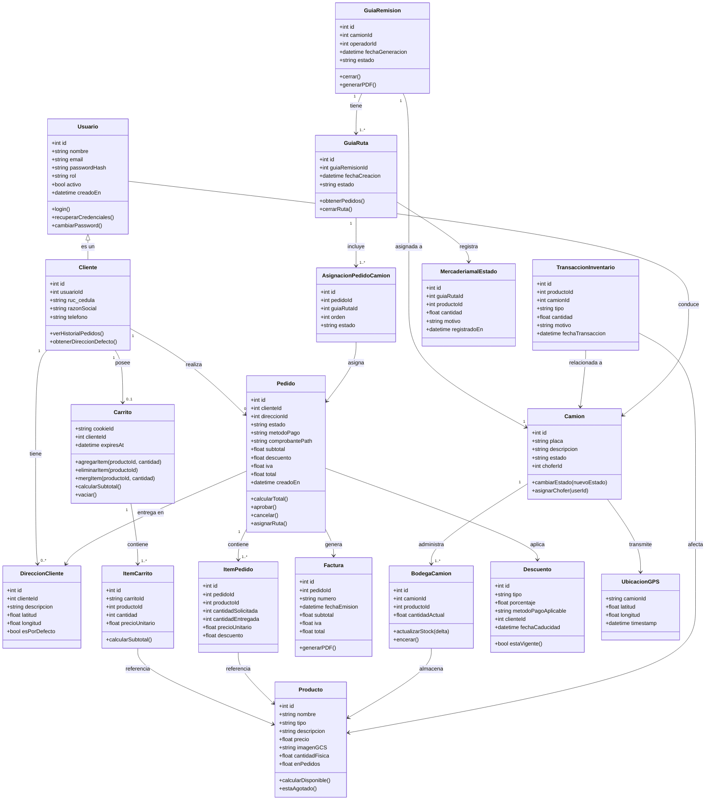

---

### 6.2 Diagrama de Casos de Uso

Modela las interacciones de los **cuatro actores** con el sistema, con relaciones `<<include>>` y `<<extend>>` que expresan dependencias y extensiones de comportamiento.


---

### 6.3 Diagramas de Secuencia — HU-001 a HU-007

Cada diagrama modela el flujo de mensajes entre actores y componentes del sistema para cada Historia de Usuario.

---

#### 6.3.1 HU-001 · Liquidación de Pago y Checkout

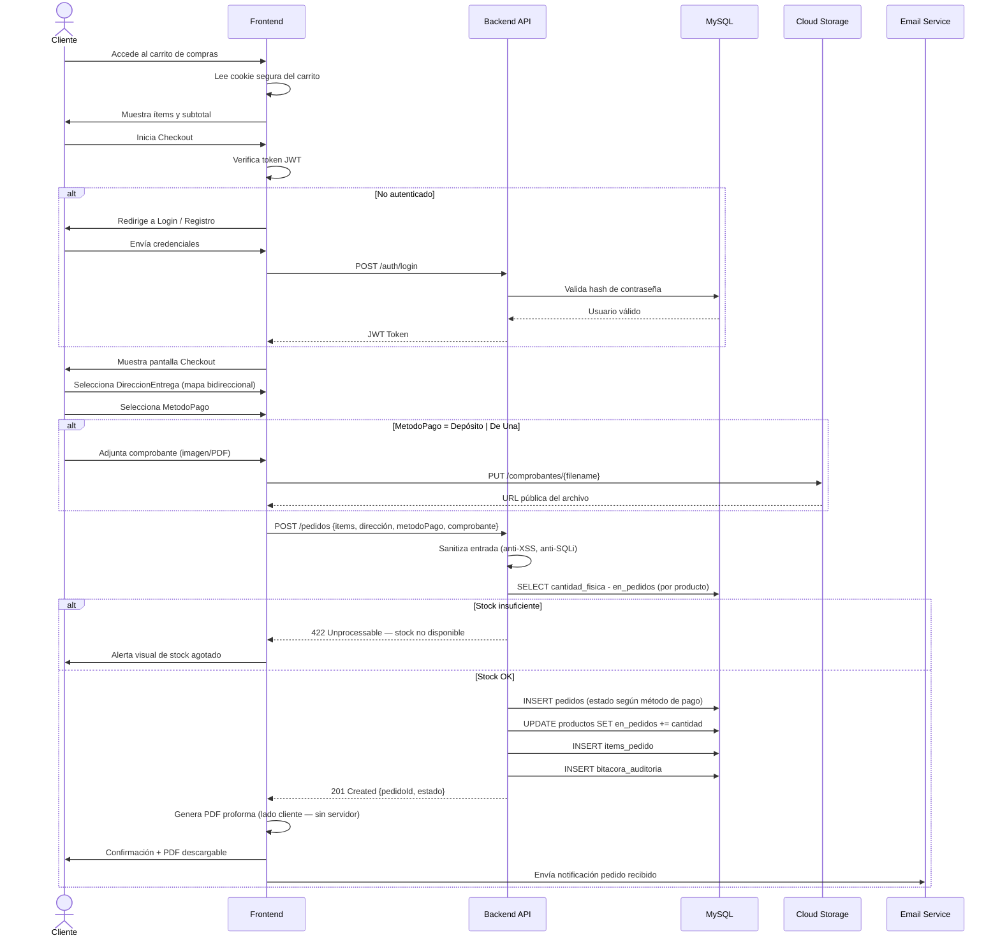

---

#### 6.3.2 HU-002 · Asignación de Rutas y Generación de Guías

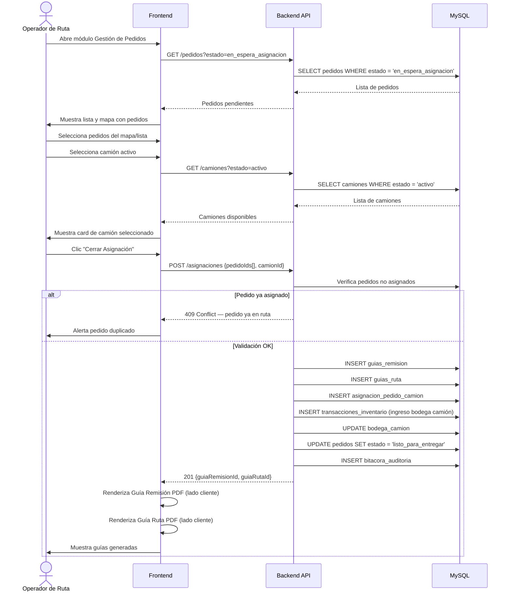

---

#### 6.3.3 HU-003 · Ejecución de Entrega, Devolución y Facturación

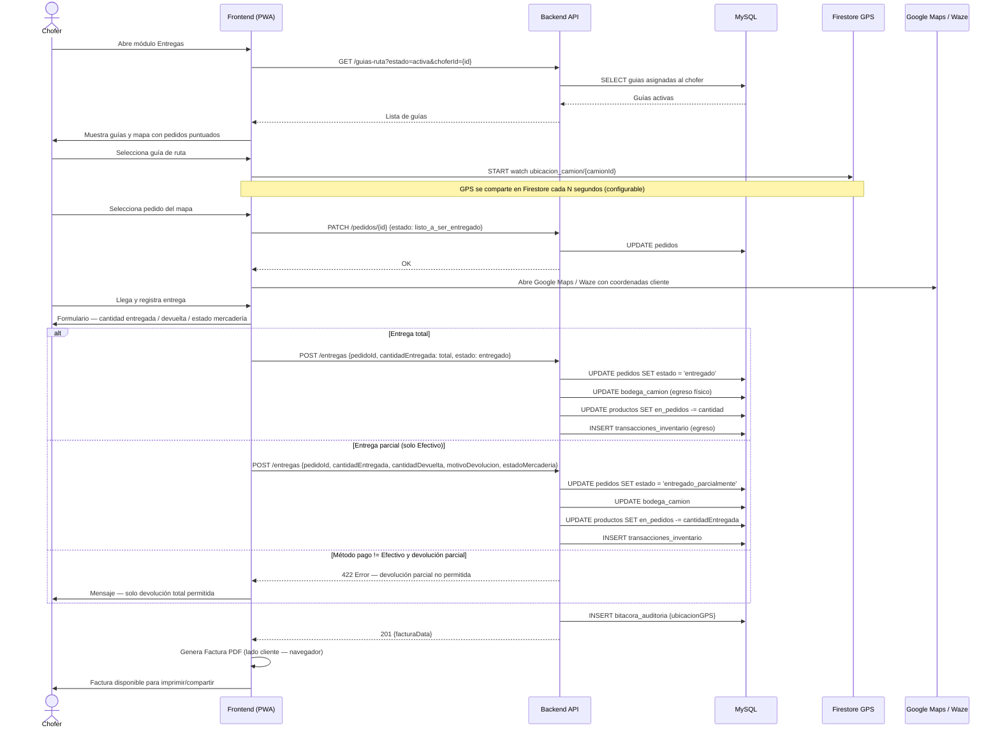

---

#### 6.3.4 HU-004 · Aprobación Manual de Pagos con Comprobante

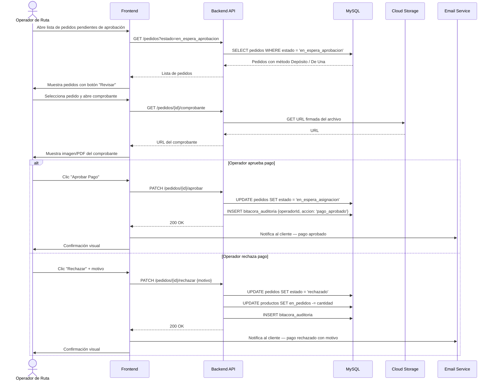

---

#### 6.3.5 HU-005 · Cierre de Guías, Arqueo y Encerado de Bodega

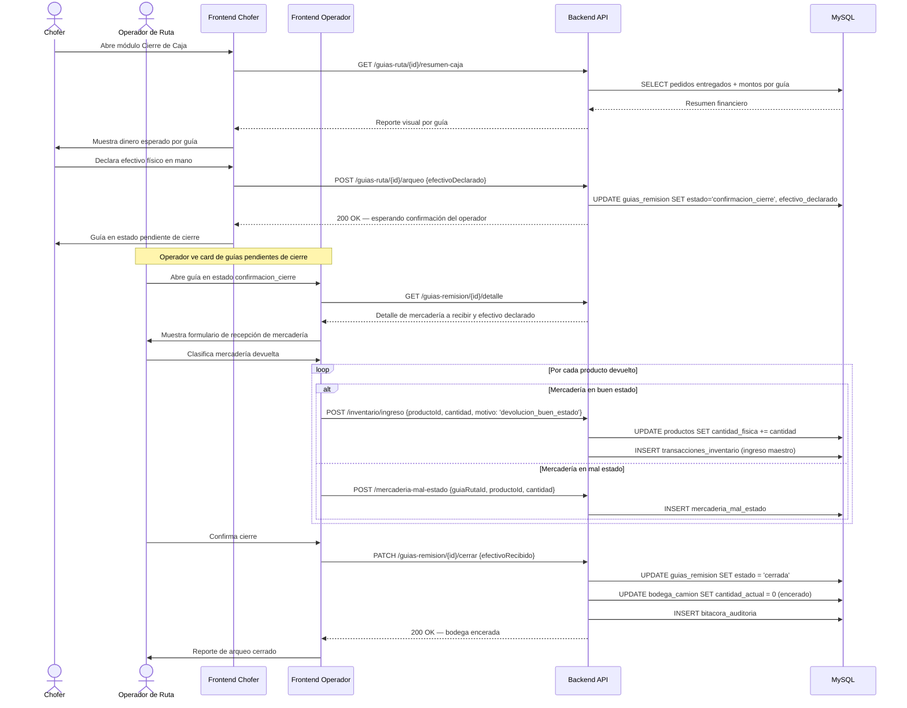

---

#### 6.3.6 HU-006 · Filtros Temporales y de Estado Estilo Datadog

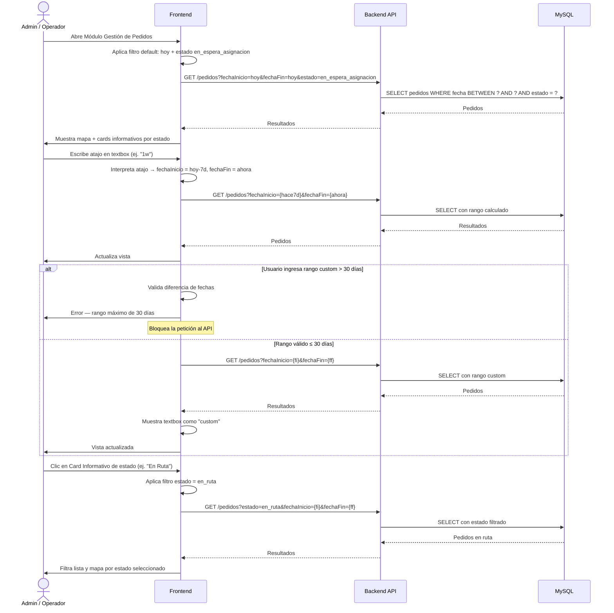

---

#### 6.3.7 HU-007 · Gestión del Carrito de Compras

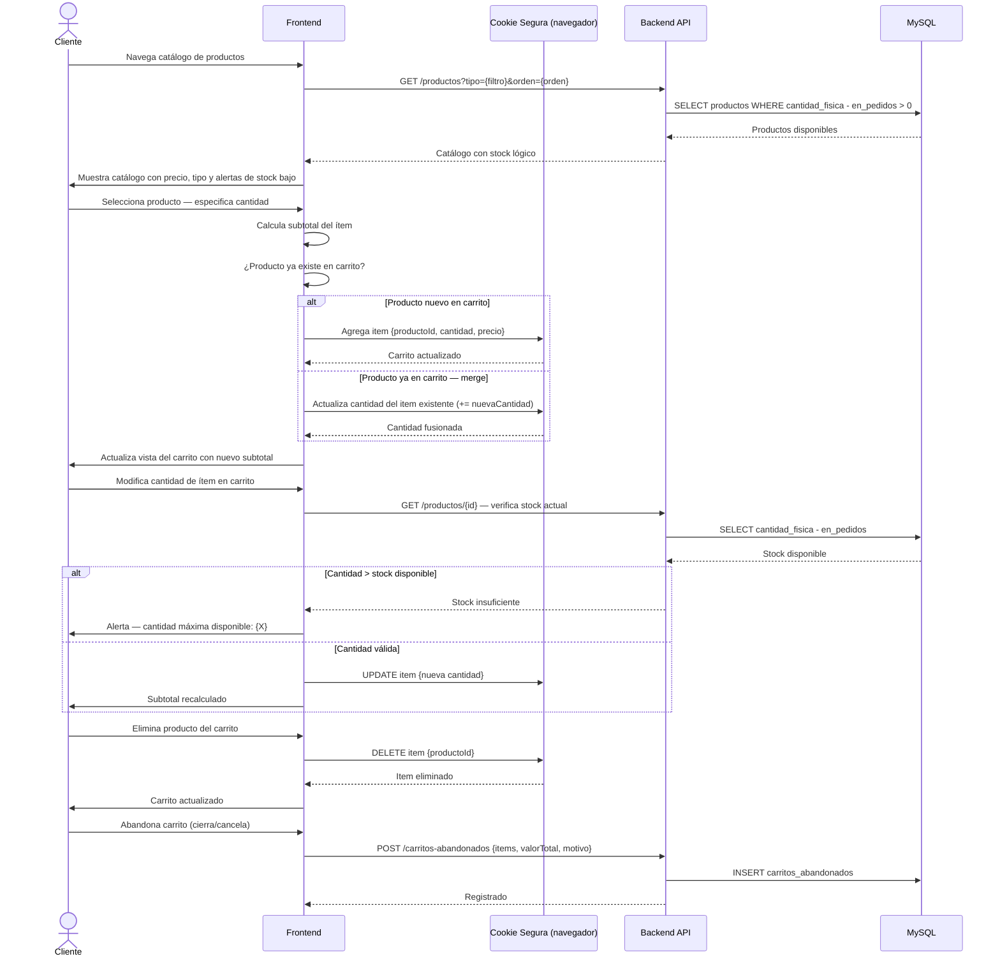

---

### 6.4 Diagramas de Colaboración — HU-001 a HU-007

Cada diagrama muestra los objetos participantes y los **mensajes numerados** que se intercambian para resolver cada historia de usuario.

---

#### 6.4.1 HU-001 · Colaboración — Checkout y Liquidación de Pago


---

#### 6.4.2 HU-002 · Colaboración — Asignación de Rutas y Generación de Guías


---

#### 6.4.3 HU-003 · Colaboración — Entrega, Devolución y Facturación


---

#### 6.4.4 HU-004 · Colaboración — Aprobación Manual de Pagos


---

#### 6.4.5 HU-005 · Colaboración — Cierre de Guías y Encerado de Bodega


---

#### 6.4.6 HU-006 · Colaboración — Filtros Temporales Estilo Datadog

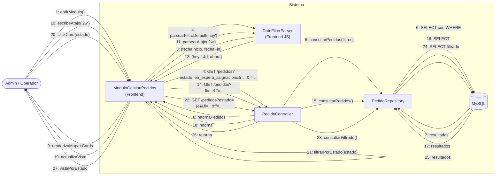

---

#### 6.4.7 HU-007 · Colaboración — Gestión del Carrito de Compras

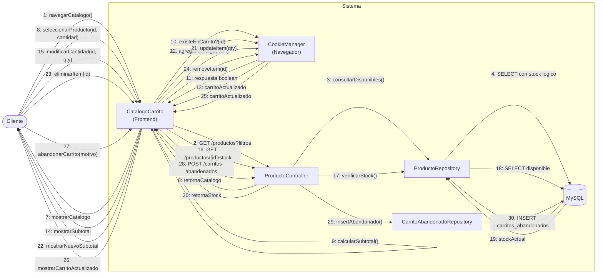

---

### 6.5 Diagrama de Estado

Modela el **ciclo de vida completo de un Pedido**, desde su creación hasta su cierre.


---

### 6.6 Diagrama de Paquetes

Muestra la **arquitectura modular** del sistema con sus dependencias entre capas y componentes.

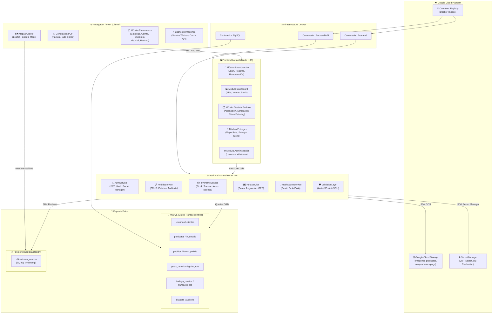

---

### 6.7 Diagrama de Entidad-Relación

Esquema completo de la **base de datos MySQL** con todas las tablas, campos clave y relaciones del sistema.

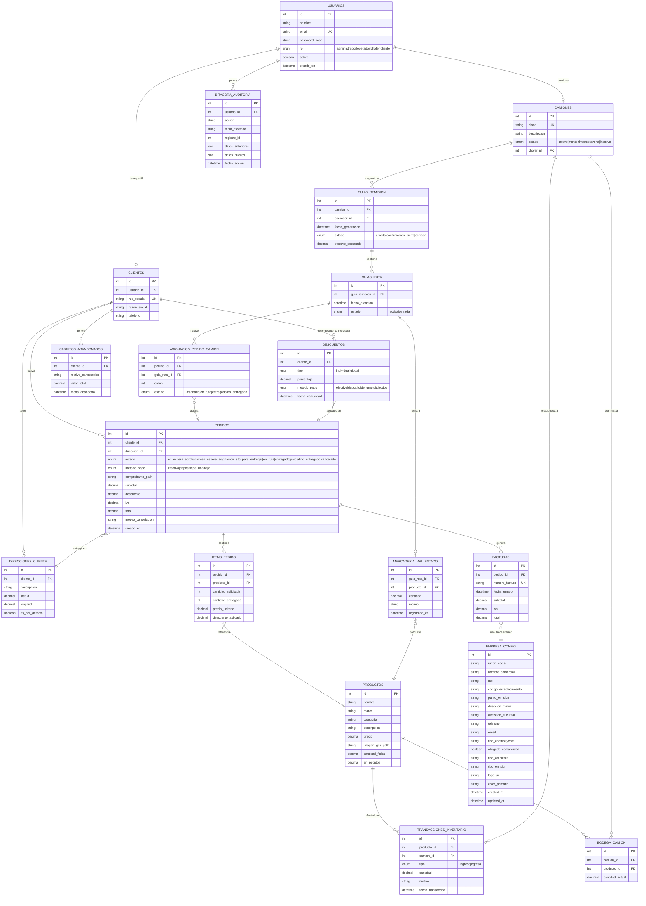


---

### 6.8 Diagrama de Flujo de Datos — Infraestructura GCP (Bajo Costo)

Arquitectura disenada para **minimizar el costo mensual** en GCP.
Se usan unicamente servicios con capa gratuita generosa o costo minimo.
La seguridad se gestiona con HTTPS incluido en la URL de Cloud Run y JWT en el backend,
sin servicios de red adicionales pagos.

> **Estimado mensual:** ~8-10 USD/mes (dominado por Cloud SQL db-f1-micro)

---

#### Nivel 0 — Contexto General

Los cuatro actores acceden directamente a Cloud Run por su URL publica
con HTTPS incluido — sin Load Balancer ni firewall de pago.

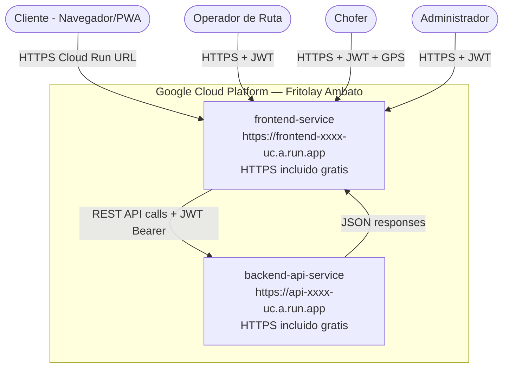

---

#### Nivel 1 — Flujo Detallado por Servicios

Cada servicio muestra su costo mensual y si tiene capa gratuita.

```mermaid
flowchart TD
    CLI(["Cliente"])
    OPE(["Operador/Admin"])
    CHO(["Chofer"])

    subgraph CR["Cloud Run — 0 USD capa gratuita"]
        direction LR
        FE_SVC["frontend-service\n*.run.app HTTPS gratis\nPWA · Service Worker · Blade"]
        BE_SVC["backend-api-service\n*.run.app HTTPS gratis\nLaravel API · JWT · SOLID"]
    end

    subgraph SQL["Cloud SQL MySQL — 8 USD/mes"]
        DB[("db-f1-micro 1 vCPU 614 MB\n10 GB SSD · Backups diarios\npedidos inventario guias auditoria")]
    end

    subgraph FS["Firestore — 0 USD capa gratuita"]
        FS_GPS[("1 GB storage gratis · 50K lecturas/dia\nubicaciones_camion GPS lat lng timestamp")]
    end

    subgraph GCS["Cloud Storage — 0.02 USD/GB/mes"]
        GCS_IMG[("Bucket imagenes-productos\nAcceso publico · CDN gratis\nCache-Control max-age 4h")]
        GCS_DOC[("Bucket comprobantes-pago\nAcceso privado · URL firmadas")]
    end

    subgraph SM_BOX["Secret Manager — 0.06 USD/mes"]
        SM["JWT_SECRET · DB_PASSWORD\nFIREBASE_KEY · MAIL_PASS"]
    end

    subgraph CICD["CI/CD — 0 USD GitHub Actions gratis"]
        direction LR
        GH["GitHub Repositorio"]
        GHA["GitHub Actions\nbuild · test · push\n2000 min/mes gratis"]
        AR["Artifact Registry\n0.5 GB gratis"]
    end

    subgraph EMAIL_BOX["Email — 0 USD Gmail SMTP"]
        GMAIL["Gmail SMTP smtp.gmail.com:587\n500 emails/dia gratis"]
    end

    subgraph FCM_BOX["Push Notifications — 0 USD FCM"]
        FCM["Firebase Cloud Messaging\nWeb Push PWA gratis"]
    end

    CLI -->|"HTTPS URL *.run.app TLS incluido"| FE_SVC
    OPE -->|"HTTPS + JWT Bearer"| FE_SVC
    CHO -->|"HTTPS + JWT + GPS coords"| FE_SVC

    FE_SVC -->|"POST/GET/PATCH JSON\nAuthorization: Bearer JWT"| BE_SVC
    BE_SVC -->|"JSON response + Signed URL GCS"| FE_SVC

    BE_SVC -->|"Eloquent ORM queries TCP"| DB
    DB     -->|"Result sets"| BE_SVC
    BE_SVC -->|"Firebase Admin SDK writeDocument"| FS_GPS
    FS_GPS -->|"onSnapshot realtime WebSocket gratis"| FE_SVC

    BE_SVC   -->|"PUT multipart upload"| GCS_DOC
    GCS_DOC  -->|"Signed URL 15min TTL"| BE_SVC
    BE_SVC   -->|"URL publica en MySQL"| GCS_IMG
    GCS_IMG  -->|"GET imagen Cache-Control 4h"| FE_SVC

    SM -->|"env vars en startup gratis"| BE_SVC

    GH  -->|"push main trigger"| GHA
    GHA -->|"docker push"| AR
    AR  -->|"gcloud run deploy"| FE_SVC
    AR  -->|"gcloud run deploy"| BE_SVC

    BE_SVC -->|"Laravel Mail SMTP TLS"| GMAIL
    GMAIL  -->|"Email entregado"| CLI
    BE_SVC -->|"FCM HTTP v1 API"| FCM
    FCM    -->|"Web Push Service Worker"| CLI
```

---

#### Nivel 2 — Flujo por Proceso de Negocio

```mermaid
flowchart LR
    subgraph P1["Checkout"]
        direction TB
        A1["Cliente accede Cloud Run URL HTTPS"]
        A2["FE llama BE API JWT en header"]
        A3["BE valida JWT sin servicio externo"]
        A4["Comprobante a GCS bucket privado"]
        A5["Pedido a Cloud SQL INSERT"]
        A6["Email via Gmail SMTP gratis"]
        A1 --> A2 --> A3 --> A4 --> A5 --> A6
    end

    subgraph P2["Tracking GPS"]
        direction TB
        B1["Chofer abre guia Cloud Run URL"]
        B2["PWA activa GPS Geolocation API"]
        B3["Coords a Firestore gratis 50K/dia"]
        B4["onSnapshot listener"]
        B5["Cliente ve mapa en tiempo real"]
        B6["FCM Push pedido listo gratis"]
        B1 --> B2 --> B3 --> B4 --> B5 --> B6
    end

    subgraph P3["Imagenes y Cache"]
        direction TB
        C1["Admin sube imagen"]
        C2["Backend PUT GCS bucket publico"]
        C3["URL guardada en MySQL"]
        C4["Cliente pide imagen"]
        C5["En cache del navegador?"]
        C6["HIT: 0 costo GCS"]
        C7["MISS: GCS fetch Cache 4h"]
        C1 --> C2 --> C3 --> C4 --> C5
        C5 -->|"HIT"| C6
        C5 -->|"MISS"| C7
    end

    subgraph P4["Deploy GitHub Actions"]
        direction TB
        D1["git push main GitHub gratis"]
        D2["GitHub Actions 2000 min/mes"]
        D3["docker build + php artisan test"]
        D4["docker push Artifact Registry"]
        D5["gcloud run deploy Cloud Run"]
        D1 --> D2 --> D3 --> D4 --> D5
    end
```

---

#### Nivel 3 — Tabla de Costos Estimados

| Servicio GCP | Capa gratuita | Costo/mes |
|---|---|---|
| **Cloud Run** (frontend + backend) | 2M requests gratis | **0 USD** |
| **Cloud SQL MySQL** db-f1-micro | Sin capa gratuita | **~8-10 USD** |
| **Firestore** | 1 GB + 50K reads/dia gratis | **0 USD** |
| **Cloud Storage** | 5 GB primeros 90 dias | **~0.10 USD** |
| **Secret Manager** | 6 secretos gratis/mes | **0 USD** |
| **Artifact Registry** | 0.5 GB gratis | **0 USD** |
| **GitHub Actions CI/CD** | 2000 min/mes gratis | **0 USD** |
| **Gmail SMTP** | 500 emails/dia gratis | **0 USD** |
| **FCM Push Notifications** | Completamente gratis | **0 USD** |
| **HTTPS/TLS** | Incluido en Cloud Run | **0 USD** |
| | **Total estimado** | **~8-10 USD/mes** |

> [!TIP]
> Configura Cloud SQL con parada programada fuera del horario laboral (22h-6h)
> para reducir el costo hasta ~3-5 USD/mes.

---

#### Nivel 4 — Seguridad sin servicios pagos

La seguridad se implementa dentro de Laravel sin Cloud Armor, sin IAP, sin Load Balancer.

```mermaid
flowchart LR
    subgraph Usuario["Usuario - cualquier rol"]
        BROWSER["Navegador / PWA"]
    end

    subgraph CR_SEC["Seguridad en Cloud Run — gratis"]
        direction TB
        TLS["TLS 1.3 HTTPS\nincluido en *.run.app\nsin Load Balancer"]
        JWT_V["JWT Validation Middleware Laravel"]
        VAL["Validacion inputs\nanti-XSS anti-SQLi Laravel FormRequest"]
        HASH["bcrypt password hash Laravel"]
        CORS["CORS en Laravel\nsolo dominios propios"]
    end

    subgraph DATA["Datos protegidos"]
        SM2["Secret Manager\nJWT_SECRET DB_PASS 0.06 USD/mes"]
        DB2[("Cloud SQL MySQL\nVPC privado sin IP publica")]
    end

    BROWSER -->|"HTTPS *.run.app"| TLS
    TLS --> JWT_V
    JWT_V --> VAL
    VAL --> HASH
    HASH --> CORS
    CORS -->|"Solo si JWT valido y rol autorizado"| DB2
    SM2 -->|"Secretos en env vars al arrancar"| JWT_V
```

---

### 6.9 Diccionario de Datos

Este diccionario de datos describe las estructuras de almacenamiento utilizadas en el sistema, divididas en bases de datos relacionales (MySQL) y NoSQL (Firestore).

#### 6.9.1 Base de Datos Relacional (MySQL - Transaccional)

A continuación, se describen las tablas principales de la base de datos MySQL, indicando el tipo de dato y descripción de cada campo.

**Tabla: `USUARIOS`**
Almacena la información de autenticación y autorización de todos los usuarios del sistema.

| Campo | Tipo | Restricciones | Descripción |
|---|---|---|---|
| `id` | INT | PK, Auto Increment | Identificador único del usuario. |
| `nombre` | VARCHAR(255) | NOT NULL | Nombre completo del usuario. |
| `email` | VARCHAR(255) | UNIQUE, NOT NULL | Correo electrónico usado para autenticación. |
| `password_hash` | VARCHAR(255) | NOT NULL | Contraseña encriptada (Bcrypt). |
| `rol` | ENUM | NOT NULL | Rol del usuario (`administrador`, `operador`, `chofer`, `cliente`). |
| `activo` | BOOLEAN | DEFAULT TRUE | Indica si el usuario puede acceder al sistema. |
| `creado_en` | DATETIME | DEFAULT CURRENT_TIMESTAMP | Fecha de registro del usuario. |

**Tabla: `CLIENTES`**
Almacena los datos del perfil comercial de los usuarios con rol de cliente.

| Campo | Tipo | Restricciones | Descripción |
|---|---|---|---|
| `id` | INT | PK, Auto Increment | Identificador único del perfil del cliente. |
| `usuario_id` | INT | FK (USUARIOS.id) | Referencia a la cuenta de usuario. |
| `ruc_cedula` | VARCHAR(20) | UNIQUE, NOT NULL | Identificación comercial o personal. |
| `razon_social` | VARCHAR(255) | NOT NULL | Nombre del negocio o persona. |
| `nombre_cliente` | VARCHAR(255) | NULL | Nombre de la persona o cliente. |
| `telefono` | VARCHAR(20) | NOT NULL | Número de contacto. |

**Tabla: `DIRECCIONES_CLIENTE`**
Almacena los puntos de entrega asociados a cada cliente.

| Campo | Tipo | Restricciones | Descripción |
|---|---|---|---|
| `id` | INT | PK, Auto Increment | Identificador de la dirección. |
| `cliente_id` | INT | FK (CLIENTES.id) | Cliente propietario de la dirección. |
| `descripcion` | TEXT | NOT NULL | Detalle de la dirección. |
| `referencia` | TEXT | NULL | Referencia de la dirección. |
| `latitud` | DECIMAL(10,8) | NOT NULL | Coordenada GPS latitud. |
| `longitud` | DECIMAL(11,8) | NOT NULL | Coordenada GPS longitud. |
| `es_por_defecto`| BOOLEAN | DEFAULT FALSE | Dirección principal de entrega. |

**Tabla: `PRODUCTOS`**
Catálogo de productos disponibles para la venta.

| Campo | Tipo | Restricciones | Descripción |
|---|---|---|---|
| `id` | INT | PK, Auto Increment | Identificador del producto. |
| `nombre` | VARCHAR(255) | NOT NULL | Nombre del producto. |
| `tipo` | VARCHAR(100) | NOT NULL | Categoría o tipo de producto. |
| `descripcion` | TEXT | NULL | Detalle del producto. |
| `precio` | DECIMAL(10,2) | NOT NULL | Precio unitario base. |
| `imagen_gcs_path`| VARCHAR(255) | NULL | URL de la imagen en Google Cloud Storage. |
| `cantidad_fisica`| DECIMAL(10,2) | DEFAULT 0 | Inventario físico total en bodega central. |
| `en_pedidos` | DECIMAL(10,2) | DEFAULT 0 | Cantidad comprometida en pedidos en curso. |

**Tabla: `PEDIDOS`**
Registro de los pedidos de compra realizados por los clientes.

| Campo | Tipo | Restricciones | Descripción |
|---|---|---|---|
| `id` | INT | PK, Auto Increment | Número único de pedido. |
| `cliente_id` | INT | FK (CLIENTES.id) | Cliente que realizó la compra. |
| `direccion_id` | INT | FK (DIRECCIONES_CLIENTE.id) | Dirección de entrega seleccionada. |
| `estado` | ENUM | NOT NULL | Estado actual (`en_espera_aprobacion`, `en_espera_asignacion`, `listo_para_entregar`, `en_ruta`, `entregado`, `parcial`, `no_entregado`, `cancelado`). |
| `metodo_pago` | ENUM | NOT NULL | Vía de pago (`efectivo`, `deposito`, `de_una`, `tc`, `td`). |
| `comprobante_path`| VARCHAR(255)| NULL | URL del comprobante de pago subido a GCS (si aplica). |
| `subtotal` | DECIMAL(10,2) | NOT NULL | Suma de items antes de IVA y descuentos. |
| `descuento` | DECIMAL(10,2) | DEFAULT 0 | Valor descontado. |
| `iva` | DECIMAL(10,2) | NOT NULL | Valor del impuesto. |
| `total` | DECIMAL(10,2) | NOT NULL | Valor final a pagar. |
| `creado_en` | DATETIME | DEFAULT CURRENT_TIMESTAMP | Fecha y hora del pedido. |

**Tabla: `ITEMS_PEDIDO`**
Detalle de los productos incluidos en cada pedido.

| Campo | Tipo | Restricciones | Descripción |
|---|---|---|---|
| `id` | INT | PK, Auto Increment | Identificador del ítem. |
| `pedido_id` | INT | FK (PEDIDOS.id) | Pedido al que pertenece. |
| `producto_id` | INT | FK (PRODUCTOS.id) | Producto solicitado (referencia al catálogo). |
| `nombre_producto` | VARCHAR(255) | NULL | **Snapshot estático:** Nombre del producto al momento de crear la orden (Inmutabilidad). |
| `descripcion_producto` | TEXT | NULL | **Snapshot estático:** Descripción del producto al momento de crear la orden (Inmutabilidad). |
| `cantidad_solicitada`| INT | NOT NULL | Unidades pedidas por el cliente. |
| `cantidad_entregada`| INT | DEFAULT 0 | Unidades realmente entregadas (para entregas parciales). |
| `precio_unitario`| DECIMAL(10,2) | NOT NULL | Precio al momento de la compra (Snapshot de valor). |
| `descuento_aplicado`| DECIMAL(10,2)| DEFAULT 0 | Descuento específico de la línea. |

**Tabla: `CAMIONES`**
Flota de vehículos y asignación de conductores.

| Campo | Tipo | Restricciones | Descripción |
|---|---|---|---|
| `id` | INT | PK, Auto Increment | Identificador interno del vehículo. |
| `placa` | VARCHAR(20) | UNIQUE, NOT NULL | Placa del vehículo. |
| `descripcion` | VARCHAR(255) | NULL | Marca, modelo o alias. |
| `estado` | ENUM | DEFAULT 'activo' | `activo`, `mantenimiento`, `averia`, `inactivo`. |
| `chofer_id` | INT | FK (USUARIOS.id) | Conductor asignado actualmente. |

**Tabla: `GUIAS_REMISION`**
Documento que ampara el traslado de mercadería general del camión.

| Campo | Tipo | Restricciones | Descripción |
|---|---|---|---|
| `id` | INT | PK, Auto Increment | Número de guía. |
| `camion_id` | INT | FK (CAMIONES.id) | Vehículo asignado. |
| `operador_id` | INT | FK (USUARIOS.id) | Operador que generó la guía. |
| `fecha_generacion`| DATETIME | DEFAULT CURRENT_TIMESTAMP | Fecha de inicio. |
| `estado` | ENUM | DEFAULT 'abierta' | `abierta`, `confirmacion_cierre`, `cerrada`. |
| `efectivo_declarado`| DECIMAL(10,2)| DEFAULT 0 | Efectivo reportado por el chofer al cierre. |

**Tabla: `GUIAS_RUTA`**
Control de la ruta diaria para entrega de pedidos.

| Campo | Tipo | Restricciones | Descripción |
|---|---|---|---|
| `id` | INT | PK, Auto Increment | Identificador de la ruta. |
| `guia_remision_id`| INT | FK (GUIAS_REMISION.id)| Guía matriz. |
| `fecha_creacion` | DATETIME | DEFAULT CURRENT_TIMESTAMP | Inicio de ruta. |
| `estado` | ENUM | DEFAULT 'activa' | `activa`, `cerrada`. |

**Tabla: `ASIGNACION_PEDIDO_CAMION`**
Relación entre pedidos y la ruta del camión que los entrega.

| Campo | Tipo | Restricciones | Descripción |
|---|---|---|---|
| `id` | INT | PK, Auto Increment | Identificador. |
| `pedido_id` | INT | FK (PEDIDOS.id) | Pedido a entregar. |
| `guia_ruta_id`| INT | FK (GUIAS_RUTA.id)| Ruta a la que pertenece. |
| `orden` | INT | NOT NULL | Orden de visita sugerido. |
| `estado` | ENUM | DEFAULT 'asignado' | `asignado`, `en_ruta`, `entregado`, `no_entregado`. |

**Tabla: `BODEGA_CAMION`**
Inventario actual físico a bordo de cada camión.

| Campo | Tipo | Restricciones | Descripción |
|---|---|---|---|
| `id` | INT | PK, Auto Increment | Identificador. |
| `camion_id` | INT | FK (CAMIONES.id) | Vehículo. |
| `producto_id` | INT | FK (PRODUCTOS.id) | Producto en carga. |
| `cantidad_actual`| DECIMAL(10,2) | NOT NULL | Cantidad a bordo (se actualiza con entregas). |

**Tabla: `FACTURAS`**
Comprobantes legales de venta generados por pedido completado.

| Campo | Tipo | Restricciones | Descripción |
|---|---|---|---|
| `id` | INT | PK, Auto Increment | Identificador interno. |
| `pedido_id` | INT | FK (PEDIDOS.id) | Pedido facturado. |
| `numero_factura` | VARCHAR(50) | UNIQUE, NOT NULL | Número de comprobante legal (SRI). |
| `fecha_emision` | DATETIME | NOT NULL | Fecha de generación. |
| `subtotal` | DECIMAL(10,2) | NOT NULL | Valor base. |
| `iva` | DECIMAL(10,2) | NOT NULL | Impuestos. |
| `total` | DECIMAL(10,2) | NOT NULL | Total facturado. |

**Tabla: `EMPRESA_CONFIG`**
Almacena la información legal del emisor, punto de emisión, código de establecimiento SRI, para usarse globalmente al generar facturas y guías.

| Campo | Tipo | Restricciones | Descripción |
|---|---|---|---|
| `id` | INT | PK, Auto Increment | Identificador único. |
| `razon_social` | VARCHAR(200) | NOT NULL | Nombre legal de la empresa. |
| `nombre_comercial` | VARCHAR(200) | NULL | Nombre comercial. |
| `ruc` | VARCHAR(13) | NOT NULL | RUC del emisor. |
| `codigo_establecimiento` | VARCHAR(3) | NOT NULL, Default '003' | Código SRI del establecimiento (Ej. 003 Ambato). |
| `punto_emision` | VARCHAR(3) | NOT NULL, Default '001' | Código SRI del punto de emisión. |
| `direccion_matriz` | VARCHAR(300) | NOT NULL | Dirección legal de la matriz. |
| `direccion_sucursal` | VARCHAR(300) | NULL | Dirección del establecimiento emisor. |
| `telefono` | VARCHAR(20) | NULL | Teléfono de contacto. |
| `email` | VARCHAR(100) | NULL | Correo electrónico de facturación. |
| `tipo_contribuyente` | VARCHAR(100) | NOT NULL, Default 'ESPECIAL' | Resolución del contribuyente. |
| `obligado_contabilidad`| BOOLEAN | NOT NULL, Default TRUE | Indica si está obligado a llevar contabilidad. |
| `tipo_ambiente` | VARCHAR(1) | NOT NULL, Default '1' | Ambiente SRI (1=Pruebas, 2=Producción). |
| `tipo_emision` | VARCHAR(1) | NOT NULL, Default '1' | Tipo Emisión SRI (1=Normal). |
| `logo_url` | VARCHAR(500) | NULL | Enlace al logo institucional. |
| `color_primario` | VARCHAR(7) | NOT NULL, Default '#E3001B'| Color de marca para PDF (Ej. Fritolay Red). |
| `created_at` / `updated_at`| TIMESTAMP | | Control de auditoría base. |

**Tabla: `MERCADERIA_MAL_ESTADO`**
Registro de devoluciones o daños reportados durante la ruta.

| Campo | Tipo | Restricciones | Descripción |
|---|---|---|---|
| `id` | INT | PK, Auto Increment | Identificador del reporte. |
| `guia_ruta_id`| INT | FK (GUIAS_RUTA.id)| Ruta en la que ocurrió. |
| `producto_id` | INT | FK (PRODUCTOS.id) | Producto dañado. |
| `cantidad` | DECIMAL(10,2) | NOT NULL | Unidades afectadas. |
| `motivo` | TEXT | NOT NULL | Razón del daño o devolución. |
| `registrado_en` | DATETIME | DEFAULT CURRENT_TIMESTAMP | Fecha del suceso. |

**Tabla: `BITACORA_AUDITORIA`**
Registro histórico de acciones críticas de los usuarios para trazabilidad.

| Campo | Tipo | Restricciones | Descripción |
|---|---|---|---|
| `id` | INT | PK, Auto Increment | Identificador de log. |
| `usuario_id` | INT | FK (USUARIOS.id) | Quien ejecutó la acción. |
| `accion` | VARCHAR(100) | NOT NULL | CREATE, UPDATE, DELETE, APROBACION. |
| `tabla_afectada` | VARCHAR(100) | NOT NULL | Entidad alterada. |
| `registro_id` | INT | NOT NULL | ID del registro alterado. |
| `datos_anteriores`| JSON | NULL | Estado previo. |
| `datos_nuevos` | JSON | NULL | Nuevo estado. |
| `fecha_accion` | DATETIME | DEFAULT CURRENT_TIMESTAMP | Timestamp de auditoría. |

---

#### 6.9.2 Base de Datos NoSQL (Firestore - Tiempo Real)

Firestore se utiliza específicamente para el rastreo de alta frecuencia y baja latencia, donde MySQL generaría demasiados bloqueos transaccionales.

**Colección: `ubicaciones_camion`**

Esta colección almacena el punto geográfico más reciente emitido por la aplicación (PWA) del Chofer. El cliente de Firestore en el frontend (mapa) se suscribe a los cambios de este documento para ver el movimiento en vivo.

| Campo | Tipo de Dato (Firestore) | Descripción |
|---|---|---|
| `document_id` | `String` | El ID del documento corresponde al `camion_id` de MySQL (ej. "camion_15"). |
| `chofer_id` | `Number` | ID del chofer que está emitiendo la ubicación. |
| `guia_ruta_id` | `Number` | Ruta activa bajo la cual se está moviendo. |
| `latitud` | `Number` (Double) | Coordenada GPS de latitud. |
| `longitud` | `Number` (Double) | Coordenada GPS de longitud. |
| `ultima_actualizacion` | `Timestamp` | Hora exacta del reporte GPS. |
| `estado_ruta` | `String` | Ej: "en_movimiento", "detenido", "entregando". |

**Nota técnica:** Para historial o trazabilidad (si se requiriera), Firestore permite crear una subcolección `historial` dentro de `ubicaciones_camion/{camion_id}`, guardando puntos de manera inmutable. Actualmente se usa escritura/actualización sobre el mismo documento para abaratar costos de lectura.


## 7. Actualizaciones Recientes (Iteración Actual)

# Especificación del Sistema - E-commerce Fritolay Ambato

Este documento mantiene un registro de las especificaciones técnicas y funcionales añadidas y modificadas en las iteraciones más recientes del sistema Fritolay Ambato.

## 1. Módulo de Aprobación de Pedidos

### 1.1 Modal de Revisión Inmersivo
- Se abandonó la redirección a una página separada para revisión de comprobantes de pago. En su lugar, cuando un pedido se encuentra en estado `PENDIENTE`, el botón de la tabla cambia dinámicamente a **"Revisión"**.
- Al hacer clic, se despliega un **Modal Inmersivo** que renderiza:
  - Información comercial y de contacto.
  - La imagen del comprobante (Cargada **directamente desde GCS** como URL pública, omitiendo firmas electrónicas temporales para evitar bloqueos por credenciales de entorno) si el pago es *Depósito* o *De Una*. Si es pago directo, indica que no se requiere comprobante.
  - Opciones de Aprobación, Cancelación y Mantener en Pendiente.

### 1.2 Auto-Aprobación Masiva e Inteligente
- Agregado el endpoint `/api/pedidos/bulk-aprobar-directos` y un botón flotante en el panel de control.
- **Visibilidad Dinámica:** El botón de Auto Aprobar cuenta con lógica AlpineJS (`hayPedidosParaAutoAprobar()`) para permanecer oculto de la interfaz a menos que existan pedidos en estado `PENDIENTE` pagados con *Efectivo, Tarjeta de Crédito, Tarjeta de Débito o De Una*.
- Permite la auto-aprobación con un solo clic de todos los pedidos válidos en pantalla.

### 1.3 Mapeo Geográfico y Ordenamiento Dinámico (Distancia)
- Se inyectó una columna de **Distancia** interactiva.
- El frontend calcula la distancia ortodrómica (Fórmula Haversine) entre la ubicación actual del operador (obtenida por `navigator.geolocation`) y las coordenadas de entrega del cliente.
- Permite al operador ordenar la tabla de pedidos ascendente o descendentemente por proximidad geográfica.
- Adicionalmente, el marcador en el mapa unifica ("agrupa") las alertas de pedidos de un mismo local comercial si comparten coordenadas, mostrando un popup unificado.

## 2. Gestión de Cancelaciones y Notas de Crédito (SRI)

Para cumplir con normativas fiscales (SRI) relativas a inventarios y facturación, los pedidos anulados ya no quedan huérfanos si ya generaron factura. 

### 2.1 Nueva Estructura de Datos (`notas_credito`)
Se creó una tabla y modelo de base de datos (`NotaCredito`) atado por relación 1 a 1 a la factura (`Factura::class`).

**Campos de la Tabla:**
- `id` (PK)
- `factura_id` (FK a `facturas`)
- `numero_nota` (String, Unique). Formato: `NC-{YYYY}-{ID_Padded}`.
- `fecha_emision` (Date)
- `valor_total` (Decimal 10,2)
- `motivo` (String)

### 2.2 Reglas de Negocio en Anulación
Tanto el cliente como el operador (desde el modal de revisión) pueden cancelar un pedido. 
- **Inventario:** Se llama inmediatamente a `productoRepository->liberarEnPedidos()` para descontar el producto del estado reservado y devolverlo al stock físico disponible.
- **Facturación:** Si el sistema generó un registro de Factura inicial para el pedido (el pedido fue previamente aprobado), se genera de forma concurrente el registro `NotaCredito` correspondiente.
- El motivo provisto por el operador (o "Cancelado por el cliente" por defecto) se inserta en el campo `motivo` (Información Adicional de la Nota de Crédito).

### 2.3 Visibilidad en el Historial del Cliente
- Al entrar a `/ecommerce/pedidos`, el endpoint `getHistorial` carga la relación anidada `factura.notaCredito`.
- Si el pedido está anulado y cuenta con una nota de crédito, el usuario verá una caja de alerta roja detallando los montos legales (SRI), número de nota, fecha de emisión y el motivo específico (Información Adicional) por el cual el operador anuló su pedido.

### 2.4 Inmutabilidad de Documentos, Generación de PDFs y Transacciones Atómicas (Patrón Snapshot & DB Atomicity)
Para garantizar el cumplimiento de normativas tributarias (SRI) y de auditoría contable/logística, los documentos emitidos (Facturas, Guías de Remisión, Notas de Crédito e Historial de Pedidos) son **completamente inmutables en el tiempo** y la ejecución de cambios es estrictamente **atómica**:

- **Independencia Total de PDFs:** La lógica de generación de PDFs cliente-servidor (`pdf-generator.js`, `historial.blade.php`, `guias.blade.php`, `EntregaService::getPedidosGuiaChofer`) consume de forma aislada los atributos `nombre_producto` y `precio_unitario` capturados en el detalle del documento (`items_pedido`). Se eliminó cualquier consulta o dependencia en tiempo real hacia la tabla maestra `productos`.
- **Garantía de Inmutabilidad:** Si un producto cambia de precio o descripción en el catálogo principal, los PDFs generados previamente mantienen la información y los importes exactamente como fueron emitidos.
- **Transacciones Atómicas de Base de Datos (`DB::transaction`):** Se aseguró que todas las operaciones donde un evento o botón desencadena múltiples escrituras/actualizaciones (`PedidoService::crearPedido`, `PedidoService::cancelarPedido`, `AprobacionService::aprobar`, `AprobacionService::rechazar`, `RutaService::crearAsignacion`, `RutaService::cancelarAsignacion`, `RutaService::cerrarRuta`, `EntregaService::registrarEntrega`, `CierreService::declararArqueo`, `CierreService::procesarMercaderiaDevuelta`, `CierreService::cerrarGuia`, `InventarioService`) estén envueltas en bloques de transacción relacional.
- **Rollback Automático:** Ante cualquier excepción o fallo imprevisto durante una secuencia multi-tabla (ej: error en registro de mercadería o actualización de inventario), la base de datos aborta y revierte automáticamente (`rollback`) todas las escrituras sin dejar registros parciales o huérfanos.
- **Paridad Multi-entorno:** La migración masiva de estructura y backfill de datos históricos fue ejecutada tanto en el servidor local **MySQL (`127.0.0.1:3306`)** como en la base de datos de producción **GCP Cloud SQL (`34.72.182.198:3306`)**.

### 2.5 Granularidad Dinámica y Control de Eje Temporal en Gráficos de Series de Tiempo (Timeline Series)
Para mejorar la legibilidad visual y evitar que la segmentación automática por defecto de la librería arruine la tendencia de los gráficos del Dashboard Administrativo, se implementó una regla condicional según el rango de fechas seleccionado por el usuario:

- **Rango Corto (Hasta 2 Días):** Si el intervalo entre la fecha inicial y la fecha final es de **1 o 2 días** (`diffInDays <= 2`), los registros son agrupados en backend estrictamente por horas mediante `DATE_FORMAT(fecha, '%Y-%m-%d %H:00')`.
- **Rango Largo (3 Días o Más):** Si el intervalo es de **3 días en adelante**, la agrupación en la consulta backend cambia dinámicamente a días mediante `DATE(fecha)`.
- **Forzado de Granularidad en Frontend (Chart.js):** En [index.blade.php](file:///d:/UNIANDES/8VO/HERRAMIENTAS%20DE%20DESARROLLO%20DE%20SOFTWARE/PI-ECOMMERCE-FRITOLAY/frontend/resources/views/dashboard/index.blade.php), se configuraron explícitamente las opciones del eje X (`scales.x`) asignando `type: 'category'` con `ticks.autoSkip: false` y títulos dinámicos (`Hora` o `Fecha`). Esto desactiva el auto-escalado conflictivo de Chart.js y garantiza que las tendencias de Ventas y Pérdidas se rendericen con la resolución exacta solcitada.

## 3. Arquitectura y Correcciones de Sistema Core

### 3.1 Middleware de Autenticación JWT Stateless
- Se migró toda la lógica de autorización desde los métodos genéricos de sesión de Laravel (`auth()->id()`) hacia un Middleware basado estrictamente en JSON Web Tokens (JWT).
- El Payload decodificado inyecta explícitamente `$request->user_id`, solucionando de raíz los errores `500 Internal Server Error` que surgían por variables de sesión nulas en peticiones asíncronas de la API.

### 3.2 Servicio de Auditoría Tipado (Strict Types)
- La capa de registro de logs (`AuditoriaService`) cuenta con métodos `logSimple()` adaptados para soportar tipos estrictos (`declare(strict_types=1)`), evitando errores fatales al pasar variables string en parámetros tipados como `int` (común en endpoints como cambios de estado en camiones o cierres de caja).

### 3.3 Almacenamiento GCS para Comprobantes
- Los comprobantes cargados por el cliente ya no intentan ser servidos mediante "Signed URLs" dependientes de credenciales de servicio local.
- Se ha actualizado la infraestructura para guardar y devolver **URLs públicas absolutas** de la plataforma Google Cloud Storage (ej: `https://storage.googleapis.com/{bucket}/...`), asegurando la carga instantánea de comprobantes tanto en modo desarrollo como producción sin problemas de políticas IAM.
- Se implementaron migraciones masivas en base de datos para convertir rutas relativas heredadas al formato URL público.

## 4. Gestión de Flota y Rutas (Módulo Camiones)

- **Asignación a Camiones:** Solucionado el flujo de endpoints RESTful. El controlador `CamionController` y su interfaz en repositorio (`CamionRepositoryInterface`) soportan correctamente el cambio de estados y la asignación paramétrica de Choferes a Camiones utilizando métodos `update()`.
- **Enrutamiento Frontend:** Corrección en el mapeo `window.api()` donde la ruta apuntaba a recursos inexistentes (`/api/admin/camiones` vs `/api/camiones`), restaurando la capacidad de cargar y asignar choferes a la flota desde la interfaz administrativa de forma transparente.

Épica: Módulo de Entregas (Chofer) y Gestión

## HU-008 - Renderizado de PDFs del Lado del Cliente (Offloading)

Como: Líder Técnico / Arquitecto de Software 
Quiero: Que la generación de documentos PDF (Guías de Remisión, Listado de Ruta, Facturas) se procese exclusivamente en el navegador del cliente utilizando `pdfmake` 
Para: Eliminar la carga computacional en el backend (servidor), reducir el consumo de memoria RAM, mejorar los tiempos de respuesta y aprovechar el procesamiento distribuido de los dispositivos de los usuarios.
Prioridad: Crítica (Restricción Técnica)

## Reglas de negocio

- RN-01: Queda estrictamente prohibido el uso de librerías de servidor como `dompdf` o `snappy` para renderizar documentos.
- RN-02: El backend debe proveer únicamente los datos crudos en formato JSON a través de endpoints ligeros.
- RN-03: El frontend debe construir el documento de manera declarativa con `pdfmake` y activar la descarga directamente en el navegador.

## Criterios de aceptación en Gherkin

Característica: Generación de Documentos PDF Cliente-Servidor Optimizada

Escenario: Descarga de Guía de Remisión (Formato SRI)
Dado que un Operador de Ruta o Chofer visualiza sus guías activas
Cuando hace clic en el botón "Descargar Guía de Remisión"
Entonces el frontend obtiene el JSON del pedido desde el servidor
Y el navegador (cliente) ensambla y renderiza el PDF localmente
Y el archivo se descarga instantáneamente sin recargar la página.

Escenario: Descarga de Listado de Ruta Detallado
Dado que un Chofer requiere la lista de sus paradas offline
Cuando hace clic en "Descargar Listado de Ruta"
Entonces el frontend procesa la tabla de clientes, direcciones y montos a cobrar
Y renderiza un PDF en formato horizontal (Landscape) utilizando los recursos locales del dispositivo.

---

## 5. Actualizaciones de Seguridad, Autenticación y UI/UX Estandarizada (Ponytail Directives)

### 5.1 Sistema de Autenticación "Recuérdame" y Control Estricto de Cookies
- **Manejo de Cookies Seguras:** El login emite el token JWT dentro de una cookie HTTP con las directivas `HttpOnly`, `Secure` (en entorno HTTPS) y `SameSite` (`Strict`/`Lax`), previniendo ataques de XSS y CSRF.
- **Expiración Dinámica de Sesión (TTL por Rol):**
  - **Sesión Estándar (sin Recuérdame):** Duración fija de **1 hora** (60 minutos) para todos los usuarios.
  - **Sesión Extendida (con Recuérdame):**
    - Administrador / Operador: **8 horas** (1 jornada laboral).
    - Chofer: **12 horas** (jornada de ruta extendida).
    - Cliente: **30 días** (persistencia de e-commerce).
- **Hardening de Secretos JWT (PR #46):** Reemplazo del uso directo de `env('JWT_SECRET')` en favor del repositorio configurativo `config('jwt.secret')` para garantizar el soporte de `config:cache` en entornos de producción.

### 5.2 Rediseño e Interfaz de Usuarios y Gestión de Flota (Camiones)
- **Módulo de Usuarios (`/admin/usuarios`):**
  - Incorporación de avatares circulares con iniciales calculadas automáticamente.
  - Insignias de rol en tonos pastel (`Administrador`, `Operador`, `Chofer`, `Cliente`).
  - Indicador LED de estado en tiempo real (Verde Esmeralda = Activo, Gris = Inactivo).
  - Buscador dinámico por nombre o correo (`searchTerm`) y filtro desplegable por rol.
- **Módulo de Gestión de Camiones (`/admin/camiones`):**
  - Tarjeta de vehículo con icono temático 🚚, placa en negrita tipográfica y subtexto de ID.
  - Buscador dinámico por placa o modelo (`searchTerm`).
  - Filtro por estado operativo (`ACTIVO`, `MANTENIMIENTO`, `INACTIVO`).
  - Selector directo de asignación de choferes registrados con actualización transparente.

### 5.3 Modal Enriquecido de Detalle de Pedidos
- **Visualización Full Modal / Glassmorphism:** Reemplazo de alertas planas SweetAlert por un modal enriquecido (`bg-slate-900/60 backdrop-blur-xs`) en las vistas de **Gestión de Pedidos** (`/gestion-pedidos`) e **Historial de Pedidos del Cliente** (`/ecommerce/historial`).
- **Contenido del Modal:**
  - Encabezado con número de orden `#ID`, fecha de emisión en formato `es-EC` e insignia de estado pastel.
  - Banner destacado de motivo de cancelación si el pedido fue anulado.
  - Cuadrícula con datos comerciales (Razón Social, Cliente), Dirección de entrega geolocalizada en km y documento de pago.
  - Tabla de productos solicitados vs. entregados con precios unitarios y subtotales.
  - Desglose financiero completo: Subtotal, Descuentos aplicados, IVA (15%) y Total Final (`$XX.XX`).
  - Acceso directo a vista previa y descarga de Factura PDF, Nota de Crédito oficial SRI y comprobantes de depósito / DE_UNA cargados en GCS.

### 5.4 Navegación Sutil Dinámica en Navbar (`layouts/app.blade.php`)
- **Resaltado Dinámico de Ruta Activa (`isActive`):** La barra de navegación detecta automáticamente la ruta activa (`window.location.pathname`).
- **Estilo Visual Adaptativo:**
  - Rutas de Cliente / Catálogo: Píldora sutil en rojo Frito-Lay pastel (`bg-red-50 text-[#E3001B] border border-red-100 font-extrabold`).
  - Rutas de Administración / Operación: Píldora sutil en Slate oscuro (`bg-slate-900 text-white font-extrabold shadow-2xs`).
  - Menú Móvil: Mapeo identico de opciones activas en el menú desplegable responsive.

### 5.5 Paginación Estandarizada Slate
- **Estructura Unificada de Tablas:** Todas las tablas administrativas (Usuarios, Camiones, Pedidos, Rutas, Historial) comparten la misma barra inferior de paginación Slate (`Mostrando X a Y de Z registros`).
- **Controles Interactivos:** Botones de páginas numeradas con resaltado activo en Slate oscuro y selector de registros por página (`5`, `10`, `20`, `50`, `100`).

